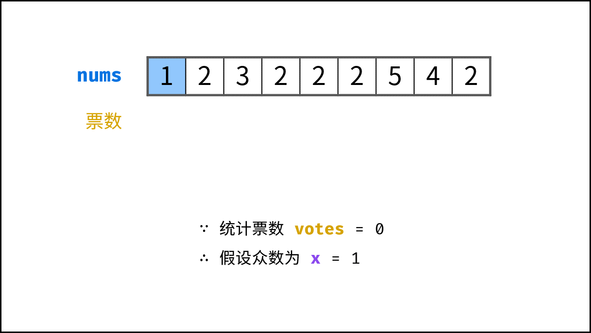
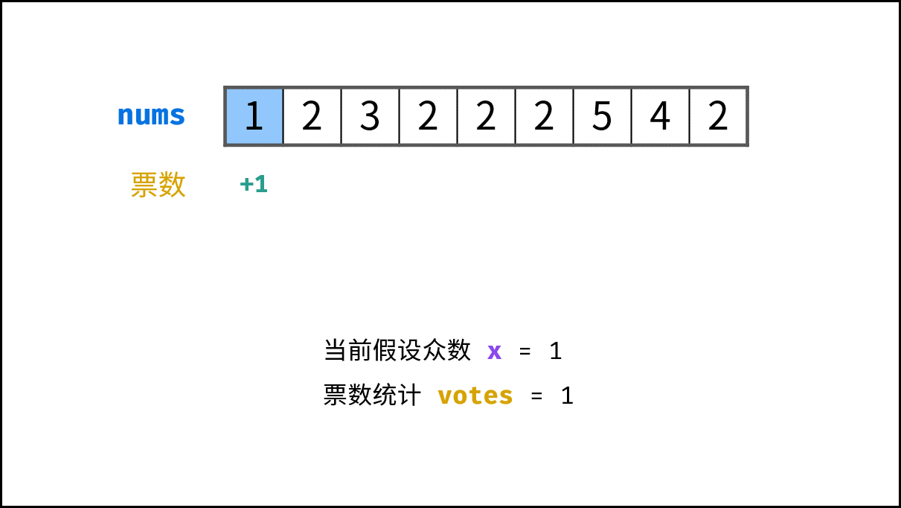
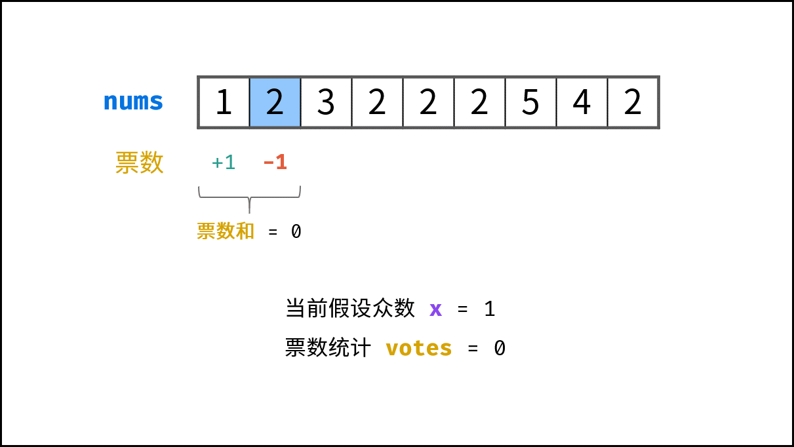
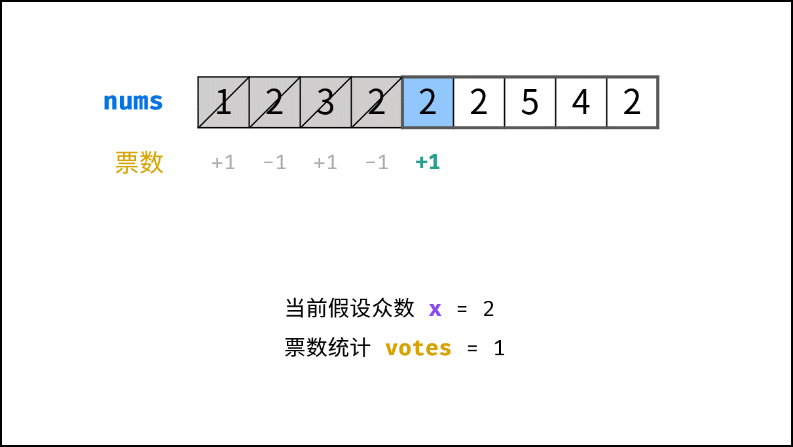
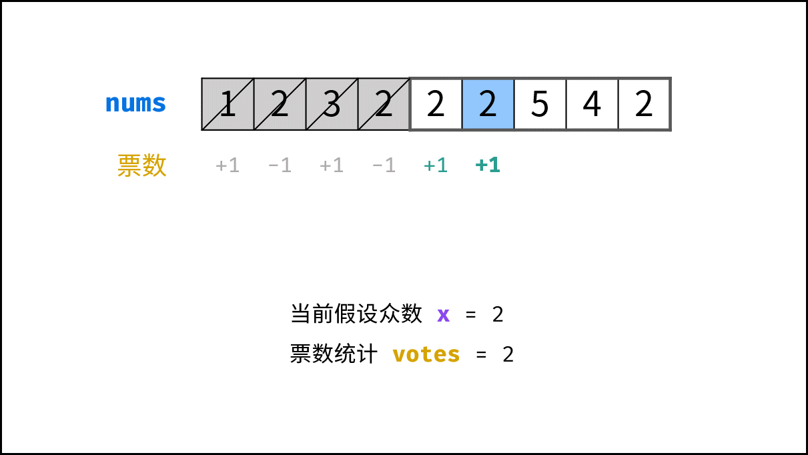
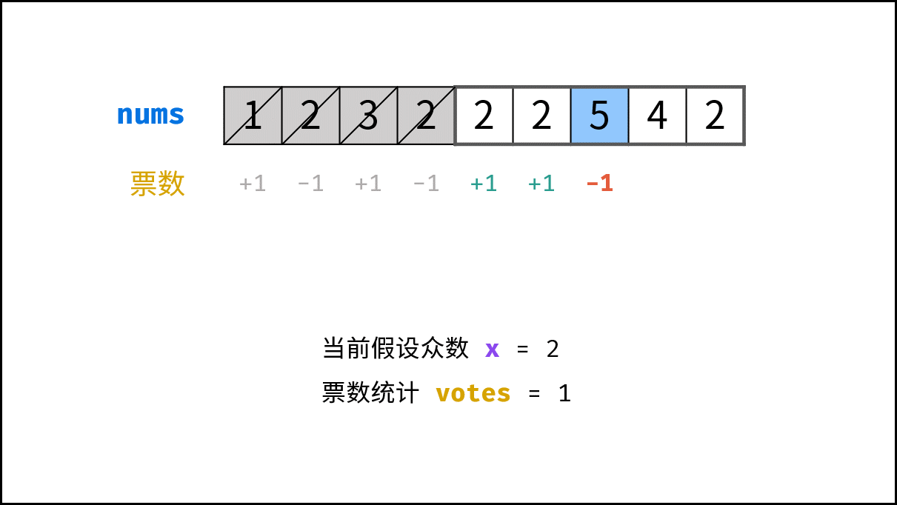
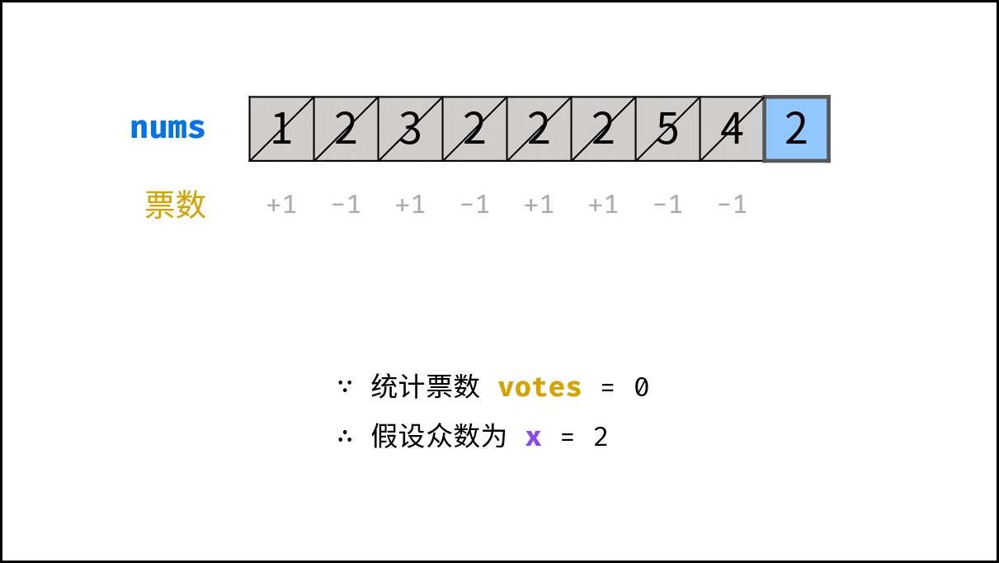
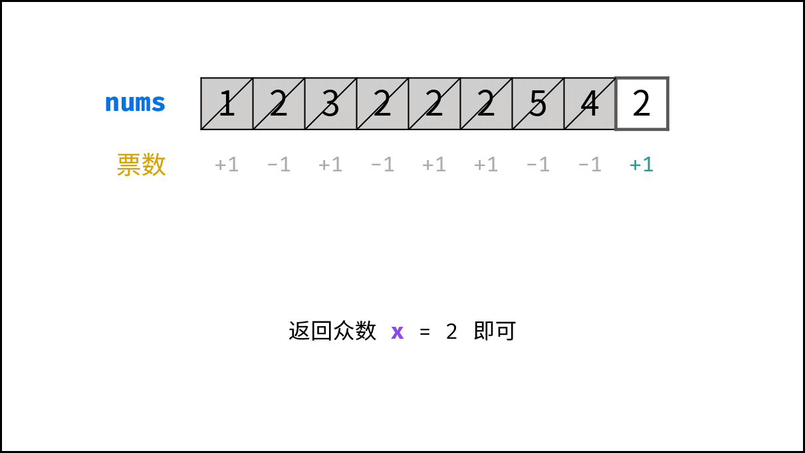

> 原文链接: https://leetcode-cn.com/problems/shu-zu-zhong-chu-xian-ci-shu-chao-guo-yi-ban-de-shu-zi-lcof


## 中文题目
<div><p>数组中有一个数字出现的次数超过数组长度的一半，请找出这个数字。</p>

<p>&nbsp;</p>

<p>你可以假设数组是非空的，并且给定的数组总是存在多数元素。</p>

<p>&nbsp;</p>

<p><strong>示例&nbsp;1:</strong></p>

<pre><strong>输入:</strong> [1, 2, 3, 2, 2, 2, 5, 4, 2]
<strong>输出:</strong> 2</pre>

<p>&nbsp;</p>

<p><strong>限制：</strong></p>

<p><code>1 &lt;= 数组长度 &lt;= 50000</code></p>

<p>&nbsp;</p>

<p>注意：本题与主站 169 题相同：<a href="https://leetcode-cn.com/problems/majority-element/">https://leetcode-cn.com/problems/majority-element/</a></p>

<p>&nbsp;</p>
</div>

## 通过代码
<RecoDemo>
</RecoDemo>


## 高赞题解
#### 解题思路：

> 本文将 “数组中出现次数超过一半的数字” 简称为 **“众数”** 。
> 需要注意的是，数学中众数的定义为 “数组中出现次数最多的数字” ，与本文定义不同。

本题常见的三种解法：

1. **哈希表统计法：** 遍历数组 `nums` ，用 HashMap 统计各数字的数量，即可找出 众数 。此方法时间和空间复杂度均为 $O(N)$ 。
2. **数组排序法：** 将数组 `nums` 排序，**数组中点的元素** 一定为众数。
3. **摩尔投票法：** 核心理念为 **票数正负抵消** 。此方法时间和空间复杂度分别为 $O(N)$ 和 $O(1)$ ，为本题的最佳解法。

##### 摩尔投票法：

> 设输入数组 `nums` 的众数为 $x$ ，数组长度为 $n$ 。

**推论一：** 若记 **众数** 的票数为 $+1$ ，**非众数** 的票数为 $-1$ ，则一定有所有数字的 **票数和 $> 0$** 。

**推论二：** 若数组的前 $a$ 个数字的 **票数和 $= 0$** ，则 数组剩余 $(n-a)$  个数字的 **票数和一定仍 $>0$** ，即后 $(n-a)$ 个数字的 **众数仍为 $x$** 。

{:width=500}

根据以上推论，记数组首个元素为 $n_1$ ，众数为 $x$ ，遍历并统计票数。当发生 **票数和 $= 0$** 时，**剩余数组的众数一定不变** ，这是由于：

- **当 $n_1 = x$ ：** 抵消的所有数字中，有一半是众数 $x$ 。
- **当 $n_1 \neq x$ ：** 抵消的所有数字中，众数 $x$ 的数量最少为 0 个，最多为一半。

利用此特性，每轮假设发生 **票数和 $= 0$** 都可以 **缩小剩余数组区间** 。当遍历完成时，最后一轮假设的数字即为众数。

##### 算法流程:

1. **初始化：** 票数统计 `votes = 0` ， 众数 `x`；
2. **循环：** 遍历数组 `nums` 中的每个数字 `num` ；
   1. 当 票数 `votes` 等于 0 ，则假设当前数字 `num` 是众数；
   2. 当 `num = x` 时，票数 `votes` 自增 1 ；当 `num != x` 时，票数 `votes` 自减 1 ；
3. **返回值：** 返回 `x` 即可；

<,,,,,,,,,,,,,>

##### 复杂度分析：

- **时间复杂度 $O(N)$ ：** $N$ 为数组 `nums` 长度。
- **空间复杂度 $O(1)$ ：** `votes` 变量使用常数大小的额外空间。

#### 代码：

```Python []
class Solution:
    def majorityElement(self, nums: List[int]) -> int:
        votes = 0
        for num in nums:
            if votes == 0: x = num
            votes += 1 if num == x else -1
        return x
```

```Java []
class Solution {
    public int majorityElement(int[] nums) {
        int x = 0, votes = 0;
        for(int num : nums){
            if(votes == 0) x = num;
            votes += num == x ? 1 : -1;
        }
        return x;
    }
}
```

```C++ []
class Solution {
public:
    int majorityElement(vector<int>& nums) {
        int x = 0, votes = 0;
        for(int num : nums){
            if(votes == 0) x = num;
            votes += num == x ? 1 : -1;
        }
        return x;
    }
};
```

**拓展：** 由于题目说明 `给定的数组总是存在多数元素` ，因此本题不用考虑 **数组不存在众数** 的情况。若考虑，需要加入一个 “验证环节” ，遍历数组 `nums` 统计 `x` 的数量。

- 若 `x` 的数量超过数组长度一半，则返回 `x` ；
- 否则，返回未找到众数；

时间和空间复杂度不变，仍为 $O(N)$ 和 $O(1)$ 。

```Python []
class Solution:
    def majorityElement(self, nums: List[int]) -> int:
        votes, count = 0, 0
        for num in nums:
            if votes == 0: x = num
            votes += 1 if num == x else -1
        # 验证 x 是否为众数
        for num in nums:
            if num == x: count += 1
        return x if count > len(nums) // 2 else 0 # 当无众数时返回 0
```

```Java []
class Solution {
    public int majorityElement(int[] nums) {
        int x = 0, votes = 0, count = 0;
        for(int num : nums){
            if(votes == 0) x = num;
            votes += num == x ? 1 : -1;
        }
        // 验证 x 是否为众数
        for(int num : nums)
            if(num == x) count++;
        return count > nums.length / 2 ? x : 0; // 当无众数时返回 0
    }
}
```

```C++ []
class Solution {
public:
    int majorityElement(vector<int>& nums) {
        int x = 0, votes = 0, count = 0;
        for(int num : nums){
            if(votes == 0) x = num;
            votes += num == x ? 1 : -1;
        }
        // 验证 x 是否为众数
        for(int num : nums)
            if(num == x) count++;
        return count > nums.size() / 2 ? x : 0; // 当无众数时返回 0
    }
};
```

## 统计信息
| 通过次数 | 提交次数 | AC比率 |
| :------: | :------: | :------: |
|    179689    |    259438    |   69.3%   |

## 提交历史
| 提交时间 | 提交结果 | 执行时间 |  内存消耗  | 语言 |
| :------: | :------: | :------: | :--------: | :--------: |
