> 原文链接: https://leetcode-cn.com/problems/lian-xu-zi-shu-zu-de-zui-da-he-lcof


## 中文题目
<div><p>输入一个整型数组，数组中的一个或连续多个整数组成一个子数组。求所有子数组的和的最大值。</p>

<p>要求时间复杂度为O(n)。</p>

<p>&nbsp;</p>

<p><strong>示例1:</strong></p>

<pre><strong>输入:</strong> nums = [-2,1,-3,4,-1,2,1,-5,4]
<strong>输出:</strong> 6
<strong>解释:</strong>&nbsp;连续子数组&nbsp;[4,-1,2,1] 的和最大，为&nbsp;6。</pre>

<p>&nbsp;</p>

<p><strong>提示：</strong></p>

<ul>
	<li><code>1 &lt;=&nbsp;arr.length &lt;= 10^5</code></li>
	<li><code>-100 &lt;= arr[i] &lt;= 100</code></li>
</ul>

<p>注意：本题与主站 53 题相同：<a href="https://leetcode-cn.com/problems/maximum-subarray/">https://leetcode-cn.com/problems/maximum-subarray/</a></p>

<p>&nbsp;</p>
</div>

## 通过代码
<RecoDemo>
</RecoDemo>


## 高赞题解
#### 解题思路：

| 常见解法 | 时间复杂度 | 空间复杂度 |
| -------- | ---------- | ---------- |
| 暴力搜索 | $O(N^2)$   | $O(1)$     |
| 分治思想 | $O(NlogN)$ | $O(logN)$  |
| 动态规划 | $O(N)$     | $O(1)$     |

动态规划是本题的最优解法，以下按照标准流程解题。

##### 动态规划解析：

- **状态定义：** 设动态规划列表 $dp$ ，$dp[i]$ 代表以元素 $nums[i]$ 为结尾的连续子数组最大和。
  - 为何定义最大和 $dp[i]$ 中必须包含元素 $nums[i]$ ：保证 $dp[i]$ 递推到 $dp[i+1]$ 的正确性；如果不包含 $nums[i]$ ，递推时则不满足题目的 **连续子数组** 要求。

- **转移方程：** 若 $dp[i-1] \leq 0$ ，说明 $dp[i - 1]$ 对 $dp[i]$ 产生负贡献，即 $dp[i-1] + nums[i]$ 还不如 $nums[i]$ 本身大。
  - 当 $dp[i - 1] > 0$ 时：执行 $dp[i] = dp[i-1] + nums[i]$ ；
  - 当 $dp[i - 1] \leq 0$ 时：执行 $dp[i] = nums[i]$ ；

- **初始状态：** $dp[0] = nums[0]$，即以 $nums[0]$ 结尾的连续子数组最大和为 $nums[0]$ 。

- **返回值：** 返回 $dp$ 列表中的最大值，代表全局最大值。

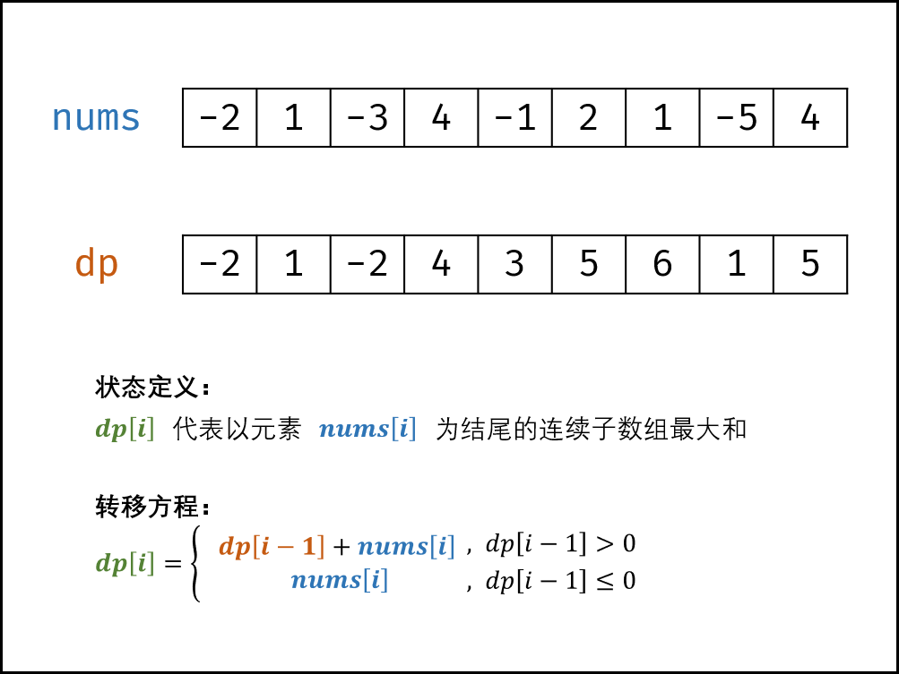{:width=500}

##### 空间复杂度降低：

- 由于 $dp[i]$ 只与 $dp[i-1]$ 和 $nums[i]$ 有关系，因此可以将原数组 $nums$ 用作 $dp$ 列表，即直接在 $nums$ 上修改即可。
- 由于省去 $dp$ 列表使用的额外空间，因此空间复杂度从 $O(N)$ 降至 $O(1)$ 。 

**复杂度分析：**

- **时间复杂度 $O(N)$ ：** 线性遍历数组 $nums$ 即可获得结果，使用 $O(N)$ 时间。
- **空间复杂度 $O(1)$ ：** 使用常数大小的额外空间。

<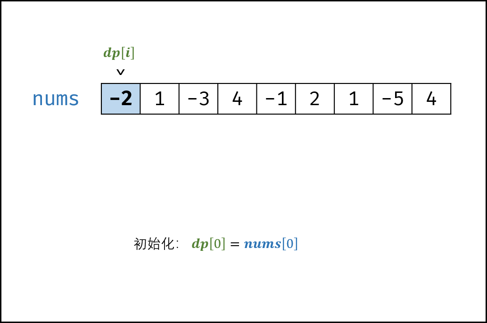,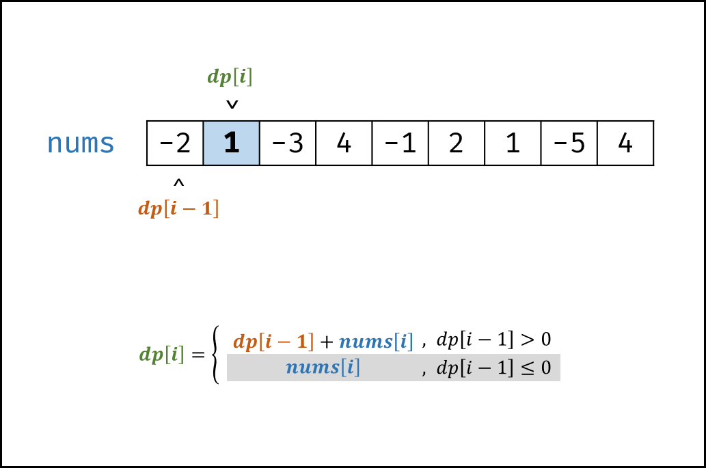,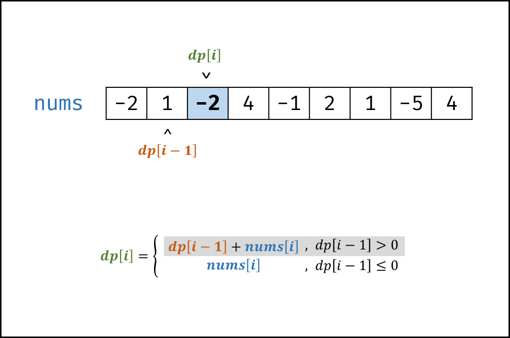,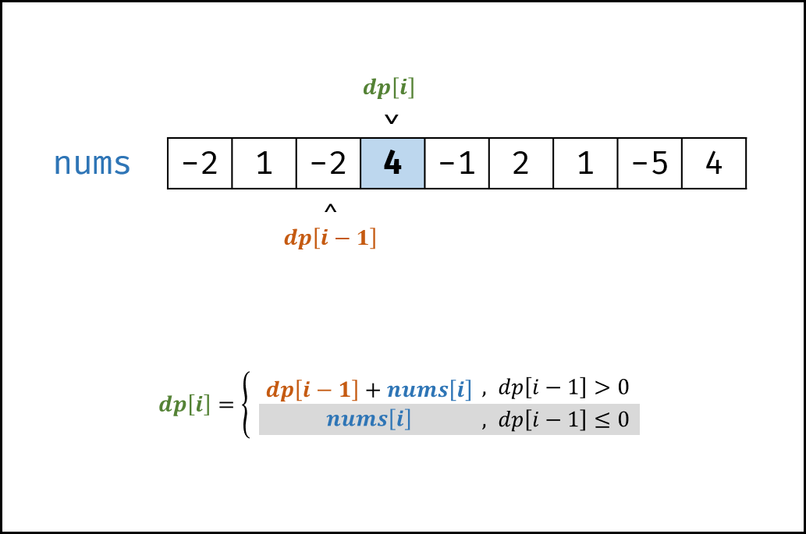,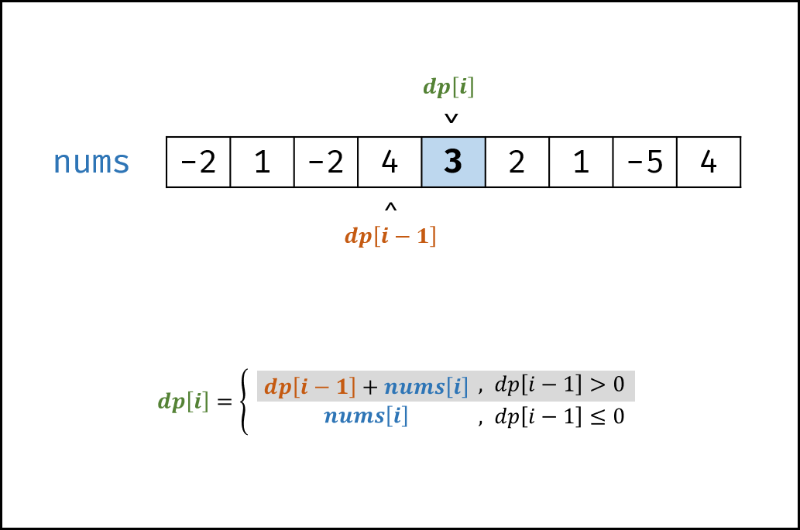,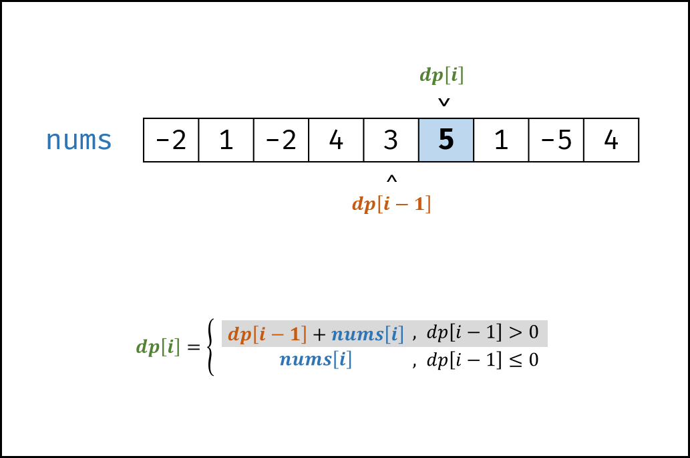,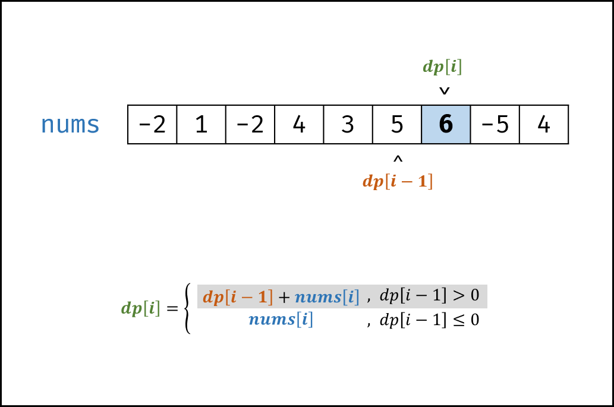,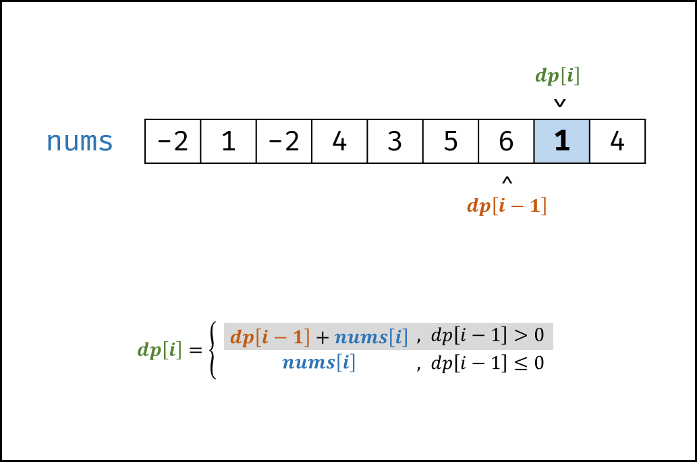,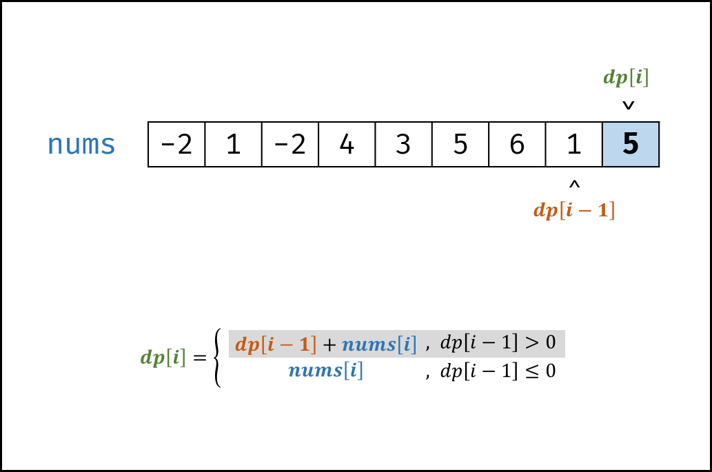,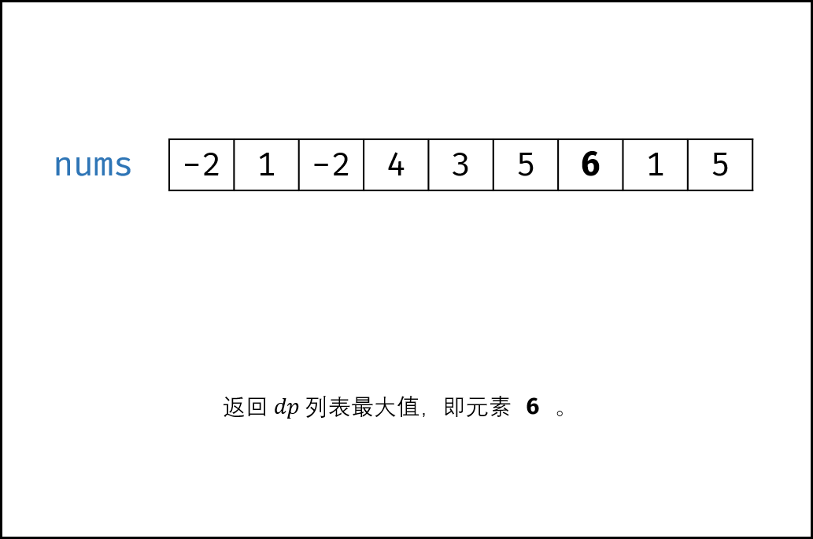>

##### 代码：

```python []
class Solution:
    def maxSubArray(self, nums: List[int]) -> int:
        for i in range(1, len(nums)):
            nums[i] += max(nums[i - 1], 0)
        return max(nums)
```

```java []
class Solution {
    public int maxSubArray(int[] nums) {
        int res = nums[0];
        for(int i = 1; i < nums.length; i++) {
            nums[i] += Math.max(nums[i - 1], 0);
            res = Math.max(res, nums[i]);
        }
        return res;
    }
}
```

## 统计信息
| 通过次数 | 提交次数 | AC比率 |
| :------: | :------: | :------: |
|    237801    |    392172    |   60.6%   |

## 提交历史
| 提交时间 | 提交结果 | 执行时间 |  内存消耗  | 语言 |
| :------: | :------: | :------: | :--------: | :--------: |
