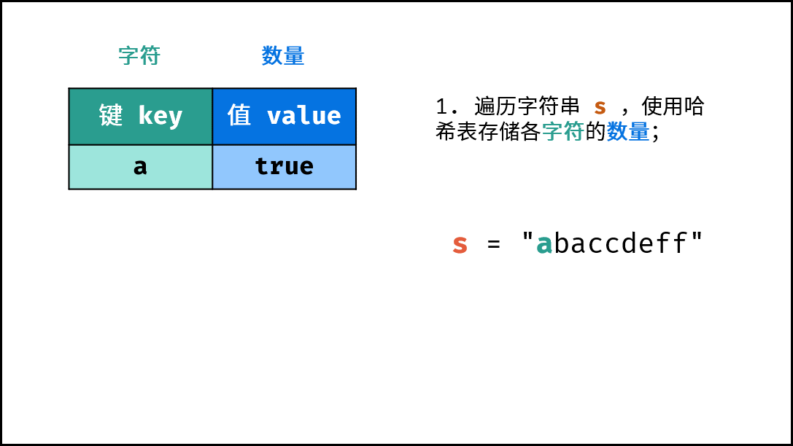

> 原文链接: https://leetcode-cn.com/problems/di-yi-ge-zhi-chu-xian-yi-ci-de-zi-fu-lcof


## 中文题目
<div><p>在字符串 s 中找出第一个只出现一次的字符。如果没有，返回一个单空格。 s 只包含小写字母。</p>

<p><strong>示例 1:</strong></p>

<pre>
输入：s = "abaccdeff"
输出：'b'
</pre>

<p><strong>示例 2:</strong></p>

<pre>
输入：s = "" 
输出：' '
</pre>

<p>&nbsp;</p>

<p><strong>限制：</strong></p>

<p><code>0 &lt;= s 的长度 &lt;= 50000</code></p>
</div>

## 通过代码
<RecoDemo>
</RecoDemo>


## 高赞题解
本题考察 **哈希表** 的使用，本文介绍 **哈希表** 和 **有序哈希表** 两种解法。其中，在字符串长度较大、重复字符很多时，“有序哈希表” 解法理论上效率更高。

#### 方法一：哈希表

1. 遍历字符串 `s` ，使用哈希表统计 “各字符数量是否 $> 1$ ”。
2. 再遍历字符串 `s` ，在哈希表中找到首个 “数量为 $1$ 的字符”，并返回。

{:width=450}

##### 算法流程：

1. **初始化：** 字典 (Python)、HashMap(Java)、map(C++)，记为 `dic` ；
2. **字符统计：** 遍历字符串 `s` 中的每个字符 `c` ；
   1. 若 `dic` 中 **不包含** 键(key) `c` ：则向 `dic` 中添加键值对 `(c, True)` ，代表字符 `c` 的数量为 $1$ ；
   2. 若 `dic` 中 **包含** 键(key) `c` ：则修改键 `c` 的键值对为 `(c, False)` ，代表字符 `c` 的数量 $> 1$ 。 
3. **查找数量为 $1$ 的字符：** 遍历字符串 `s` 中的每个字符 `c` ；
   1. 若 `dic`中键 `c` 对应的值为 `True` ：，则返回 `c` 。
4. 返回 `' '` ，代表字符串无数量为 $1$ 的字符。

<,,,,,,,,,,>

##### 复杂度分析：

- **时间复杂度 $O(N)$ ：** $N$ 为字符串 `s` 的长度；需遍历 `s` 两轮，使用 $O(N)$ ；HashMap 查找操作的复杂度为 $O(1)$ ；
- **空间复杂度 $O(1)$ ：** 由于题目指出 `s`  只包含小写字母，因此最多有 26 个不同字符，HashMap 存储需占用 $O(26) = O(1)$ 的额外空间。

##### 代码：

Python 代码中的 `not c in dic` 整体为一个布尔值； `c in dic` 为判断字典中是否含有键 `c` 。

```Python []
class Solution:
    def firstUniqChar(self, s: str) -> str:
        dic = {}
        for c in s:
            dic[c] = not c in dic
        for c in s:
            if dic[c]: return c
        return ' '
```

```Java []
class Solution {
    public char firstUniqChar(String s) {
        HashMap<Character, Boolean> dic = new HashMap<>();
        char[] sc = s.toCharArray();
        for(char c : sc)
            dic.put(c, !dic.containsKey(c));
        for(char c : sc)
            if(dic.get(c)) return c;
        return ' ';
    }
}
```

```C++ []
class Solution {
public:
    char firstUniqChar(string s) {
        unordered_map<char, bool> dic;
        for(char c : s)
            dic[c] = dic.find(c) == dic.end();
        for(char c : s)
            if(dic[c]) return c;
        return ' ';
    }
};
```

#### 方法二：有序哈希表

在哈希表的基础上，有序哈希表中的键值对是 **按照插入顺序排序** 的。基于此，可通过遍历有序哈希表，实现搜索首个 “数量为 $1$ 的字符”。

哈希表是 **去重** 的，即哈希表中键值对数量 $\leq$ 字符串 `s` 的长度。因此，相比于方法一，方法二减少了第二轮遍历的循环次数。当字符串很长（重复字符很多）时，方法二则效率更高。

##### 复杂度分析：

时间和空间复杂度均与 “方法一” 相同，而具体分析：方法一 需遍历 `s` 两轮；方法二 遍历 `s` 一轮，遍历 `dic` 一轮（ `dic` 的长度不大于 26 ）。

##### 代码：

Python 3.6 后，默认字典就是有序的，因此无需使用 `OrderedDict()` ，详情可见：[为什么Python 3.6以后字典有序并且效率更高？](https://www.cnblogs.com/xieqiankun/p/python_dict.html)

Java 使用 `LinkedHashMap` 实现有序哈希表。

由于 C++ 未提供自带的链式哈希表，因此借助一个 vector 按序存储哈希表 dic 中的 key ，第二轮遍历此 vector 即可。

```Python []
class Solution:
    def firstUniqChar(self, s: str) -> str:
        dic = collections.OrderedDict()
        for c in s:
            dic[c] = not c in dic
        for k, v in dic.items():
            if v: return k
        return ' '
```

```Python []
class Solution:
    def firstUniqChar(self, s: str) -> str:
        dic = {}
        for c in s:
            dic[c] = not c in dic
        for k, v in dic.items():
            if v: return k
        return ' '
```

```Java []
class Solution {
    public char firstUniqChar(String s) {
        Map<Character, Boolean> dic = new LinkedHashMap<>();
        char[] sc = s.toCharArray();
        for(char c : sc)
            dic.put(c, !dic.containsKey(c));
        for(Map.Entry<Character, Boolean> d : dic.entrySet()){
           if(d.getValue()) return d.getKey();
        }
        return ' ';
    }
}
```

```C++ []
class Solution {
public:
    char firstUniqChar(string s) {
        vector<char> keys;
        unordered_map<char, bool> dic;
        for(char c : s) {
            if(dic.find(c) == dic.end())
                keys.push_back(c);
            dic[c] = dic.find(c) == dic.end();
        }
        for(char c : keys) {
            if(dic[c]) return c;
        }
        return ' ';
    }
};
```

\
{:style="text-align: center;"}

欢迎您对「图解算法数据结构」提出评论、意见或期待
{:style="text-align: center;"}

## 统计信息
| 通过次数 | 提交次数 | AC比率 |
| :------: | :------: | :------: |
|    169337    |    274703    |   61.6%   |

## 提交历史
| 提交时间 | 提交结果 | 执行时间 |  内存消耗  | 语言 |
| :------: | :------: | :------: | :--------: | :--------: |
