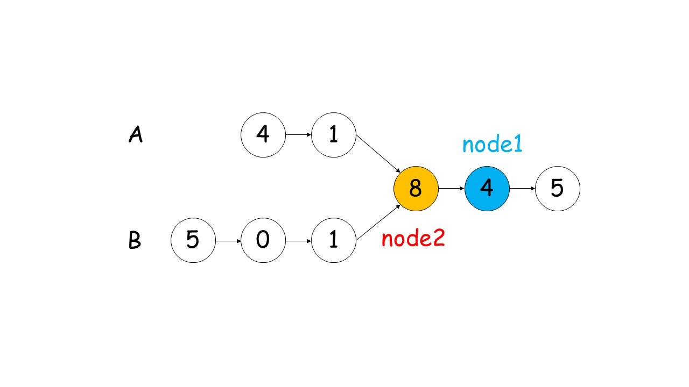
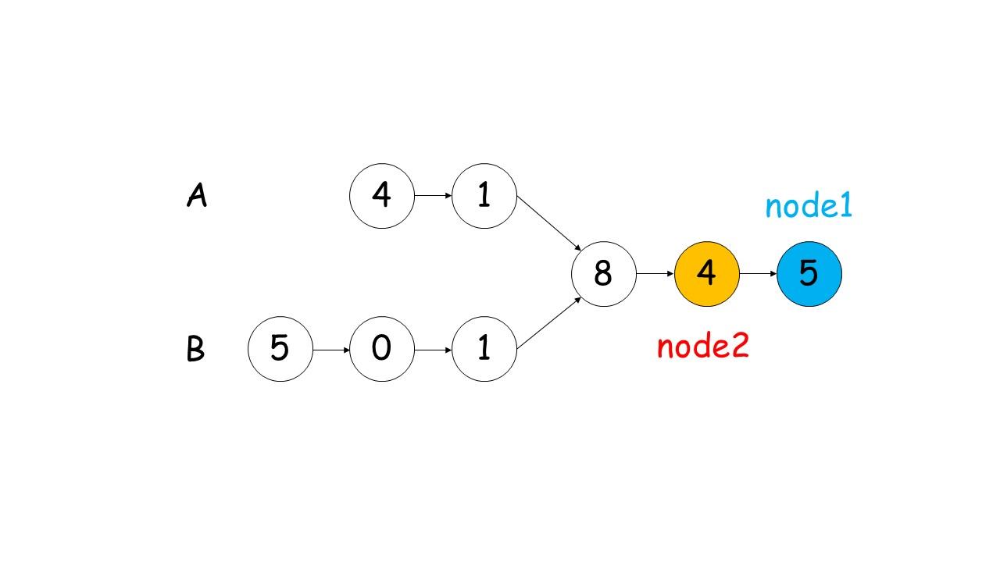
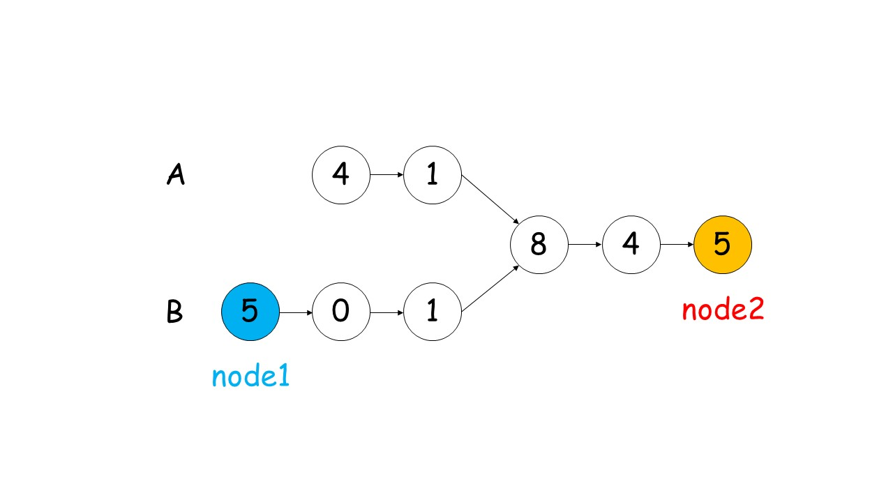
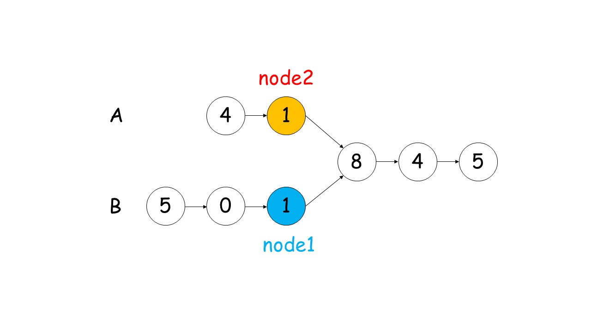
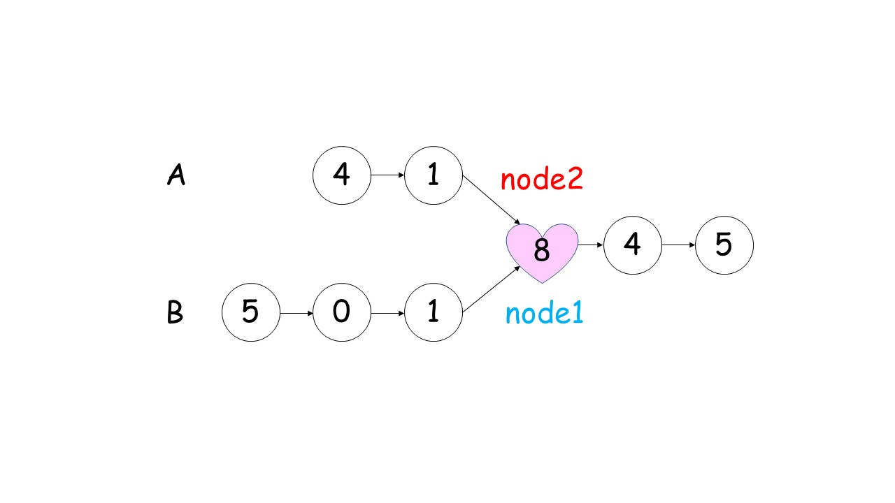

> 原文链接: https://leetcode-cn.com/problems/liang-ge-lian-biao-de-di-yi-ge-gong-gong-jie-dian-lcof


## 中文题目
<div><p>输入两个链表，找出它们的第一个公共节点。</p>

<p>如下面的两个链表<strong>：</strong></p>

<p><a href="https://assets.leetcode-cn.com/aliyun-lc-upload/uploads/2018/12/14/160_statement.png" target="_blank"></a></p>

<p>在节点 c1 开始相交。</p>

<p>&nbsp;</p>

<p><strong>示例 1：</strong></p>

<p><a href="https://assets.leetcode.com/uploads/2018/12/13/160_example_1.png" target="_blank"></a></p>

<pre><strong>输入：</strong>intersectVal = 8, listA = [4,1,8,4,5], listB = [5,0,1,8,4,5], skipA = 2, skipB = 3
<strong>输出：</strong>Reference of the node with value = 8
<strong>输入解释：</strong>相交节点的值为 8 （注意，如果两个列表相交则不能为 0）。从各自的表头开始算起，链表 A 为 [4,1,8,4,5]，链表 B 为 [5,0,1,8,4,5]。在 A 中，相交节点前有 2 个节点；在 B 中，相交节点前有 3 个节点。
</pre>

<p>&nbsp;</p>

<p><strong>示例&nbsp;2：</strong></p>

<p><a href="https://assets.leetcode.com/uploads/2018/12/13/160_example_2.png" target="_blank"></a></p>

<pre><strong>输入：</strong>intersectVal&nbsp;= 2, listA = [0,9,1,2,4], listB = [3,2,4], skipA = 3, skipB = 1
<strong>输出：</strong>Reference of the node with value = 2
<strong>输入解释：</strong>相交节点的值为 2 （注意，如果两个列表相交则不能为 0）。从各自的表头开始算起，链表 A 为 [0,9,1,2,4]，链表 B 为 [3,2,4]。在 A 中，相交节点前有 3 个节点；在 B 中，相交节点前有 1 个节点。
</pre>

<p>&nbsp;</p>

<p><strong>示例&nbsp;3：</strong></p>

<p><a href="https://assets.leetcode.com/uploads/2018/12/13/160_example_3.png" target="_blank"></a></p>

<pre><strong>输入：</strong>intersectVal = 0, listA = [2,6,4], listB = [1,5], skipA = 3, skipB = 2
<strong>输出：</strong>null
<strong>输入解释：</strong>从各自的表头开始算起，链表 A 为 [2,6,4]，链表 B 为 [1,5]。由于这两个链表不相交，所以 intersectVal 必须为 0，而 skipA 和 skipB 可以是任意值。
<strong>解释：</strong>这两个链表不相交，因此返回 null。
</pre>

<p>&nbsp;</p>

<p><strong>注意：</strong></p>

<ul>
	<li>如果两个链表没有交点，返回 <code>null</code>.</li>
	<li>在返回结果后，两个链表仍须保持原有的结构。</li>
	<li>可假定整个链表结构中没有循环。</li>
	<li>程序尽量满足 O(<em>n</em>) 时间复杂度，且仅用 O(<em>1</em>) 内存。</li>
	<li>本题与主站 160 题相同：<a href="https://leetcode-cn.com/problems/intersection-of-two-linked-lists/">https://leetcode-cn.com/problems/intersection-of-two-linked-lists/</a></li>
</ul>
</div>

## 通过代码
<RecoDemo>
</RecoDemo>


## 高赞题解
#### 解题思路：
我们使用两个指针 `node1`，`node2` 分别指向两个链表 `headA`，`headB` 的头结点，然后同时分别逐结点遍历，当 `node1` 到达链表 `headA` 的末尾时，重新定位到链表 `headB` 的头结点；当 `node2` 到达链表 `headB` 的末尾时，重新定位到链表 `headA` 的头结点。

这样，当它们相遇时，所指向的结点就是第一个公共结点。

<,,,,,,,,>


#### 代码：

```python []
class Solution:
    def getIntersectionNode(self, headA: ListNode, headB: ListNode) -> ListNode:
        node1, node2 = headA, headB
        
        while node1 != node2:
            node1 = node1.next if node1 else headB
            node2 = node2.next if node2 else headA

        return node1
```
```c++ []
class Solution {
public:
    ListNode *getIntersectionNode(ListNode *headA, ListNode *headB) {
        ListNode *node1 = headA;
        ListNode *node2 = headB;
        
        while (node1 != node2) {
            node1 = node1 != NULL ? node1->next : headB;
            node2 = node2 != NULL ? node2->next : headA;
        }
        return node1;
    }
};
```


#### 复杂度分析
- 时间复杂度：$O(M+N)$。
- 空间复杂度：$O(1)$。

欢迎批评指正~

## 统计信息
| 通过次数 | 提交次数 | AC比率 |
| :------: | :------: | :------: |
|    187300    |    287670    |   65.1%   |

## 提交历史
| 提交时间 | 提交结果 | 执行时间 |  内存消耗  | 语言 |
| :------: | :------: | :------: | :--------: | :--------: |
