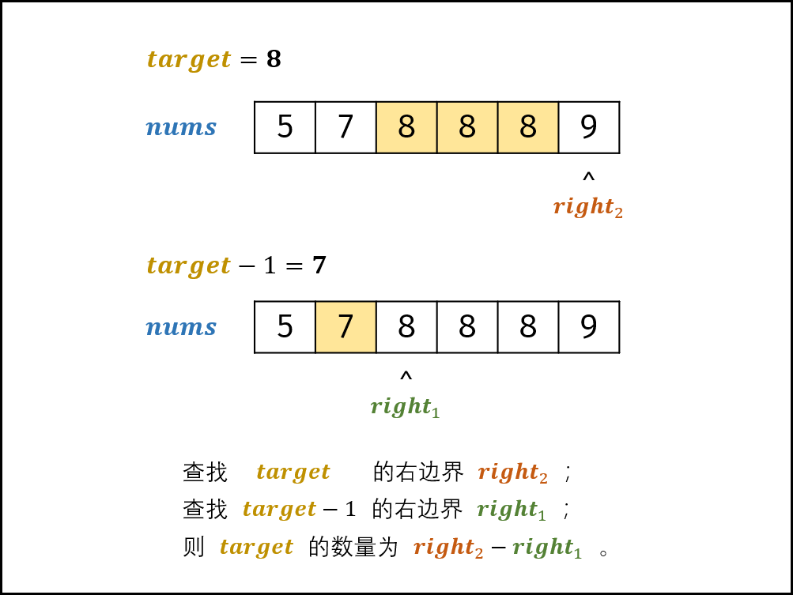

> 原文链接: https://leetcode-cn.com/problems/zai-pai-xu-shu-zu-zhong-cha-zhao-shu-zi-lcof


## 中文题目
<div><p>统计一个数字在排序数组中出现的次数。</p>

<p> </p>

<p><strong>示例 1:</strong></p>

<pre>
<strong>输入:</strong> nums = [<code>5,7,7,8,8,10]</code>, target = 8
<strong>输出:</strong> 2</pre>

<p><strong>示例 2:</strong></p>

<pre>
<strong>输入:</strong> nums = [<code>5,7,7,8,8,10]</code>, target = 6
<strong>输出:</strong> 0</pre>

<p> </p>

<p><strong>提示：</strong></p>

<ul>
	<li><code>0 <= nums.length <= 10<sup>5</sup></code></li>
	<li><code>-10<sup>9</sup> <= nums[i] <= 10<sup>9</sup></code></li>
	<li><code>nums</code> 是一个非递减数组</li>
	<li><code>-10<sup>9</sup> <= target <= 10<sup>9</sup></code></li>
</ul>

<p> </p>

<p><strong>注意：</strong>本题与主站 34 题相同（仅返回值不同）：<a href="https://leetcode-cn.com/problems/find-first-and-last-position-of-element-in-sorted-array/">https://leetcode-cn.com/problems/find-first-and-last-position-of-element-in-sorted-array/</a></p>
</div>

## 通过代码
<RecoDemo>
</RecoDemo>


## 高赞题解
#### 解题思路：

> 排序数组中的搜索问题，首先想到 **二分法** 解决。

排序数组 $nums$ 中的所有数字 $target$ 形成一个窗口，记窗口的 **左 / 右边界** 索引分别为 $left$ 和 $right$ ，分别对应窗口左边 / 右边的首个元素。

本题要求统计数字 $target$ 的出现次数，可转化为：使用二分法分别找到 **左边界 $left$** 和 **右边界 $right$** ，易得数字 $target$ 的数量为 $right - left - 1$ 。

{:width=500}

##### 算法解析：

1. **初始化：** 左边界 $i = 0$ ，右边界 $j = len(nums) - 1$ 。
2. **循环二分：** 当闭区间 $[i, j]$ 无元素时跳出；
   1. 计算中点 $m = (i + j) / 2$ （向下取整）；
   2. 若 $nums[m] < target$ ，则 $target$ 在闭区间 $[m + 1, j]$ 中，因此执行 $i = m + 1$；
   3. 若 $nums[m] > target$ ，则 $target$ 在闭区间 $[i, m - 1]$ 中，因此执行 $j = m - 1$；
   4. 若 $nums[m] = target$ ，则右边界 $right$ 在闭区间 $[m+1, j]$ 中；左边界 $left$ 在闭区间 $[i, m-1]$ 中。因此分为以下两种情况：
      1. 若查找 **右边界 $right$** ，则执行 $i = m + 1$ ；（跳出时 $i$ 指向右边界）
      2. 若查找 **左边界 $left$** ，则执行 $j = m - 1$ ；（跳出时 $j$ 指向左边界）
3. **返回值：** 应用两次二分，分别查找 $right$ 和 $left$ ，最终返回 $right - left - 1$ 即可。

##### 效率优化：

> 以下优化基于：查找完右边界 $right = i$ 后，则 $nums[j]$ 指向最右边的 $target$ （若存在）。

1. 查找完右边界后，可用 $nums[j] = j$ 判断数组中是否包含 $target$ ，若不包含则直接提前返回 $0$ ，无需后续查找左边界。
2. 查找完右边界后，左边界 $left$ 一定在闭区间 $[0, j]$ 中，因此直接从此区间开始二分查找即可。

<,,,,,>

##### 复杂度分析：

- **时间复杂度 $O(log N)$ ：** 二分法为对数级别复杂度。
- **空间复杂度 $O(1)$ ：** 几个变量使用常数大小的额外空间。

##### 代码：

可将 $nums[m] = target$ 情况合并至其他两种情况中。

```python []
class Solution:
    def search(self, nums: [int], target: int) -> int:
        # 搜索右边界 right
        i, j = 0, len(nums) - 1
        while i <= j:
            m = (i + j) // 2
            if nums[m] <= target: i = m + 1
            else: j = m - 1
        right = i
        # 若数组中无 target ，则提前返回
        if j >= 0 and nums[j] != target: return 0
        # 搜索左边界 left
        i = 0
        while i <= j:
            m = (i + j) // 2
            if nums[m] < target: i = m + 1
            else: j = m - 1
        left = j
        return right - left - 1
```

```java []
class Solution {
    public int search(int[] nums, int target) {
        // 搜索右边界 right
        int i = 0, j = nums.length - 1;
        while(i <= j) {
            int m = (i + j) / 2;
            if(nums[m] <= target) i = m + 1;
            else j = m - 1;
        }
        int right = i;
        // 若数组中无 target ，则提前返回
        if(j >= 0 && nums[j] != target) return 0;
        // 搜索左边界 right
        i = 0; j = nums.length - 1;
        while(i <= j) {
            int m = (i + j) / 2;
            if(nums[m] < target) i = m + 1;
            else j = m - 1;
        }
        int left = j;
        return right - left - 1;
    }
}
```

以上代码显得比较臃肿（两轮二分查找代码冗余）。为简化代码，可将**二分查找右边界 $right$ 的代码** 封装至函数 `helper()` 。

{:width=450}

如上图所示，由于数组 $nums$ 中元素都为整数，因此可以分别二分查找 $target$ 和 $target - 1$ 的右边界，将两结果相减并返回即可。

> 本质上看， `helper()` 函数旨在查找数字 $tar$ 在数组 $nums$ 中的 **插入点** ，且若数组中存在值相同的元素，则插入到这些元素的右边。

```python []
class Solution:
    def search(self, nums: [int], target: int) -> int:
        def helper(tar):
            i, j = 0, len(nums) - 1
            while i <= j:
                m = (i + j) // 2
                if nums[m] <= tar: i = m + 1
                else: j = m - 1
            return i
        return helper(target) - helper(target - 1)
```

```java []
class Solution {
    public int search(int[] nums, int target) {
        return helper(nums, target) - helper(nums, target - 1);
    }
    int helper(int[] nums, int tar) {
        int i = 0, j = nums.length - 1;
        while(i <= j) {
            int m = (i + j) / 2;
            if(nums[m] <= tar) i = m + 1;
            else j = m - 1;
        }
        return i;
    }
}
```

> 感谢评论区大佬 @LittleSeven 提出的解法优化。

## 统计信息
| 通过次数 | 提交次数 | AC比率 |
| :------: | :------: | :------: |
|    208184    |    388155    |   53.6%   |

## 提交历史
| 提交时间 | 提交结果 | 执行时间 |  内存消耗  | 语言 |
| :------: | :------: | :------: | :--------: | :--------: |
