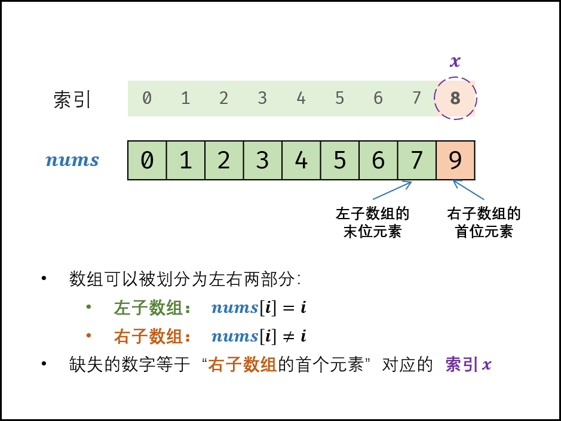

> 原文链接: https://leetcode-cn.com/problems/que-shi-de-shu-zi-lcof


## 中文题目
<div><p>一个长度为n-1的递增排序数组中的所有数字都是唯一的，并且每个数字都在范围0～n-1之内。在范围0～n-1内的n个数字中有且只有一个数字不在该数组中，请找出这个数字。</p>

<p>&nbsp;</p>

<p><strong>示例 1:</strong></p>

<pre><strong>输入:</strong> [0,1,3]
<strong>输出:</strong> 2
</pre>

<p><strong>示例&nbsp;2:</strong></p>

<pre><strong>输入:</strong> [0,1,2,3,4,5,6,7,9]
<strong>输出:</strong> 8</pre>

<p>&nbsp;</p>

<p><strong>限制：</strong></p>

<p><code>1 &lt;= 数组长度 &lt;= 10000</code></p>
</div>

## 通过代码
<RecoDemo>
</RecoDemo>


## 高赞题解
#### 解题思路：

- 排序数组中的搜索问题，首先想到 **二分法** 解决。
- 根据题意，数组可以按照以下规则划分为两部分。
  - **左子数组：** $nums[i] = i$ ；
  - **右子数组：** $nums[i] \ne i$ ；
- 缺失的数字等于 **“右子数组的首位元素”** 对应的索引；因此考虑使用二分法查找 “右子数组的首位元素” 。

{:width=500}

##### 算法解析：

1. **初始化：** 左边界 $i = 0$ ，右边界 $j = len(nums) - 1$ ；代表闭区间 $[i, j]$ 。
2. **循环二分：** 当 $i \leq j$ 时循环 *（即当闭区间 $[i, j]$ 为空时跳出）* ；
   1. 计算中点 $m = (i + j) // 2$ ，其中 "$//$" 为向下取整除法；
   2. 若 $nums[m] = m$ ，则 “右子数组的首位元素” 一定在闭区间 $[m + 1, j]$ 中，因此执行 $i = m + 1$；
   3. 若 $nums[m] \ne m$ ，则 “左子数组的末位元素” 一定在闭区间 $[i, m - 1]$ 中，因此执行 $j = m - 1$；
3. **返回值：** 跳出时，变量 $i$ 和 $j$ 分别指向 “右子数组的首位元素” 和 “左子数组的末位元素” 。因此返回 $i$ 即可。

<,,,,,>

##### 复杂度分析：

- **时间复杂度 $O(log N)$：** 二分法为对数级别复杂度。
- **空间复杂度 $O(1)$：** 几个变量使用常数大小的额外空间。

#### 代码：

```Python []
class Solution:
    def missingNumber(self, nums: List[int]) -> int:
        i, j = 0, len(nums) - 1
        while i <= j:
            m = (i + j) // 2
            if nums[m] == m: i = m + 1
            else: j = m - 1
        return i
```

```Java []
class Solution {
    public int missingNumber(int[] nums) {
        int i = 0, j = nums.length - 1;
        while(i <= j) {
            int m = (i + j) / 2;
            if(nums[m] == m) i = m + 1;
            else j = m - 1;
        }
        return i;
    }
}
```

## 统计信息
| 通过次数 | 提交次数 | AC比率 |
| :------: | :------: | :------: |
|    185457    |    414209    |   44.8%   |

## 提交历史
| 提交时间 | 提交结果 | 执行时间 |  内存消耗  | 语言 |
| :------: | :------: | :------: | :--------: | :--------: |
