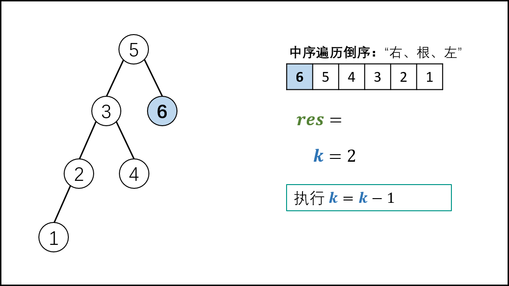

> 原文链接: https://leetcode-cn.com/problems/er-cha-sou-suo-shu-de-di-kda-jie-dian-lcof


## 中文题目
<div><p>给定一棵二叉搜索树，请找出其中第k大的节点。</p>

<p>&nbsp;</p>

<p><strong>示例 1:</strong></p>

<pre><strong>输入:</strong> root = [3,1,4,null,2], k = 1
   3
  / \
 1   4
  \
&nbsp;  2
<strong>输出:</strong> 4</pre>

<p><strong>示例 2:</strong></p>

<pre><strong>输入:</strong> root = [5,3,6,2,4,null,null,1], k = 3
       5
      / \
     3   6
    / \
   2   4
  /
 1
<strong>输出:</strong> 4</pre>

<p>&nbsp;</p>

<p><strong>限制：</strong></p>

<p>1 &le; k &le; 二叉搜索树元素个数</p>
</div>

## 通过代码
<RecoDemo>
</RecoDemo>


## 高赞题解
#### 解题思路：

> 本文解法基于此性质：二叉搜索树的中序遍历为 **递增序列** 。

- 根据以上性质，易得二叉搜索树的 **中序遍历倒序** 为 **递减序列** 。
- 因此，求 “二叉搜索树第 $k$ 大的节点” 可转化为求 “此树的中序遍历倒序的第 $k$ 个节点”。

{:width=450}

> **中序遍历** 为 “左、根、右” 顺序，递归法代码如下：

```Python []
# 打印中序遍历
def dfs(root):
    if not root: return
    dfs(root.left)  # 左
    print(root.val) # 根
    dfs(root.right) # 右
```

```Java []
// 打印中序遍历
void dfs(TreeNode root) {
    if(root == null) return;
    dfs(root.left); // 左
    System.out.println(root.val); // 根
    dfs(root.right); // 右
}
```

> **中序遍历的倒序** 为 “右、根、左” 顺序，递归法代码如下：

```Python []
# 打印中序遍历倒序
def dfs(root):
    if not root: return
    dfs(root.right) # 右
    print(root.val) # 根
    dfs(root.left)  # 左
```

```Java []
// 打印中序遍历倒序
void dfs(TreeNode root) {
    if(root == null) return;
    dfs(root.right); // 右
    System.out.println(root.val); // 根
    dfs(root.left); // 左
}
```

- 为求第 $k$ 个节点，需要实现以下 **三项工作** ：
  1. 递归遍历时计数，统计当前节点的序号；
  2. 递归到第 $k$ 个节点时，应记录结果 $res$ ；
  3. 记录结果后，后续的遍历即失去意义，应提前终止（即返回）。

##### 递归解析：

1. **终止条件：** 当节点 $root$ 为空（越过叶节点），则直接返回；
2. **递归右子树：** 即 $dfs(root.right)$ ；
3. **三项工作：**
   1. 提前返回： 若 $k = 0$ ，代表已找到目标节点，无需继续遍历，因此直接返回；
   2. 统计序号： 执行 $k = k - 1$ （即从 $k$ 减至 $0$ ）；
   3. 记录结果： 若 $k = 0$ ，代表当前节点为第 $k$ 大的节点，因此记录 $res = root.val$ ；
4. **递归左子树：** 即 $dfs(root.left)$ ；

<,,,,,,>

##### 复杂度分析：

- **时间复杂度 $O(N)$ ：** 当树退化为链表时（全部为右子节点），无论 $k$ 的值大小，递归深度都为 $N$ ，占用 $O(N)$ 时间。
- **空间复杂度 $O(N)$ ：**  当树退化为链表时（全部为右子节点），系统使用 $O(N)$ 大小的栈空间。

#### 代码：

> 题目指出：$1 \leq k \leq N$ （二叉搜索树节点个数）；因此无需考虑 $k > N$ 的情况。
> 若考虑，可以在中序遍历完成后判断 $k > 0$ 是否成立，若成立则说明 $k > N$ 。

```Python []
class Solution:
    def kthLargest(self, root: TreeNode, k: int) -> int:
        def dfs(root):
            if not root: return
            dfs(root.right)
            if self.k == 0: return
            self.k -= 1
            if self.k == 0: self.res = root.val
            dfs(root.left)

        self.k = k
        dfs(root)
        return self.res
```

```Java []
class Solution {
    int res, k;
    public int kthLargest(TreeNode root, int k) {
        this.k = k;
        dfs(root);
        return res;
    }
    void dfs(TreeNode root) {
        if(root == null) return;
        dfs(root.right);
        if(k == 0) return;
        if(--k == 0) res = root.val;
        dfs(root.left);
    }
}
```

## 统计信息
| 通过次数 | 提交次数 | AC比率 |
| :------: | :------: | :------: |
|    174526    |    230123    |   75.8%   |

## 提交历史
| 提交时间 | 提交结果 | 执行时间 |  内存消耗  | 语言 |
| :------: | :------: | :------: | :--------: | :--------: |
