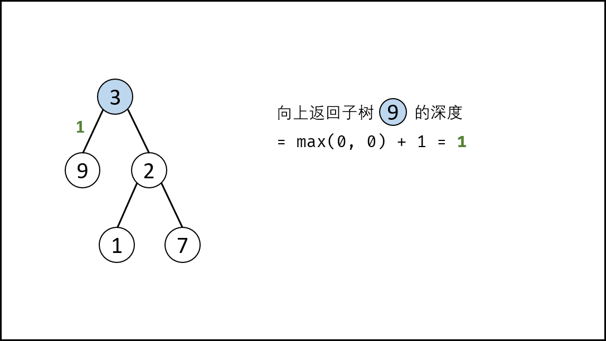
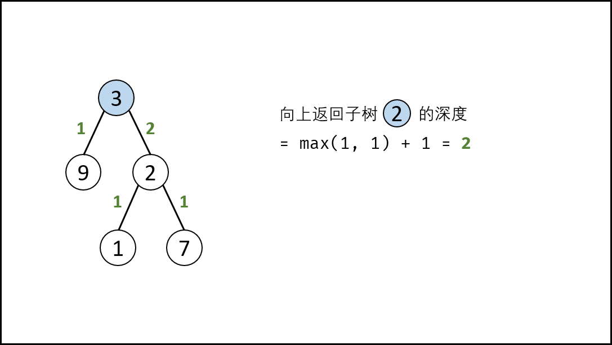
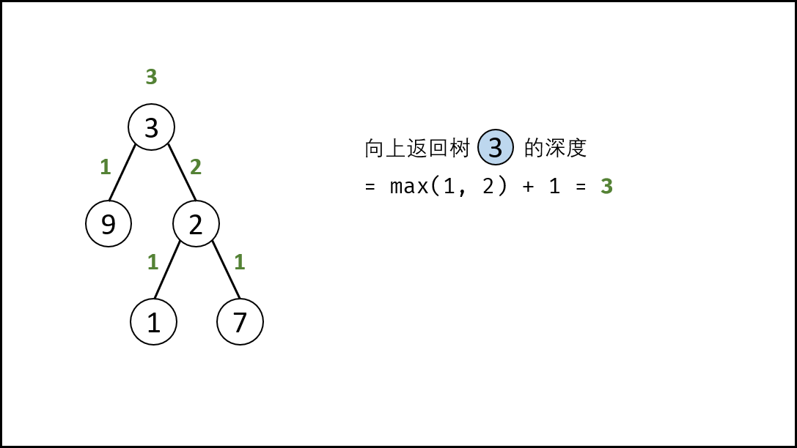

> 原文链接: https://leetcode-cn.com/problems/er-cha-shu-de-shen-du-lcof


## 中文题目
<div><p>输入一棵二叉树的根节点，求该树的深度。从根节点到叶节点依次经过的节点（含根、叶节点）形成树的一条路径，最长路径的长度为树的深度。</p>

<p>例如：</p>

<p>给定二叉树 <code>[3,9,20,null,null,15,7]</code>，</p>

<pre>    3
   / \
  9  20
    /  \
   15   7</pre>

<p>返回它的最大深度&nbsp;3 。</p>

<p>&nbsp;</p>

<p><strong>提示：</strong></p>

<ol>
	<li><code>节点总数 &lt;= 10000</code></li>
</ol>

<p>注意：本题与主站 104&nbsp;题相同：<a href="https://leetcode-cn.com/problems/maximum-depth-of-binary-tree/">https://leetcode-cn.com/problems/maximum-depth-of-binary-tree/</a></p>
</div>

## 通过代码
<RecoDemo>
</RecoDemo>


## 高赞题解
> 树的遍历方式总体分为两类：深度优先搜索（DFS）、广度优先搜索（BFS）；
> - **常见的 DFS ：** 先序遍历、中序遍历、后序遍历；
> - **常见的 BFS ：** 层序遍历（即按层遍历）。

- 求树的深度需要遍历树的所有节点，本文将介绍基于 **后序遍历（DFS）** 和 **层序遍历（BFS）** 的两种解法。

#### 方法一：后序遍历（DFS）

- 树的后序遍历 / 深度优先搜索往往利用 **递归** 或 **栈** 实现，本文使用递归实现。
- **关键点：** 此树的深度和其左（右）子树的深度之间的关系。显然，**此树的深度** 等于 **左子树的深度** 与 **右子树的深度** 中的 **最大值** $+1$ 。

{:width=450}

##### 算法解析：

1. **终止条件：** 当 `root​` 为空，说明已越过叶节点，因此返回 深度 $0$ 。
2. **递推工作：** 本质上是对树做后序遍历。
   1. 计算节点 `root​` 的 **左子树的深度** ，即调用 `maxDepth(root.left)`；
   2. 计算节点 `root​` 的 **右子树的深度** ，即调用 `maxDepth(root.right)`；
3. **返回值：** 返回 **此树的深度** ，即 `max(maxDepth(root.left), maxDepth(root.right)) + 1`。

<,,,,,,,,,>

##### 复杂度分析：

- **时间复杂度 $O(N)$ ：** $N$ 为树的节点数量，计算树的深度需要遍历所有节点。
- **空间复杂度 $O(N)$ ：** 最差情况下（当树退化为链表时），递归深度可达到 $N$ 。

```python []
class Solution:
    def maxDepth(self, root: TreeNode) -> int:
        if not root: return 0
        return max(self.maxDepth(root.left), self.maxDepth(root.right)) + 1
```

```java []
class Solution {
    public int maxDepth(TreeNode root) {
        if(root == null) return 0;
        return Math.max(maxDepth(root.left), maxDepth(root.right)) + 1;
    }
}
```

#### 方法二：层序遍历（BFS）

- 树的层序遍历 / 广度优先搜索往往利用 **队列** 实现。
- **关键点：** 每遍历一层，则计数器 $+1$ ，直到遍历完成，则可得到树的深度。

##### 算法解析：

1. **特例处理：** 当 `root​` 为空，直接返回 深度 $0$ 。
2. **初始化：** 队列 `queue` （加入根节点  `root` ），计数器 `res = 0`。
3. **循环遍历：** 当 `queue` 为空时跳出。
   1. 初始化一个空列表 `tmp` ，用于临时存储下一层节点；
   2. 遍历队列： 遍历 `queue` 中的各节点 `node` ，并将其左子节点和右子节点加入 `tmp`；
   3. 更新队列： 执行 `queue = tmp` ，将下一层节点赋值给 `queue`；
   4. 统计层数： 执行 `res += 1` ，代表层数加 $1$；
4. **返回值：** 返回 `res` 即可。

<,,,,,>

##### 复杂度分析：

- **时间复杂度 $O(N)$ ：** $N$ 为树的节点数量，计算树的深度需要遍历所有节点。
- **空间复杂度 $O(N)$ ：** 最差情况下（当树平衡时），队列 `queue` 同时存储 $N/2$ 个节点。



```python []
class Solution:
    def maxDepth(self, root: TreeNode) -> int:
        if not root: return 0
        queue, res = [root], 0
        while queue:
            tmp = []
            for node in queue:
                if node.left: tmp.append(node.left)
                if node.right: tmp.append(node.right)
            queue = tmp
            res += 1
        return res
```

```java []
class Solution {
    public int maxDepth(TreeNode root) {
        if(root == null) return 0;
        List<TreeNode> queue = new LinkedList<>() {{ add(root); }}, tmp;
        int res = 0;
        while(!queue.isEmpty()) {
            tmp = new LinkedList<>();
            for(TreeNode node : queue) {
                if(node.left != null) tmp.add(node.left);
                if(node.right != null) tmp.add(node.right);
            }
            queue = tmp;
            res++;
        }
        return res;
    }
}
```

## 统计信息
| 通过次数 | 提交次数 | AC比率 |
| :------: | :------: | :------: |
|    189060    |    239179    |   79.0%   |

## 提交历史
| 提交时间 | 提交结果 | 执行时间 |  内存消耗  | 语言 |
| :------: | :------: | :------: | :--------: | :--------: |
