> 原文链接: https://leetcode-cn.com/problems/ping-heng-er-cha-shu-lcof


## 中文题目
<div><p>输入一棵二叉树的根节点，判断该树是不是平衡二叉树。如果某二叉树中任意节点的左右子树的深度相差不超过1，那么它就是一棵平衡二叉树。</p>

<p> </p>

<p><strong>示例 1:</strong></p>

<p>给定二叉树 <code>[3,9,20,null,null,15,7]</code></p>

<pre>
    3
   / \
  9  20
    /  \
   15   7</pre>

<p>返回 <code>true</code> 。<br />
<br />
<strong>示例 2:</strong></p>

<p>给定二叉树 <code>[1,2,2,3,3,null,null,4,4]</code></p>

<pre>
       1
      / \
     2   2
    / \
   3   3
  / \
 4   4
</pre>

<p>返回 <code>false</code> 。</p>

<p> </p>

<p><strong>限制：</strong></p>

<ul>
	<li><code>0 <= 树的结点个数 <= 10000</code></li>
</ul>

<p>注意：本题与主站 110 题相同：<a href="https://leetcode-cn.com/problems/balanced-binary-tree/">https://leetcode-cn.com/problems/balanced-binary-tree/</a></p>

<p> </p>
</div>

## 通过代码
<RecoDemo>
</RecoDemo>


## 高赞题解
> 此题为 [面试题55 - I. 二叉树的深度](https://leetcode-cn.com/problems/er-cha-shu-de-shen-du-lcof/solution/mian-shi-ti-55-i-er-cha-shu-de-shen-du-xian-xu-bia/) 的拓展，建议先做上一题。

以下两种方法均基于以下性质推出： **此树的深度** 等于 **左子树的深度** 与 **右子树的深度** 中的 **最大值** $+1$ 。

{:width=450}

#### 方法一：后序遍历 + 剪枝 （从底至顶）

> 此方法为本题的最优解法，但剪枝的方法不易第一时间想到。

思路是对二叉树做后序遍历，从底至顶返回子树深度，若判定某子树不是平衡树则 “剪枝” ，直接向上返回。

##### 算法流程：

**`recur(root)` 函数：**

- **返回值：**
  1. 当节点`root` 左 / 右子树的深度差 $\leq 1$ ：则返回当前子树的深度，即节点 `root` 的左 / 右子树的深度最大值 $+1$ （ `max(left, right) + 1` ）；
  2. 当节点`root` 左 / 右子树的深度差 $> 2$ ：则返回 $-1$ ，代表 **此子树不是平衡树** 。
- **终止条件：**
  1. 当 `root` 为空：说明越过叶节点，因此返回高度 $0$ ；
  2. 当左（右）子树深度为 $-1$ ：代表此树的 **左（右）子树** 不是平衡树，因此剪枝，直接返回 $-1$ ；

**`isBalanced(root)` 函数：**

- **返回值：** 若 `recur(root) != -1` ，则说明此树平衡，返回 $true$ ； 否则返回 $false$ 。

<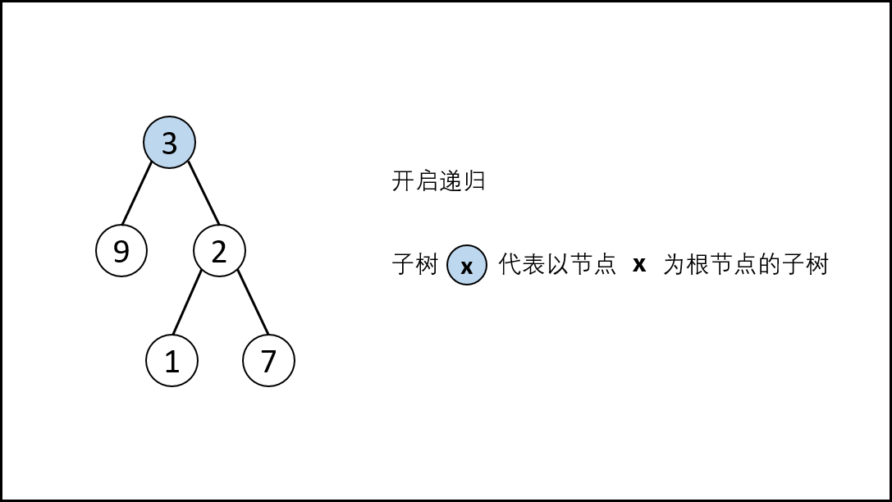,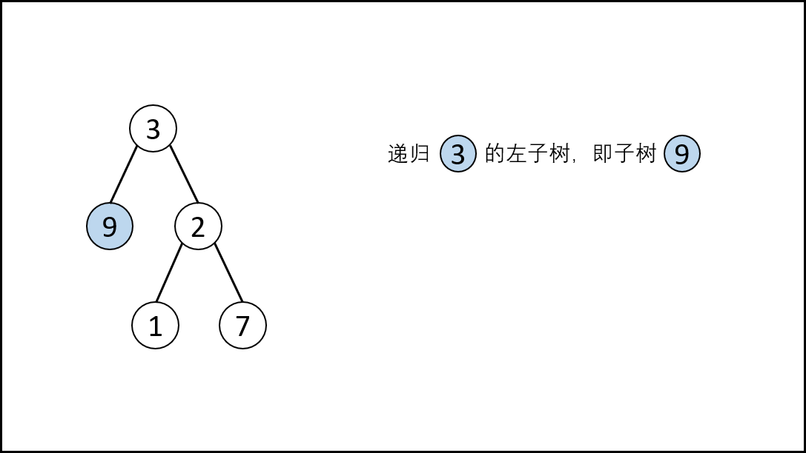,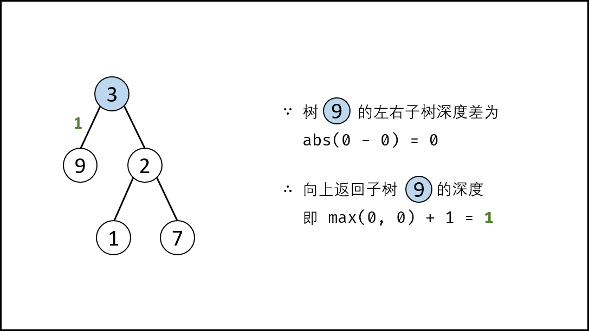,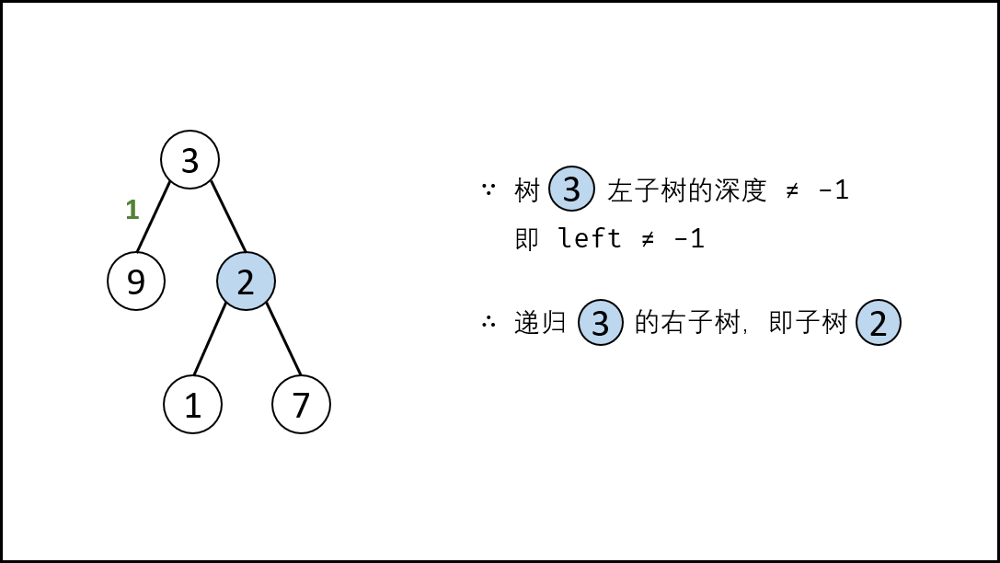,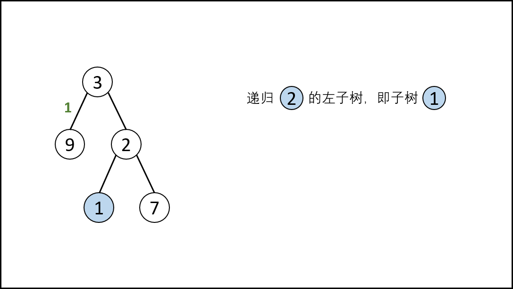,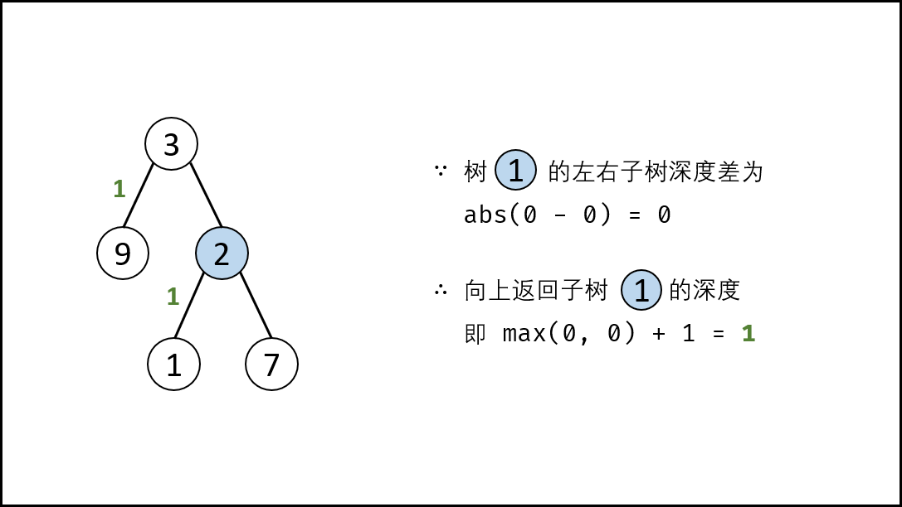,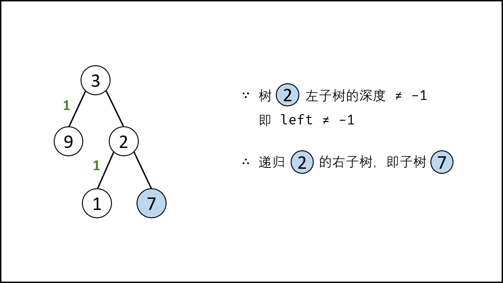,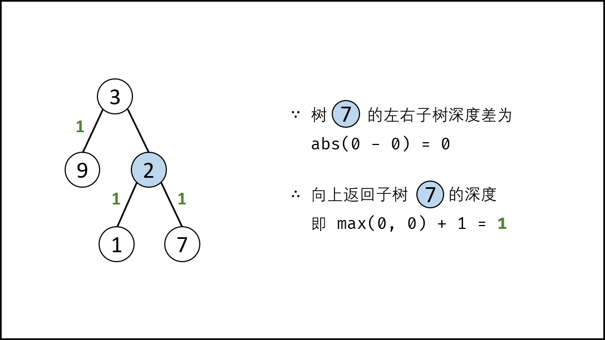,,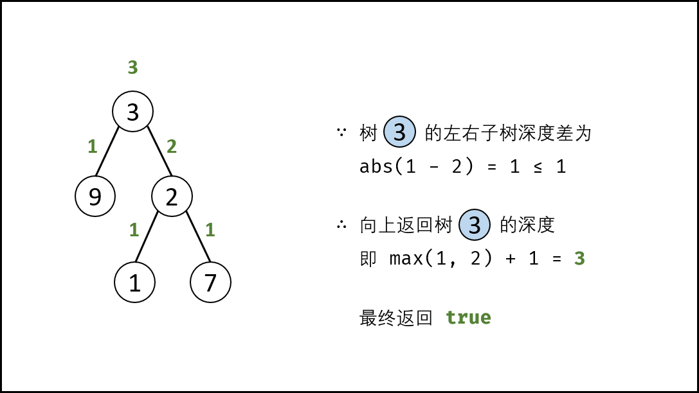>

##### 复杂度分析：

- **时间复杂度 $O(N)$：** $N$ 为树的节点数；最差情况下，需要递归遍历树的所有节点。
- **空间复杂度 $O(N)$：** 最差情况下（树退化为链表时），系统递归需要使用 $O(N)$ 的栈空间。

##### 代码：

```python []
class Solution:
    def isBalanced(self, root: TreeNode) -> bool:
        def recur(root):
            if not root: return 0
            left = recur(root.left)
            if left == -1: return -1
            right = recur(root.right)
            if right == -1: return -1
            return max(left, right) + 1 if abs(left - right) <= 1 else -1

        return recur(root) != -1
```

```java []
class Solution {
    public boolean isBalanced(TreeNode root) {
        return recur(root) != -1;
    }

    private int recur(TreeNode root) {
        if (root == null) return 0;
        int left = recur(root.left);
        if(left == -1) return -1;
        int right = recur(root.right);
        if(right == -1) return -1;
        return Math.abs(left - right) < 2 ? Math.max(left, right) + 1 : -1;
    }
}
```

#### 方法二：先序遍历 + 判断深度 （从顶至底）

> 此方法容易想到，但会产生大量重复计算，时间复杂度较高。

思路是构造一个获取当前子树的深度的函数 `depth(root)` （即 [面试题55 - I. 二叉树的深度](https://leetcode-cn.com/problems/er-cha-shu-de-shen-du-lcof/solution/mian-shi-ti-55-i-er-cha-shu-de-shen-du-xian-xu-bia/) ），通过比较某子树的左右子树的深度差 `abs(depth(root.left) - depth(root.right)) <= 1` 是否成立，来判断某子树是否是二叉平衡树。若所有子树都平衡，则此树平衡。

##### 算法流程：

**`isBalanced(root)` 函数：** 判断树 `root` 是否平衡

- **特例处理：** 若树根节点 `root` 为空，则直接返回 $true$ ；
- **返回值：** 所有子树都需要满足平衡树性质，因此以下三者使用与逻辑 $\&\&$ 连接；
  1. `abs(self.depth(root.left) - self.depth(root.right)) <= 1` ：判断 **当前子树** 是否是平衡树；
  2. `self.isBalanced(root.left)` ： 先序遍历递归，判断 **当前子树的左子树** 是否是平衡树；
  3. `self.isBalanced(root.right)` ： 先序遍历递归，判断 **当前子树的右子树** 是否是平衡树；

**`depth(root)` 函数：** 计算树 `root` 的深度

- **终止条件：** 当 `root` 为空，即越过叶子节点，则返回高度 $0$ ；
- **返回值：** 返回左 / 右子树的深度的最大值 $+1$ 。

<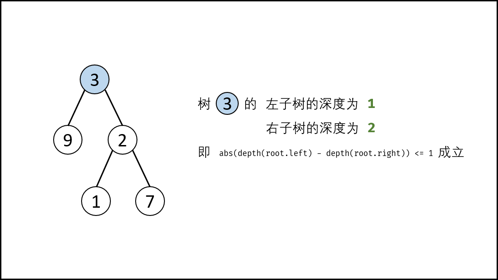,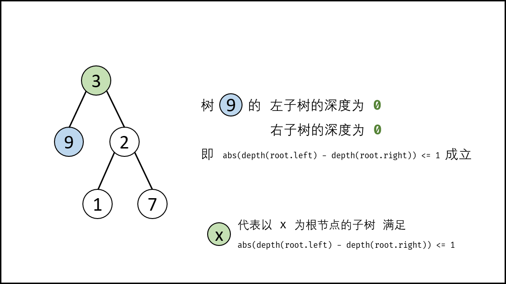,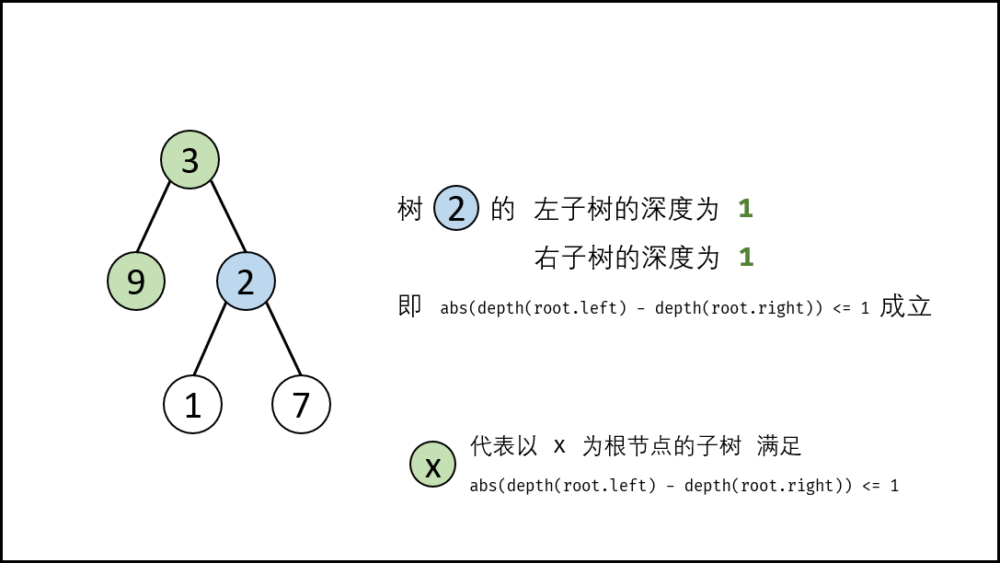,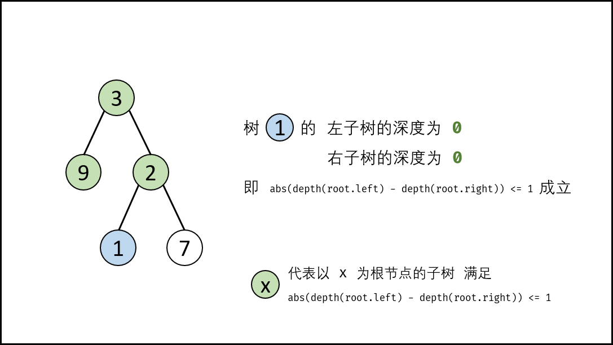,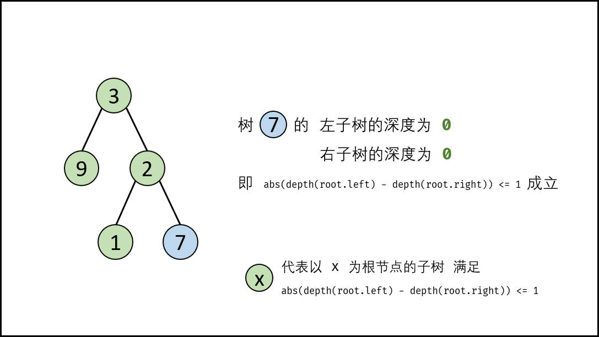,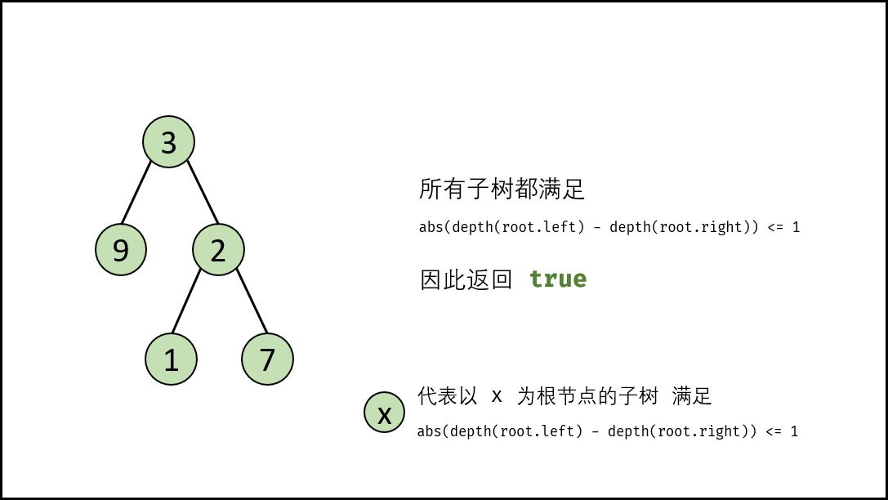>

##### 复杂度分析：

- **时间复杂度 $O(N log N)$：** 最差情况下（为 “满二叉树” 时）， `isBalanced(root)` 遍历树所有节点，判断每个节点的深度 `depth(root)` 需要遍历 **各子树的所有节点** 。
  - 满二叉树高度的复杂度 $O(log N)$ ，将满二叉树按层分为 $log (N+1)$ 层；
  - 通过调用 `depth(root)` ，判断二叉树各层的节点的对应子树的深度，需遍历节点数量为 $N \times 1, \frac{N-1}{2} \times 2, \frac{N-3}{4} \times 4, \frac{N-7}{8} \times 8, ..., 1 \times \frac{N+1}{2}$ 。因此各层执行 `depth(root)` 的时间复杂度为 $O(N)$ （每层开始，最多遍历 $N$ 个节点，最少遍历 $\frac{N+1}{2}$ 个节点）。
  > 其中，$\frac{N-3}{4} \times 4$ 代表从此层开始总共需遍历 $N-3$ 个节点，此层共有 $4$ 个节点，因此每个子树需遍历 $\frac{N-3}{4}$ 个节点。
  - 因此，总体时间复杂度 $=$ 每层执行复杂度 $\times$ 层数复杂度 = $O(N \times log N)$ 。

{:width=500}

- **空间复杂度 $O(N)$：** 最差情况下（树退化为链表时），系统递归需要使用 $O(N)$ 的栈空间。

##### 代码：

```python []
class Solution:
    def isBalanced(self, root: TreeNode) -> bool:
        if not root: return True
        return abs(self.depth(root.left) - self.depth(root.right)) <= 1 and \
            self.isBalanced(root.left) and self.isBalanced(root.right)

    def depth(self, root):
        if not root: return 0
        return max(self.depth(root.left), self.depth(root.right)) + 1
```

```java []
class Solution {
    public boolean isBalanced(TreeNode root) {
        if (root == null) return true;
        return Math.abs(depth(root.left) - depth(root.right)) <= 1 && isBalanced(root.left) && isBalanced(root.right);
    }

    private int depth(TreeNode root) {
        if (root == null) return 0;
        return Math.max(depth(root.left), depth(root.right)) + 1;
    }
}
```

## 统计信息
| 通过次数 | 提交次数 | AC比率 |
| :------: | :------: | :------: |
|    147034    |    249417    |   59.0%   |

## 提交历史
| 提交时间 | 提交结果 | 执行时间 |  内存消耗  | 语言 |
| :------: | :------: | :------: | :--------: | :--------: |
