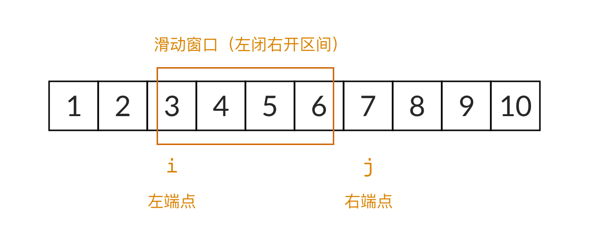

> 原文链接: https://leetcode-cn.com/problems/he-wei-sde-lian-xu-zheng-shu-xu-lie-lcof


## 中文题目
<div><p>输入一个正整数 <code>target</code> ，输出所有和为 <code>target</code> 的连续正整数序列（至少含有两个数）。</p>

<p>序列内的数字由小到大排列，不同序列按照首个数字从小到大排列。</p>

<p>&nbsp;</p>

<p><strong>示例 1：</strong></p>

<pre><strong>输入：</strong>target = 9
<strong>输出：</strong>[[2,3,4],[4,5]]
</pre>

<p><strong>示例 2：</strong></p>

<pre><strong>输入：</strong>target = 15
<strong>输出：</strong>[[1,2,3,4,5],[4,5,6],[7,8]]
</pre>

<p>&nbsp;</p>

<p><strong>限制：</strong></p>

<ul>
	<li><code>1 &lt;= target &lt;= 10^5</code></li>
</ul>

<p>&nbsp;</p>
</div>

## 通过代码
<RecoDemo>
</RecoDemo>


## 高赞题解
## 什么是滑动窗口

滑动窗口可以看成**数组中框起来的一个部分**。在一些数组类题目中，我们可以用滑动窗口来观察可能的候选结果。当滑动窗口从数组的左边滑到了右边，我们就可以从所有的候选结果中找到最优的结果。

对于这道题来说，数组就是正整数序列 $[1, 2, 3, \dots, n]$。我们设滑动窗口的左边界为 $i$，右边界为 $j$，则滑动窗口框起来的是一个左闭右开区间 $[i, j)$。注意，为了编程的方便，滑动窗口一般表示成一个**左闭右开区间**。在一开始，$i=1, j=1$，滑动窗口位于序列的最左侧，窗口大小为零。



滑动窗口的重要性质是：**窗口的左边界和右边界永远只能向右移动**，而不能向左移动。这是为了保证滑动窗口的时间复杂度是 $O(n)$。如果左右边界向左移动的话，这叫做“回溯”，算法的时间复杂度就可能不止 $O(n)$。

在这道题中，我们关注的是滑动窗口中所有数的和。当滑动窗口的右边界向右移动时，也就是 `j = j + 1`，窗口中多了一个数字 `j`，窗口的和也就要加上 `j`。当滑动窗口的左边界向右移动时，也就是 `i = i + 1`，窗口中少了一个数字 `i`，窗口的和也就要减去 `i`。滑动窗口只有 **右边界向右移动（扩大窗口）** 和 **左边界向右移动（缩小窗口）** 两个操作，所以实际上非常简单。

## 如何用滑动窗口解这道题

要用滑动窗口解这道题，我们要回答两个问题：

+ 第一个问题，窗口何时扩大，何时缩小？
+ 第二个问题，滑动窗口能找到全部的解吗？

对于第一个问题，回答非常简单：

+ 当窗口的和小于 `target` 的时候，窗口的和需要增加，所以要扩大窗口，窗口的右边界向右移动
+ 当窗口的和大于 `target` 的时候，窗口的和需要减少，所以要缩小窗口，窗口的左边界向右移动
+ 当窗口的和恰好等于 `target` 的时候，我们需要记录此时的结果。设此时的窗口为 $[i, j)$，那么我们已经找到了一个 $i$ 开头的序列，也是唯一一个 $i$ 开头的序列，接下来需要找 $i+1$ 开头的序列，所以窗口的左边界要向右移动

对于第二个问题，我们可以稍微简单地证明一下：


我们一开始要找的是 1 开头的序列，只要窗口的和小于 `target`，窗口的右边界会一直向右移动。假设 $1+2+\dots+8$ 小于 `target`，再加上一个 9 之后， 发现 $1+2+\dots+8+9$ 又大于 `target` 了。这说明 1 开头的序列找不到解。此时滑动窗口的最右元素是 9。

接下来，我们需要找 2 开头的序列，我们发现，$2 + \dots + 8 < 1 + 2 + \dots + 8 < \mathrm{target}$。这说明 2 开头的序列至少要加到 9。那么，我们只需要把原先 1~9 的滑动窗口的左边界向右移动，变成 2~9 的滑动窗口，然后继续寻找。而右边界完全不需要向左移动。

以此类推，滑动窗口的左右边界都不需要向左移动，所以这道题用滑动窗口一定可以得到所有的解。时间复杂度是 $O(n)$。

**注：这道题当前可以用等差数列的求和公式来计算滑动窗口的和。不过我这里没有使用求和公式，是为了展示更通用的解题思路。实际上，把题目中的正整数序列换成任意的递增整数序列，这个方法都可以解。**

## 本题题解

```C++ []
vector<vector<int>> findContinuousSequence(int target) {
    int i = 1; // 滑动窗口的左边界
    int j = 1; // 滑动窗口的右边界
    int sum = 0; // 滑动窗口中数字的和
    vector<vector<int>> res;

    while (i <= target / 2) {
        if (sum < target) {
            // 右边界向右移动
            sum += j;
            j++;
        } else if (sum > target) {
            // 左边界向右移动
            sum -= i;
            i++;
        } else {
            // 记录结果
            vector<int> arr;
            for (int k = i; k < j; k++) {
                arr.push_back(k);
            }
            res.push_back(arr);
            // 左边界向右移动
            sum -= i;
            i++;
        }
    }

    return res;
}
```

```Java []
public int[][] findContinuousSequence(int target) {
    int i = 1; // 滑动窗口的左边界
    int j = 1; // 滑动窗口的右边界
    int sum = 0; // 滑动窗口中数字的和
    List<int[]> res = new ArrayList<>();

    while (i <= target / 2) {
        if (sum < target) {
            // 右边界向右移动
            sum += j;
            j++;
        } else if (sum > target) {
            // 左边界向右移动
            sum -= i;
            i++;
        } else {
            // 记录结果
            int[] arr = new int[j-i];
            for (int k = i; k < j; k++) {
                arr[k-i] = k;
            }
            res.add(arr);
            // 左边界向右移动
            sum -= i;
            i++;
        }
    }

    return res.toArray(new int[res.size()][]);
}
```

```Python []
def findContinuousSequence(self, target: int) -> List[List[int]]:
    i = 1 # 滑动窗口的左边界
    j = 1 # 滑动窗口的右边界
    sum = 0 # 滑动窗口中数字的和
    res = []

    while i <= target // 2:
        if sum < target:
            # 右边界向右移动
            sum += j
            j += 1
        elif sum > target:
            # 左边界向右移动
            sum -= i
            i += 1
        else:
            # 记录结果
            arr = list(range(i, j))
            res.append(arr)
            # 左边界向右移动
            sum -= i
            i += 1

    return res
```

如果你觉得本文对你有帮助，欢迎 ➡️ [关注我](https://leetcode-cn.com/u/nettee/)，我的《LeetCode 例题精讲》系列文章正在写作，不仅有题解，更能让你学会解题的通用思路，举一反三！


## 统计信息
| 通过次数 | 提交次数 | AC比率 |
| :------: | :------: | :------: |
|    147554    |    208253    |   70.9%   |

## 提交历史
| 提交时间 | 提交结果 | 执行时间 |  内存消耗  | 语言 |
| :------: | :------: | :------: | :--------: | :--------: |
