> 原文链接: https://leetcode-cn.com/problems/fan-zhuan-dan-ci-shun-xu-lcof


## 中文题目
<div><p>输入一个英文句子，翻转句子中单词的顺序，但单词内字符的顺序不变。为简单起见，标点符号和普通字母一样处理。例如输入字符串&quot;I am a student. &quot;，则输出&quot;student. a am I&quot;。</p>

<p>&nbsp;</p>

<p><strong>示例 1：</strong></p>

<pre><strong>输入:</strong> &quot;<code>the sky is blue</code>&quot;
<strong>输出:&nbsp;</strong>&quot;<code>blue is sky the</code>&quot;
</pre>

<p><strong>示例 2：</strong></p>

<pre><strong>输入:</strong> &quot; &nbsp;hello world! &nbsp;&quot;
<strong>输出:&nbsp;</strong>&quot;world! hello&quot;
<strong>解释: </strong>输入字符串可以在前面或者后面包含多余的空格，但是反转后的字符不能包括。
</pre>

<p><strong>示例 3：</strong></p>

<pre><strong>输入:</strong> &quot;a good &nbsp; example&quot;
<strong>输出:&nbsp;</strong>&quot;example good a&quot;
<strong>解释: </strong>如果两个单词间有多余的空格，将反转后单词间的空格减少到只含一个。
</pre>

<p>&nbsp;</p>

<p><strong>说明：</strong></p>

<ul>
	<li>无空格字符构成一个单词。</li>
	<li>输入字符串可以在前面或者后面包含多余的空格，但是反转后的字符不能包括。</li>
	<li>如果两个单词间有多余的空格，将反转后单词间的空格减少到只含一个。</li>
</ul>

<p><strong>注意：</strong>本题与主站 151 题相同：<a href="https://leetcode-cn.com/problems/reverse-words-in-a-string/">https://leetcode-cn.com/problems/reverse-words-in-a-string/</a></p>

<p><strong>注意：</strong>此题对比原题有改动</p>
</div>

## 通过代码
<RecoDemo>
</RecoDemo>


## 高赞题解
#### 方法一：双指针

##### 算法解析：

- 倒序遍历字符串 $s$ ，记录单词左右索引边界 $i$ , $j$ ；
- 每确定一个单词的边界，则将其添加至单词列表 $res$ ；
- 最终，将单词列表拼接为字符串，并返回即可。

##### 复杂度分析：

- **时间复杂度 $O(N)$ ：** 其中 $N$ 为字符串 $s$ 的长度，线性遍历字符串。
- **空间复杂度 $O(N)$ ：** 新建的 list(Python) 或 StringBuilder(Java) 中的字符串总长度 $\leq N$ ，占用 $O(N)$ 大小的额外空间。

<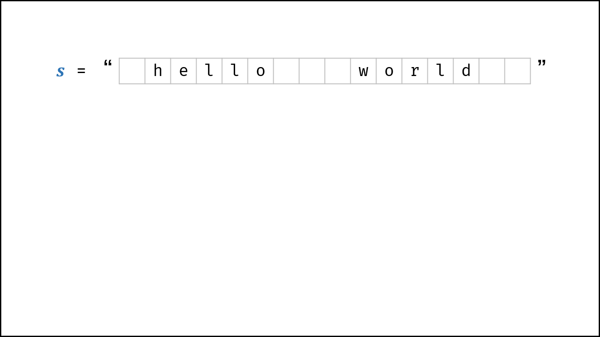,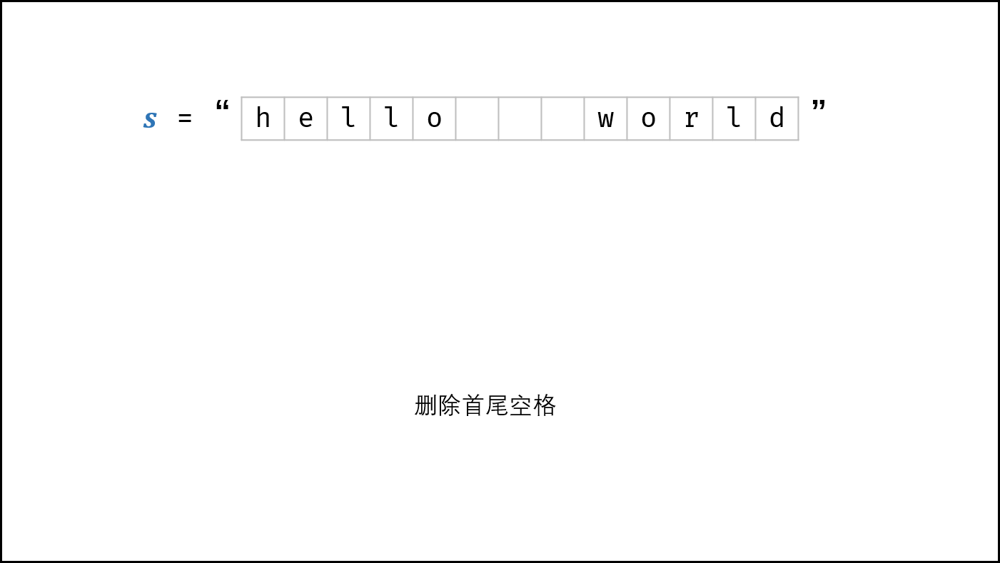,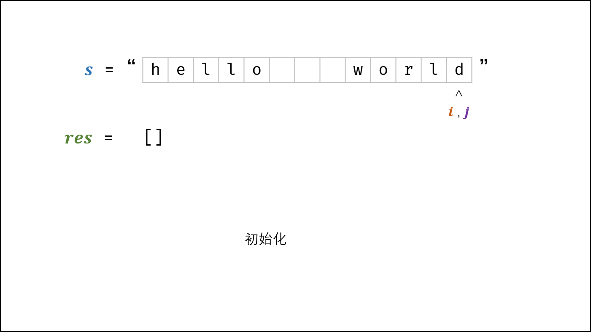,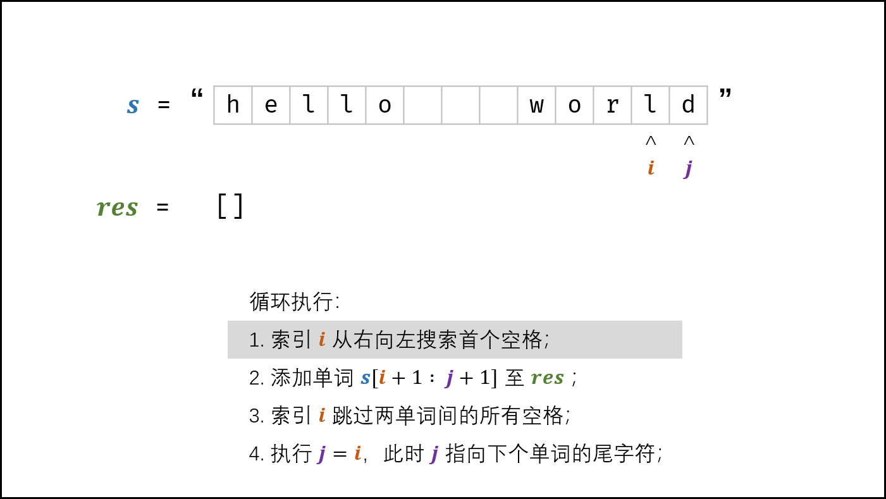,,,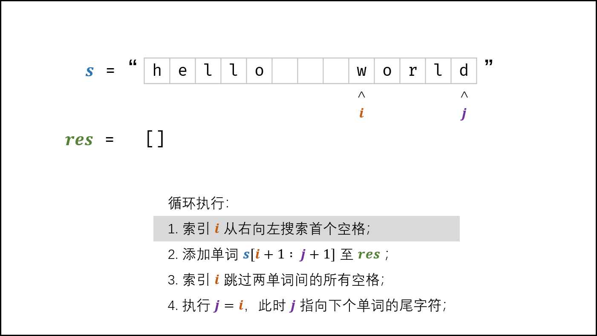,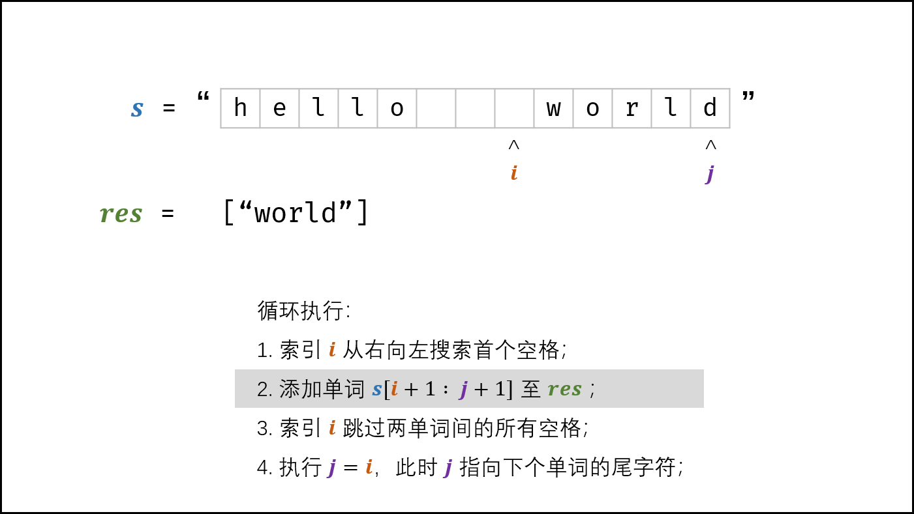,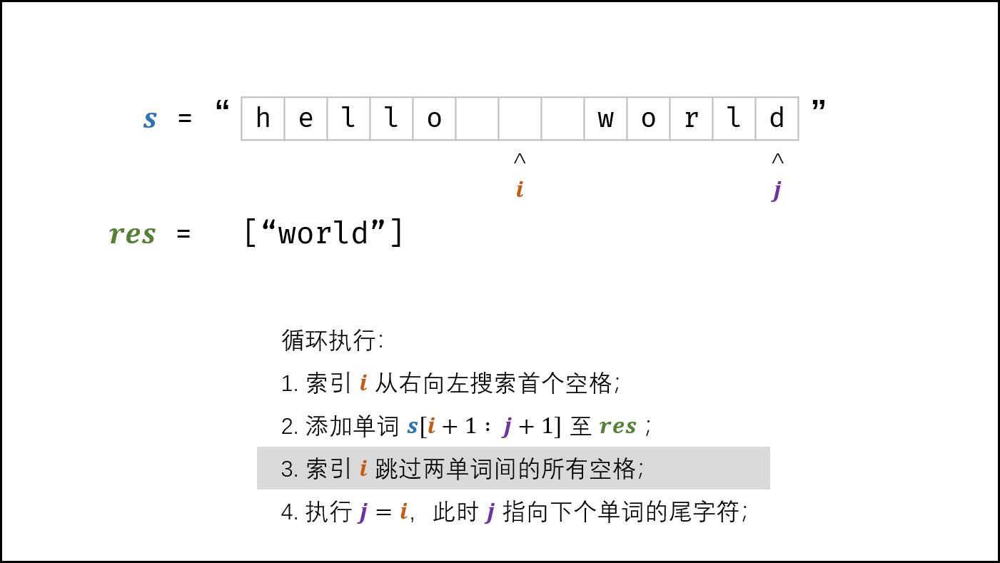,,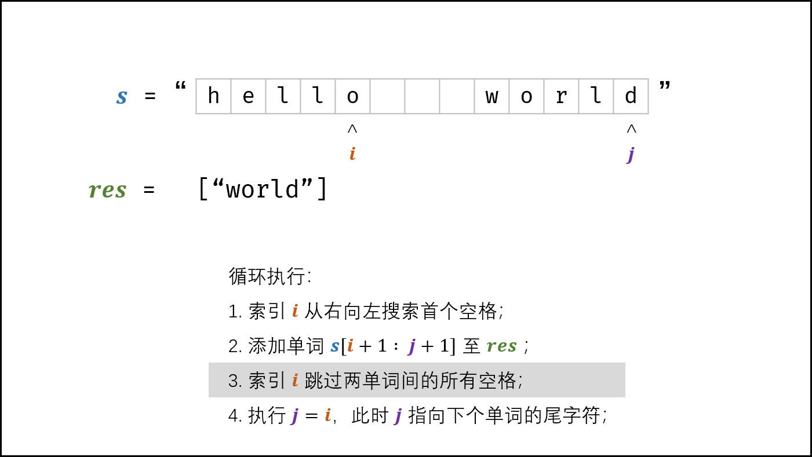,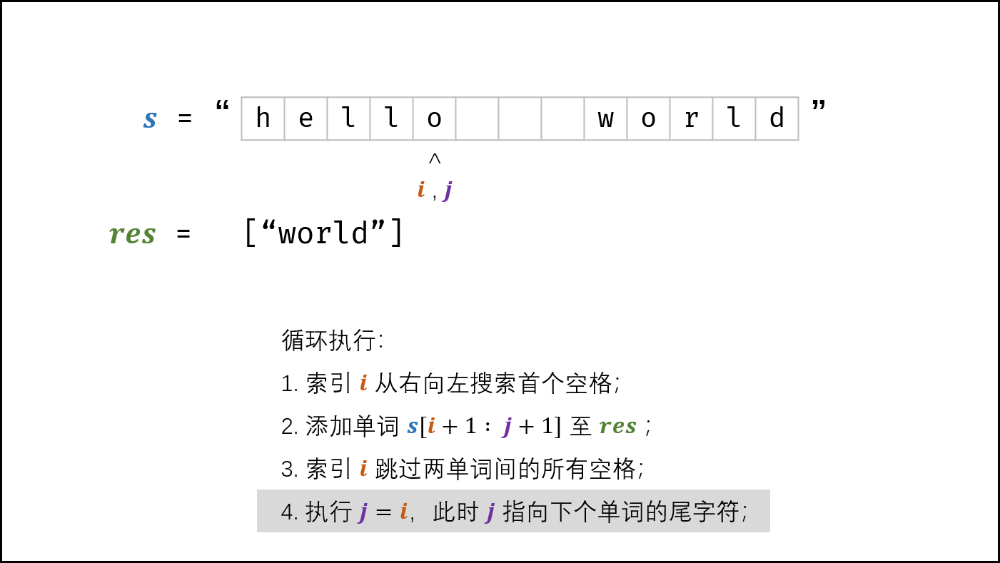,,,,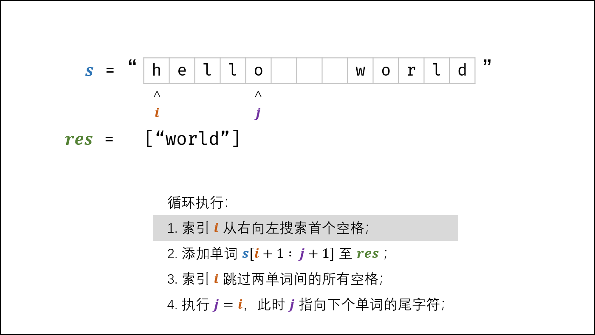,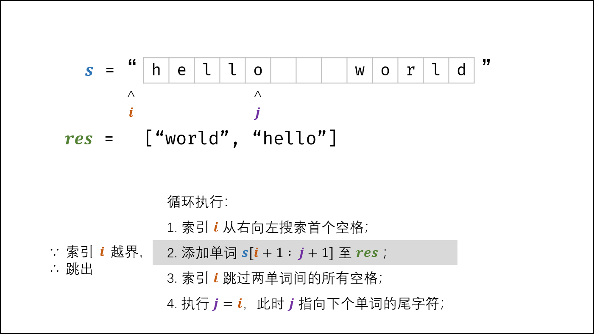,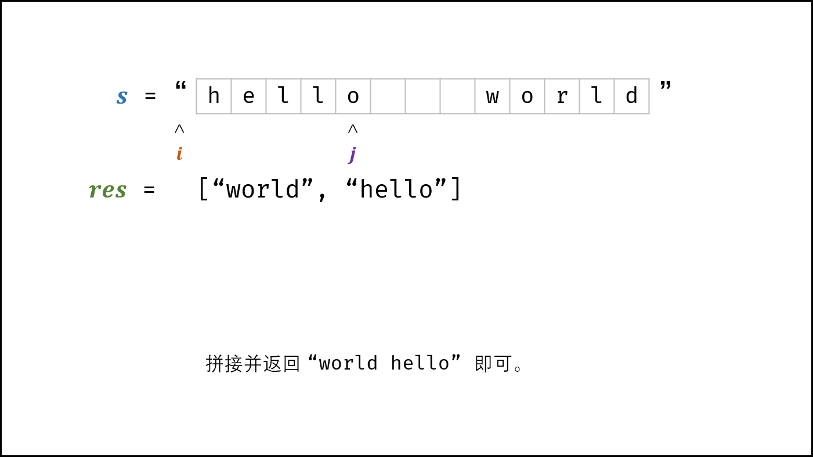>

##### 代码：

```Python []
class Solution:
    def reverseWords(self, s: str) -> str:
        s = s.strip() # 删除首尾空格
        i = j = len(s) - 1
        res = []
        while i >= 0:
            while i >= 0 and s[i] != ' ': i -= 1 # 搜索首个空格
            res.append(s[i + 1: j + 1]) # 添加单词
            while s[i] == ' ': i -= 1 # 跳过单词间空格
            j = i # j 指向下个单词的尾字符
        return ' '.join(res) # 拼接并返回
```

```Java []
class Solution {
    public String reverseWords(String s) {
        s = s.trim(); // 删除首尾空格
        int j = s.length() - 1, i = j;
        StringBuilder res = new StringBuilder();
        while(i >= 0) {
            while(i >= 0 && s.charAt(i) != ' ') i--; // 搜索首个空格
            res.append(s.substring(i + 1, j + 1) + " "); // 添加单词
            while(i >= 0 && s.charAt(i) == ' ') i--; // 跳过单词间空格
            j = i; // j 指向下个单词的尾字符
        }
        return res.toString().trim(); // 转化为字符串并返回
    }
}
```

#### 方法二：分割 + 倒序

利用 “字符串分割”、“列表倒序” 的内置函数 *（面试时不建议使用）* ，可简便地实现本题的字符串翻转要求。

##### 算法解析：

- **Python ：** 由于 $split()$ 方法将单词间的 “多个空格看作一个空格” （参考自 [split()和split(' ')的区别](https://www.cnblogs.com/python-coder/p/10073329.html) ），因此不会出现多余的 “空单词” 。因此，直接利用 $reverse()$ 方法翻转单词列表 $strs$ ，拼接为字符串并返回即可。

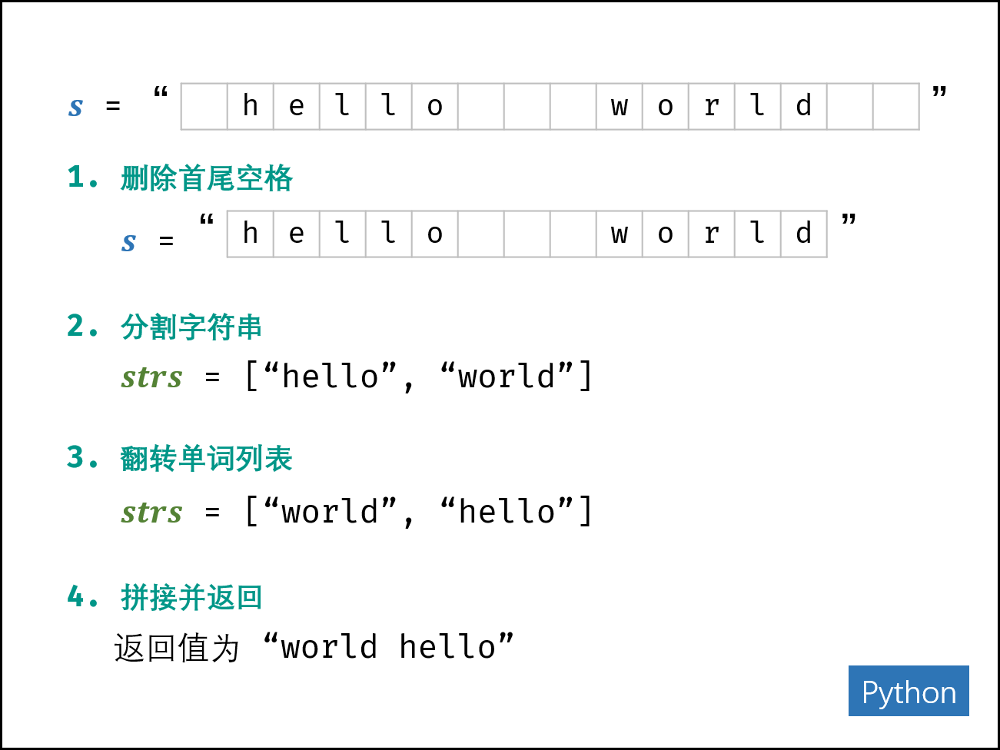{:width=500}

- **Java ：** 以空格为分割符完成字符串分割后，若两单词间有 $x > 1$ 个空格，则在单词列表 $strs$ 中，此两单词间会多出 $x - 1$ 个 “空单词” （即 `""` ）。解决方法：倒序遍历单词列表，并将单词逐个添加至 StringBuilder ，遇到空单词时跳过。

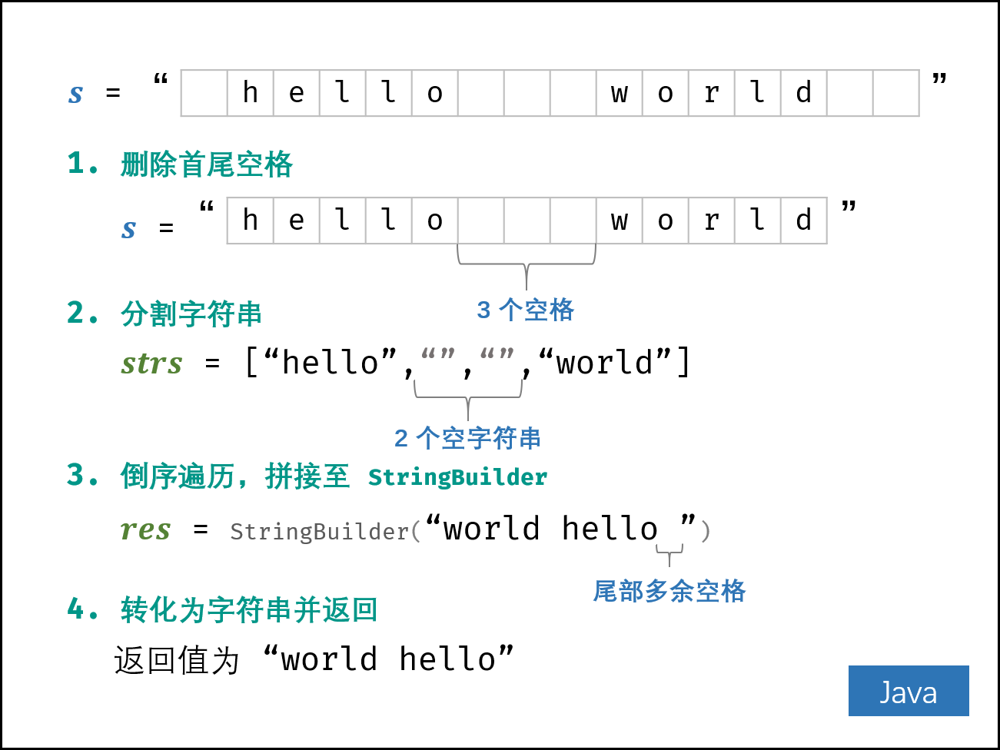{:width=500}

##### 复杂度分析：

- **时间复杂度 $O(N)$ ：** 总体为线性时间复杂度，各函数时间复杂度和参考资料链接如下。
  - [`split()` 方法：](https://softwareengineering.stackexchange.com/questions/331909/whats-the-complexity-of-javas-string-split-function) 为 $O(N)$ ；
  - [`trim()` 和 `strip()` 方法：](https://stackoverflow.com/questions/51110114/is-string-trim-faster-than-string-replace) 最差情况下（当字符串全为空格时），为 $O(N)$ ；
  - [`join()` 方法：](https://stackoverflow.com/questions/37133547/time-complexity-of-string-concatenation-in-python) 为 $O(N)$ ；
  - [`reverse()` 方法：](https://stackoverflow.com/questions/37606159/what-is-the-time-complexity-of-python-list-reverse) 为 $O(N)$ ；
- **空间复杂度 $O(N)$ ：** 单词列表 $strs$ 占用线性大小的额外空间。

##### 代码：

```Python []
class Solution:
    def reverseWords(self, s: str) -> str:
        s = s.strip() # 删除首尾空格
        strs = s.split() # 分割字符串
        strs.reverse() # 翻转单词列表
        return ' '.join(strs) # 拼接为字符串并返回
```

```Java []
class Solution {
    public String reverseWords(String s) {
        String[] strs = s.trim().split(" "); // 删除首尾空格，分割字符串
        StringBuilder res = new StringBuilder();
        for(int i = strs.length - 1; i >= 0; i--) { // 倒序遍历单词列表
            if(strs[i].equals("")) continue; // 遇到空单词则跳过
            res.append(strs[i] + " "); // 将单词拼接至 StringBuilder
        }
        return res.toString().trim(); // 转化为字符串，删除尾部空格，并返回
    }
}
```

Python 可一行实现：

```Python []
class Solution:
    def reverseWords(self, s: str) -> str:
        return ' '.join(s.strip().split()[::-1])
```

## 统计信息
| 通过次数 | 提交次数 | AC比率 |
| :------: | :------: | :------: |
|    140958    |    318517    |   44.3%   |

## 提交历史
| 提交时间 | 提交结果 | 执行时间 |  内存消耗  | 语言 |
| :------: | :------: | :------: | :--------: | :--------: |
