> 原文链接: https://leetcode-cn.com/problems/bu-ke-pai-zhong-de-shun-zi-lcof


## 中文题目
<div><p>从<strong>若干副扑克牌</strong>中随机抽 <code>5</code> 张牌，判断是不是一个顺子，即这5张牌是不是连续的。2～10为数字本身，A为1，J为11，Q为12，K为13，而大、小王为 0 ，可以看成任意数字。A 不能视为 14。</p>

<p>&nbsp;</p>

<p><strong>示例&nbsp;1:</strong></p>

<pre>
<strong>输入:</strong> [1,2,3,4,5]
<strong>输出:</strong> True</pre>

<p>&nbsp;</p>

<p><strong>示例&nbsp;2:</strong></p>

<pre>
<strong>输入:</strong> [0,0,1,2,5]
<strong>输出:</strong> True</pre>

<p>&nbsp;</p>

<p><strong>限制：</strong></p>

<p>数组长度为 5&nbsp;</p>

<p>数组的数取值为 [0, 13] .</p>
</div>

## 通过代码
<RecoDemo>
</RecoDemo>


## 高赞题解
#### 解题思路：

根据题意，此 $5$ 张牌是顺子的 **充分条件** 如下：

1. 除大小王外，所有牌 **无重复**  ；
2. 设此 $5$ 张牌中最大的牌为 $max$ ，最小的牌为 $min$ （大小王除外），则需满足：

$$
max - min < 5
$$

因而，可将问题转化为：此 $5$ 张牌是否满足以上两个条件？

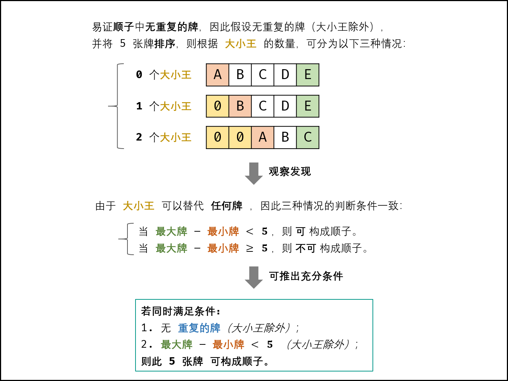{:width=600}

#### 方法一： 集合 Set + 遍历

- 遍历五张牌，遇到大小王（即 $0$ ）直接跳过。
- **判别重复：** 利用 Set 实现遍历判重， Set 的查找方法的时间复杂度为 $O(1)$ ；
- **获取最大 / 最小的牌：** 借助辅助变量 $ma$ 和 $mi$ ，遍历统计即可。

##### 复杂度分析：

- **时间复杂度 $O(N) = O(5) = O(1)$ ：** 其中 $N$ 为 $nums$ 长度，本题中 $N \equiv 5$ ；遍历数组使用 $O(N)$ 时间。
- **空间复杂度 $O(N) = O(5) = O(1)$ ：** 用于判重的辅助 Set 使用 $O(N)$ 额外空间。

<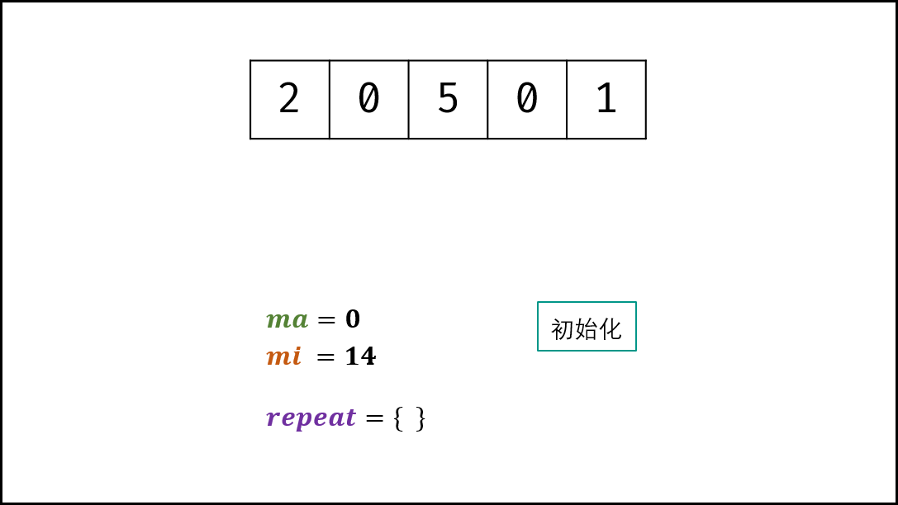,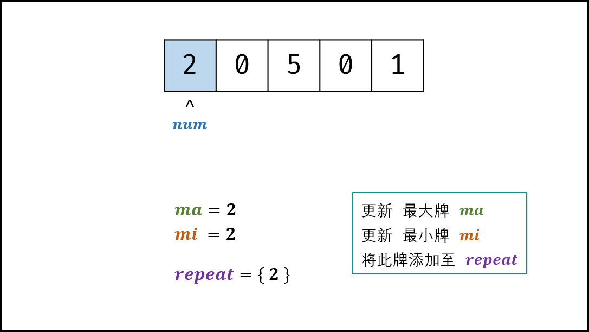,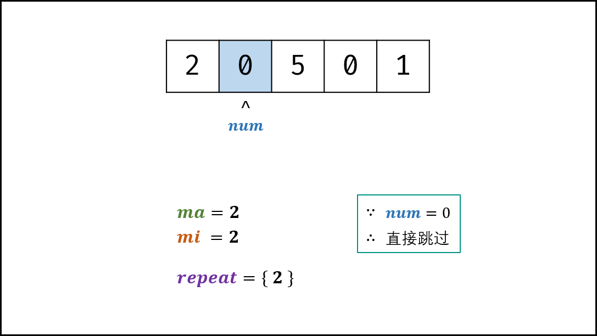,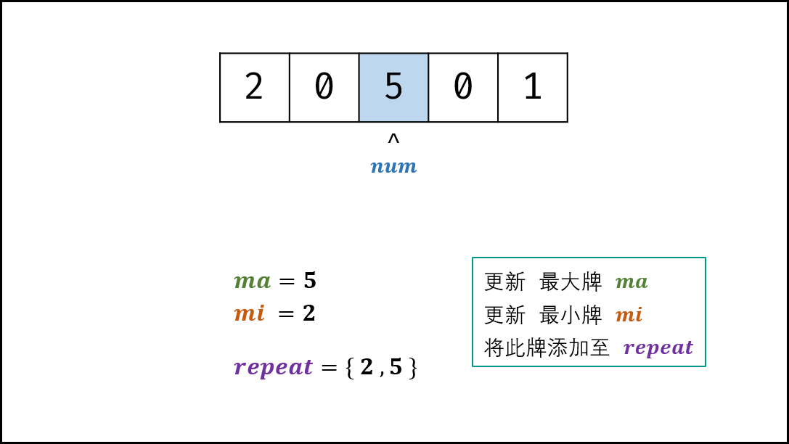,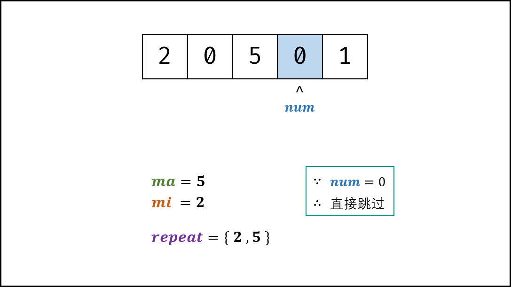,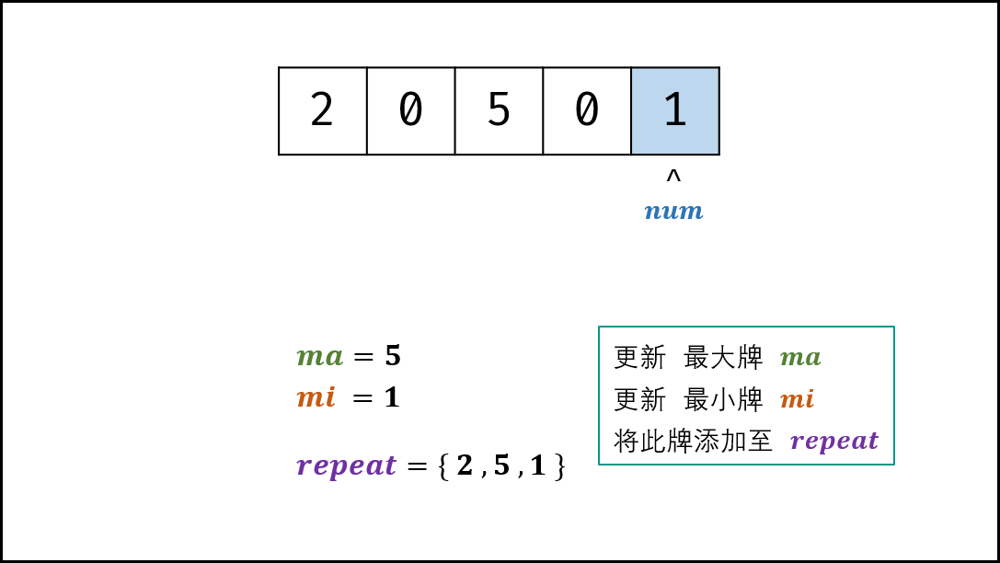,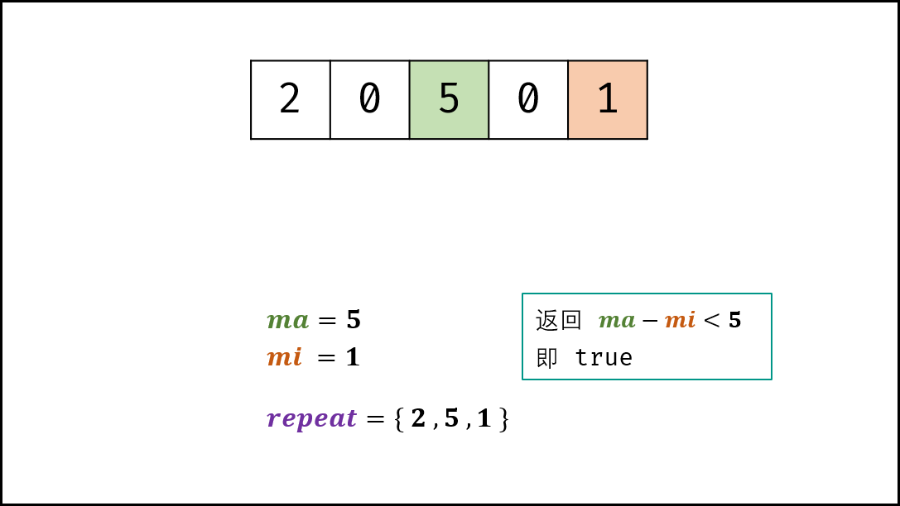>

##### 代码：

```Python []
class Solution:
    def isStraight(self, nums: List[int]) -> bool:
        repeat = set()
        ma, mi = 0, 14
        for num in nums:
            if num == 0: continue # 跳过大小王
            ma = max(ma, num) # 最大牌
            mi = min(mi, num) # 最小牌
            if num in repeat: return False # 若有重复，提前返回 false
            repeat.add(num) # 添加牌至 Set
        return ma - mi < 5 # 最大牌 - 最小牌 < 5 则可构成顺子 
```

```Java []
class Solution {
    public boolean isStraight(int[] nums) {
        Set<Integer> repeat = new HashSet<>();
        int max = 0, min = 14;
        for(int num : nums) {
            if(num == 0) continue; // 跳过大小王
            max = Math.max(max, num); // 最大牌
            min = Math.min(min, num); // 最小牌
            if(repeat.contains(num)) return false; // 若有重复，提前返回 false
            repeat.add(num); // 添加此牌至 Set
        }
        return max - min < 5; // 最大牌 - 最小牌 < 5 则可构成顺子
    }
}
```

#### 方法二：排序 + 遍历

- 先对数组执行排序。
- **判别重复：** 排序数组中的相同元素位置相邻，因此可通过遍历数组，判断 $nums[i] = nums[i + 1]$ 是否成立来判重。
- **获取最大 / 最小的牌：** 排序后，数组末位元素 $nums[4]$ 为最大牌；元素 $nums[joker]$ 为最小牌，其中 $joker$ 为大小王的数量。

##### 复杂度分析：

- **时间复杂度 $O(N \log N) = O(5 \log 5) = O(1)$ ：** 其中 $N$ 为 $nums$ 长度，本题中 $N \equiv 5$ ；数组排序使用 $O(N \log N)$ 时间。
- **空间复杂度 $O(1)$ ：** 变量 $joker$ 使用 $O(1)$ 大小的额外空间。

<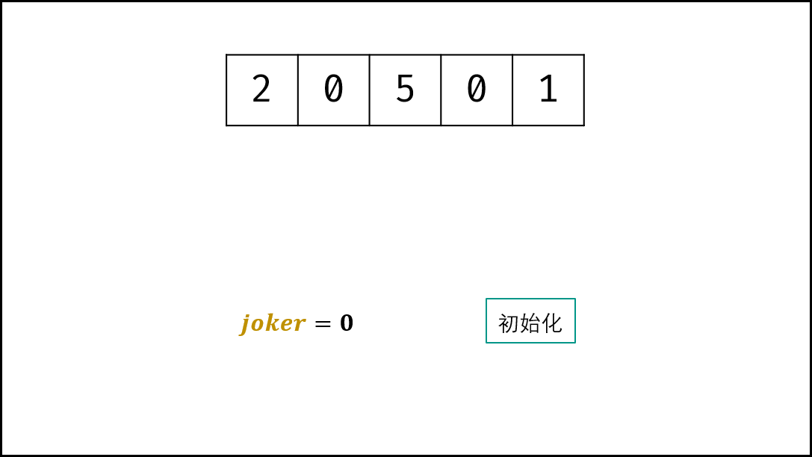,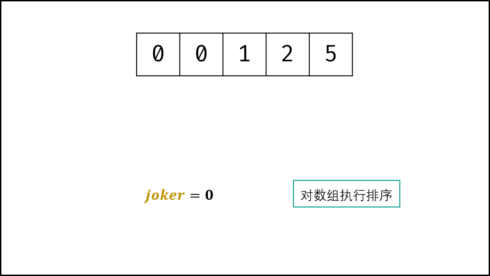,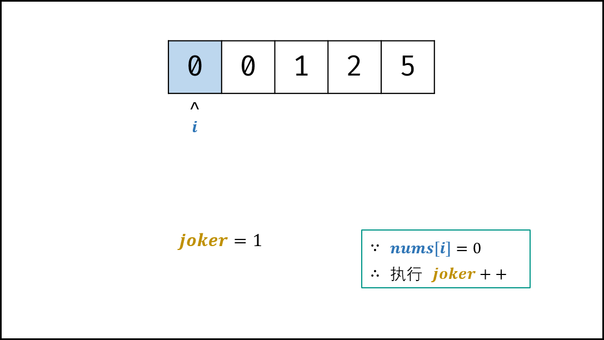,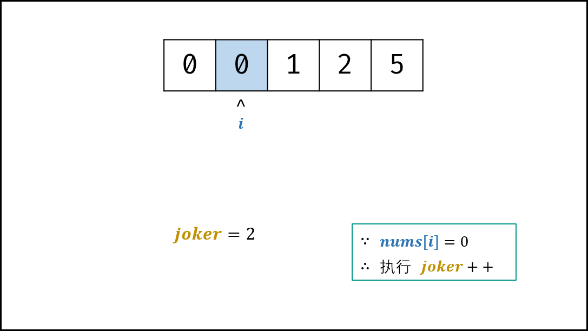,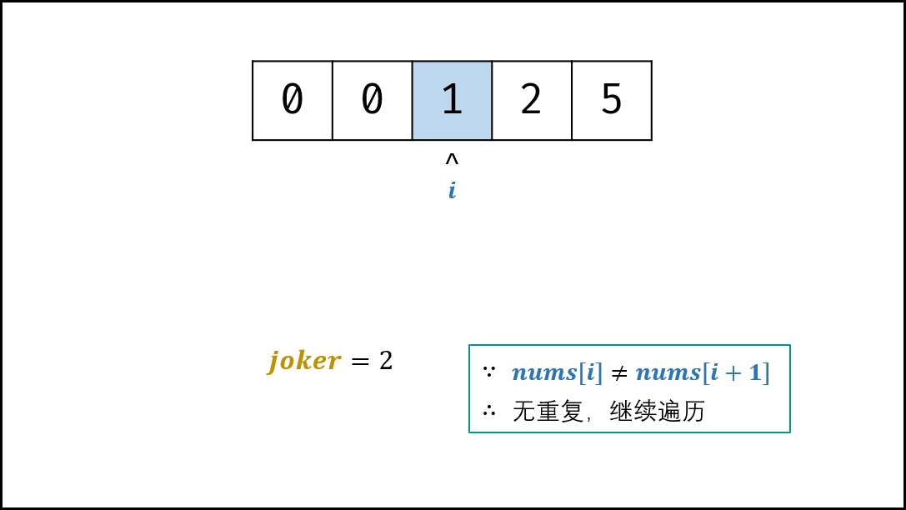,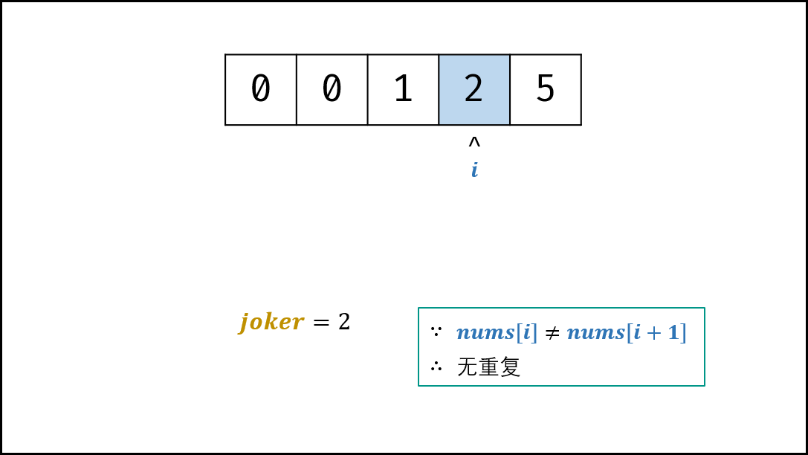,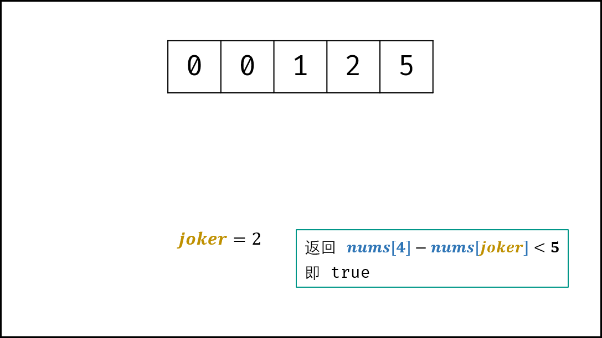>

##### 代码：

```Python []
class Solution:
    def isStraight(self, nums: List[int]) -> bool:
        joker = 0
        nums.sort() # 数组排序
        for i in range(4):
            if nums[i] == 0: joker += 1 # 统计大小王数量
            elif nums[i] == nums[i + 1]: return False # 若有重复，提前返回 false
        return nums[4] - nums[joker] < 5 # 最大牌 - 最小牌 < 5 则可构成顺子
```

```Java []
class Solution {
    public boolean isStraight(int[] nums) {
        int joker = 0;
        Arrays.sort(nums); // 数组排序
        for(int i = 0; i < 4; i++) {
            if(nums[i] == 0) joker++; // 统计大小王数量
            else if(nums[i] == nums[i + 1]) return false; // 若有重复，提前返回 false
        }
        return nums[4] - nums[joker] < 5; // 最大牌 - 最小牌 < 5 则可构成顺子
    }
}
```

## 统计信息
| 通过次数 | 提交次数 | AC比率 |
| :------: | :------: | :------: |
|    112707    |    244896    |   46.0%   |

## 提交历史
| 提交时间 | 提交结果 | 执行时间 |  内存消耗  | 语言 |
| :------: | :------: | :------: | :--------: | :--------: |
