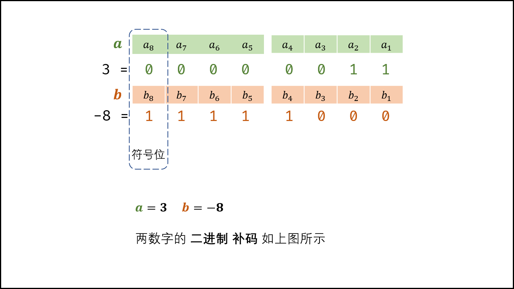
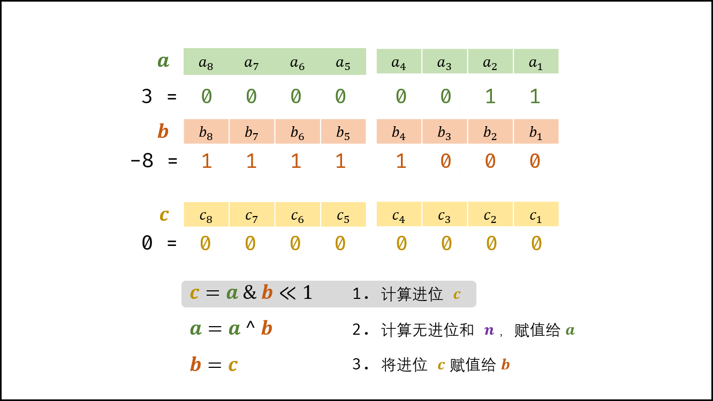
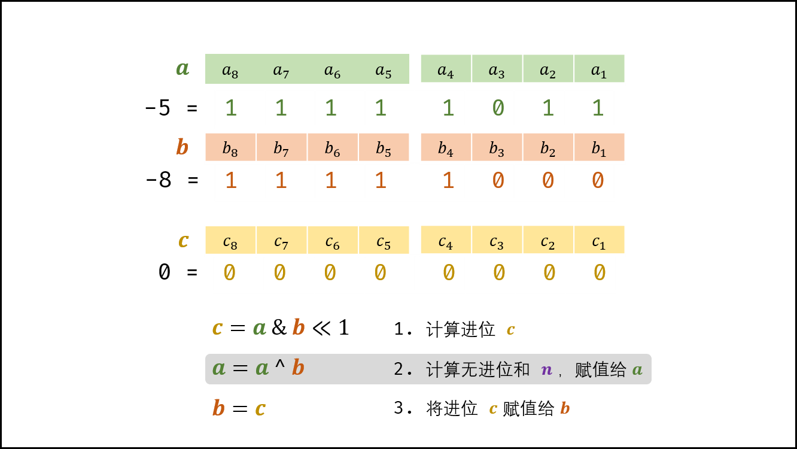
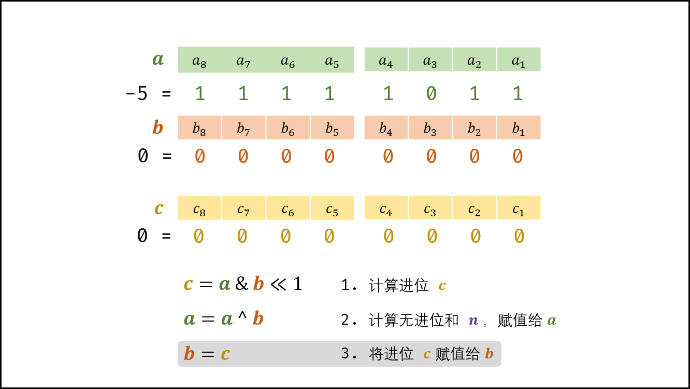
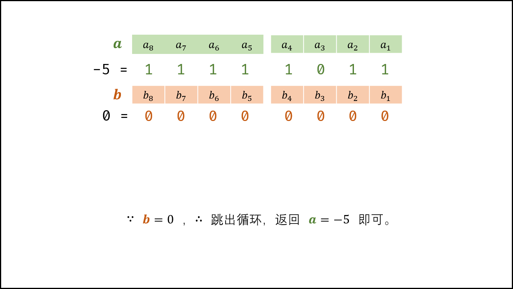

> 原文链接: https://leetcode-cn.com/problems/bu-yong-jia-jian-cheng-chu-zuo-jia-fa-lcof


## 中文题目
<div><p>写一个函数，求两个整数之和，要求在函数体内不得使用 &ldquo;+&rdquo;、&ldquo;-&rdquo;、&ldquo;*&rdquo;、&ldquo;/&rdquo; 四则运算符号。</p>

<p>&nbsp;</p>

<p><strong>示例:</strong></p>

<pre><strong>输入:</strong> a = 1, b = 1
<strong>输出:</strong> 2</pre>

<p>&nbsp;</p>

<p><strong>提示：</strong></p>

<ul>
	<li><code>a</code>,&nbsp;<code>b</code>&nbsp;均可能是负数或 0</li>
	<li>结果不会溢出 32 位整数</li>
</ul>
</div>

## 通过代码
<RecoDemo>
</RecoDemo>


## 高赞题解
#### 解题思路：

本题考察对位运算的灵活使用，即使用位运算实现加法。
设两数字的二进制形式 $a, b$ ，其求和 $s = a + b$ ，$a(i)$ 代表 $a$ 的二进制第 $i$ 位，则分为以下四种情况：

| $a(i)$ | $b(i)$ | 无进位和 $n(i)$ | 进位 $c(i+1)$ |
| :----: | :----: | :-------------: | :-----------: |
|  $0$   |  $0$   |       $0$       |      $0$      |
|  $0$   |  $1$   |       $1$       |      $0$      |
|  $1$   |  $0$   |       $1$       |      $0$      |
|  $1$   |  $1$   |       $0$       |      $1$      |

观察发现，**无进位和** 与 **异或运算** 规律相同，**进位** 和 **与运算** 规律相同（并需左移一位）。因此，无进位和 $n$ 与进位 $c$ 的计算公式如下；

$$
\begin{cases}
n = a \oplus b & 非进位和：异或运算 \\
c = a \& b << 1 & 进位：与运算 + 左移一位
\end{cases}
$$

（和 $s$ ）$=$（非进位和 $n$ ）$+$（进位 $c$ ）。即可将 $s = a + b$ 转化为：

$$
s = a + b \Rightarrow s = n + c
$$

循环求 $n$ 和 $c$ ，直至进位 $c = 0$ ；此时 $s = n$ ，返回 $n$ 即可。

{:width=500}

> **Q ：** 若数字 $a$ 和 $b$ 中有负数，则变成了减法，如何处理？
> **A ：** 在计算机系统中，数值一律用 **补码** 来表示和存储。**补码的优势：** 加法、减法可以统一处理（CPU只有加法器）。因此，以上方法 **同时适用于正数和负数的加法** 。

##### 复杂度分析：

- **时间复杂度 $O(1)$ ：** 最差情况下（例如 $a =$ 0x7fffffff , $b = 1$ 时），需循环 32 次，使用 $O(1)$ 时间；每轮中的常数次位操作使用 $O(1)$ 时间。
- **空间复杂度 $O(1)$ ：** 使用常数大小的额外空间。

<,,,,>

#### 代码：

```java []
class Solution {
    public int add(int a, int b) {
        while(b != 0) { // 当进位为 0 时跳出
            int c = (a & b) << 1;  // c = 进位
            a ^= b; // a = 非进位和
            b = c; // b = 进位
        }
        return a;
    }
}
```

```python []
class Solution:
    def add(self, a: int, b: int) -> int:
        x = 0xffffffff
        a, b = a & x, b & x
        while b != 0:
            a, b = (a ^ b), (a & b) << 1 & x
        return a if a <= 0x7fffffff else ~(a ^ x)
```

> 由于 Python 的数字存储特点，需要做特殊考虑，以下详细介绍。

##### Python 负数的存储：

Python，Java 等语言中的数字都是以 **补码** 形式存储的。但 Python 没有 `int` , `long` 等不同长度变量，即在编程时无变量位数的概念。
**获取负数的补码：** 需要将数字与十六进制数 `0xffffffff` 相与。可理解为舍去此数字 32 位以上的数字（将 32 位以上都变为 $0$ ），从无限长度变为一个 32 位整数。
**返回前数字还原：** 若补码 $a$ 为负数（ `0x7fffffff` 是最大的正数的补码 ），需执行 `~(a ^ x)` 操作，将补码还原至 Python 的存储格式。 `a ^ x` 运算将 1 至 32 位按位取反； `~` 运算是将整个数字取反；因此， `~(a ^ x)` 是将 32 位以上的位取反，1 至 32 位不变。

```python
print(hex(1)) # = 0x1 补码
print(hex(-1)) # = -0x1 负号 + 原码 （ Python 特色，Java 会直接输出补码）

print(hex(1 & 0xffffffff)) # = 0x1 正数补码
print(hex(-1 & 0xffffffff)) # = 0xffffffff 负数补码

print(-1 & 0xffffffff) # = 4294967295 （ Python 将其认为正数）
```

## 统计信息
| 通过次数 | 提交次数 | AC比率 |
| :------: | :------: | :------: |
|    77497    |    132041    |   58.7%   |

## 提交历史
| 提交时间 | 提交结果 | 执行时间 |  内存消耗  | 语言 |
| :------: | :------: | :------: | :--------: | :--------: |
