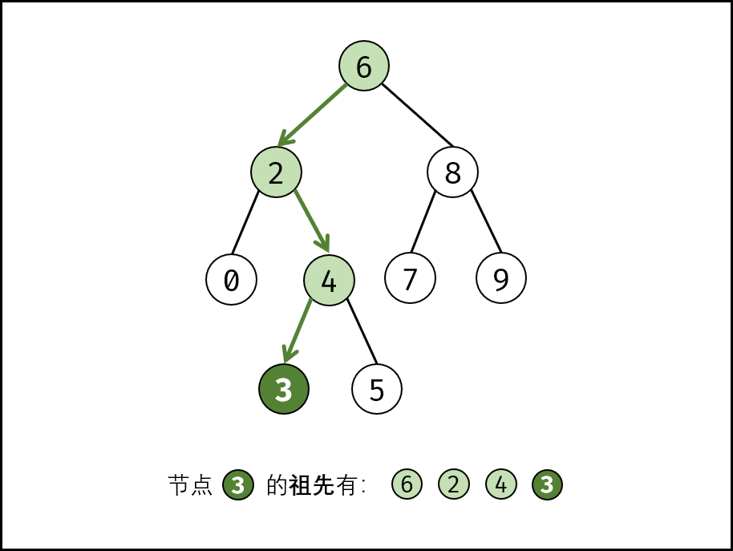

> 原文链接: https://leetcode-cn.com/problems/er-cha-sou-suo-shu-de-zui-jin-gong-gong-zu-xian-lcof


## 中文题目
<div><p>给定一个二叉搜索树, 找到该树中两个指定节点的最近公共祖先。</p>

<p><a href="https://baike.baidu.com/item/%E6%9C%80%E8%BF%91%E5%85%AC%E5%85%B1%E7%A5%96%E5%85%88/8918834?fr=aladdin" target="_blank">百度百科</a>中最近公共祖先的定义为：&ldquo;对于有根树 T 的两个结点 p、q，最近公共祖先表示为一个结点 x，满足 x 是 p、q 的祖先且 x 的深度尽可能大（<strong>一个节点也可以是它自己的祖先</strong>）。&rdquo;</p>

<p>例如，给定如下二叉搜索树:&nbsp; root =&nbsp;[6,2,8,0,4,7,9,null,null,3,5]</p>

<p></p>

<p>&nbsp;</p>

<p><strong>示例 1:</strong></p>

<pre><strong>输入:</strong> root = [6,2,8,0,4,7,9,null,null,3,5], p = 2, q = 8
<strong>输出:</strong> 6 
<strong>解释: </strong>节点 <code>2 </code>和节点 <code>8 </code>的最近公共祖先是 <code>6。</code>
</pre>

<p><strong>示例 2:</strong></p>

<pre><strong>输入:</strong> root = [6,2,8,0,4,7,9,null,null,3,5], p = 2, q = 4
<strong>输出:</strong> 2
<strong>解释: </strong>节点 <code>2</code> 和节点 <code>4</code> 的最近公共祖先是 <code>2</code>, 因为根据定义最近公共祖先节点可以为节点本身。</pre>

<p>&nbsp;</p>

<p><strong>说明:</strong></p>

<ul>
	<li>所有节点的值都是唯一的。</li>
	<li>p、q 为不同节点且均存在于给定的二叉搜索树中。</li>
</ul>

<p>注意：本题与主站 235 题相同：<a href="https://leetcode-cn.com/problems/lowest-common-ancestor-of-a-binary-search-tree/">https://leetcode-cn.com/problems/lowest-common-ancestor-of-a-binary-search-tree/</a></p>
</div>

## 通过代码
<RecoDemo>
</RecoDemo>


## 高赞题解
#### 解题思路：

**祖先的定义：** 若节点 $p$ 在节点 $root$ 的左（右）子树中，或 $p = root$，则称 $root$ 是 $p$ 的祖先。

{:width=400}

**最近公共祖先的定义：** 设节点 $root$ 为节点 $p,q$ 的某公共祖先，若其左子节点 $root.left$ 和右子节点 $root.right$ 都不是 $p,q$ 的公共祖先，则称 $root$ 是 “最近的公共祖先” 。

根据以上定义，若 $root$ 是 $p,q$ 的 **最近公共祖先** ，则只可能为以下情况之一：

1. $p$ 和 $q$ 在 $root$ 的子树中，且分列 $root$ 的 **异侧**（即分别在左、右子树中）；
2. $p = root$，且 $q$ 在 $root$ 的左或右子树中；  
3. $q = root$，且 $p$ 在 $root$ 的左或右子树中；  

{:width=400}

本题给定了两个重要条件：① 树为 **二叉搜索树** ，② 树的所有节点的值都是 **唯一** 的。根据以上条件，可方便地判断 $p,q$ 与 $root$ 的子树关系，即：

- 若 $root.val < p.val$ ，则 $p$ 在 $root$ **右子树** 中；
- 若 $root.val > p.val$ ，则 $p$ 在 $root$ **左子树** 中；
- 若 $root.val = p.val$ ，则 $p$ 和 $root$ 指向 **同一节点** 。

#### 方法一：迭代

1. **循环搜索：** 当节点 $root$ 为空时跳出；
   1. 当 $p, q$ 都在 $root$ 的 **右子树** 中，则遍历至 $root.right$ ；
   2. 否则，当 $p, q$ 都在 $root$ 的 **左子树** 中，则遍历至 $root.left$ ；
   3. 否则，说明找到了 **最近公共祖先** ，跳出。
2. **返回值：** 最近公共祖先 $root$ 。

##### 复杂度分析：

- **时间复杂度 $O(N)$ ：** 其中 $N$ 为二叉树节点数；每循环一轮排除一层，二叉搜索树的层数最小为 $\log N$ （满二叉树），最大为 $N$ （退化为链表）。
- **空间复杂度 $O(1)$ ：** 使用常数大小的额外空间。

<,,,>

##### 代码：

```Python []
class Solution:
    def lowestCommonAncestor(self, root: 'TreeNode', p: 'TreeNode', q: 'TreeNode') -> 'TreeNode':
        while root:
            if root.val < p.val and root.val < q.val: # p,q 都在 root 的右子树中
                root = root.right # 遍历至右子节点
            elif root.val > p.val and root.val > q.val: # p,q 都在 root 的左子树中
                root = root.left # 遍历至左子节点
            else: break
        return root
```

```Java []
class Solution {
    public TreeNode lowestCommonAncestor(TreeNode root, TreeNode p, TreeNode q) {
        while(root != null) {
            if(root.val < p.val && root.val < q.val) // p,q 都在 root 的右子树中
                root = root.right; // 遍历至右子节点
            else if(root.val > p.val && root.val > q.val) // p,q 都在 root 的左子树中
                root = root.left; // 遍历至左子节点
            else break;
        }
        return root;
    }
}
```

优化：若可保证 $p.val < q.val$ ，则在循环中可减少判断条件。

```Python []
class Solution:
    def lowestCommonAncestor(self, root: 'TreeNode', p: 'TreeNode', q: 'TreeNode') -> 'TreeNode':
        if p.val > q.val: p, q = q, p # 保证 p.val < q.val
        while root:
            if root.val < p.val: # p,q 都在 root 的右子树中
                root = root.right # 遍历至右子节点
            elif root.val > q.val: # p,q 都在 root 的左子树中
                root = root.left # 遍历至左子节点
            else: break
        return root
```

```Java []
class Solution {
    public TreeNode lowestCommonAncestor(TreeNode root, TreeNode p, TreeNode q) {
        if(p.val > q.val) { // 保证 p.val < q.val
            TreeNode tmp = p;
            p = q;
            q = tmp;
        }
        while(root != null) {
            if(root.val < p.val) // p,q 都在 root 的右子树中
                root = root.right; // 遍历至右子节点
            else if(root.val > q.val) // p,q 都在 root 的左子树中
                root = root.left; // 遍历至左子节点
            else break;
        }
        return root;
    }
}
```

#### 方法二：递归

1. **递推工作：**
   1. 当 $p, q$ 都在 $root$ 的 **右子树** 中，则开启递归 $root.right$ 并返回；
   2. 否则，当 $p, q$ 都在 $root$ 的 **左子树** 中，则开启递归 $root.left$ 并返回；
2. **返回值：** 最近公共祖先 $root$ 。

##### 复杂度分析：

- **时间复杂度 $O(N)$ ：** 其中 $N$ 为二叉树节点数；每循环一轮排除一层，二叉搜索树的层数最小为 $\log N$ （满二叉树），最大为 $N$ （退化为链表）。
- **空间复杂度 $O(N)$ ：** 最差情况下，即树退化为链表时，递归深度达到树的层数 $N$ 。

##### 代码：

```Python []
class Solution:
    def lowestCommonAncestor(self, root: 'TreeNode', p: 'TreeNode', q: 'TreeNode') -> 'TreeNode':
        if root.val < p.val and root.val < q.val:
            return self.lowestCommonAncestor(root.right, p, q)
        if root.val > p.val and root.val > q.val:
            return self.lowestCommonAncestor(root.left, p, q)
        return root
```

```Java []
class Solution {
    public TreeNode lowestCommonAncestor(TreeNode root, TreeNode p, TreeNode q) {
        if(root.val < p.val && root.val < q.val)
            return lowestCommonAncestor(root.right, p, q);
        if(root.val > p.val && root.val > q.val)
            return lowestCommonAncestor(root.left, p, q);
        return root;
    }
}
```

## 统计信息
| 通过次数 | 提交次数 | AC比率 |
| :------: | :------: | :------: |
|    126989    |    182765    |   69.5%   |

## 提交历史
| 提交时间 | 提交结果 | 执行时间 |  内存消耗  | 语言 |
| :------: | :------: | :------: | :--------: | :--------: |
