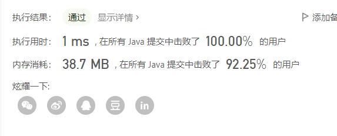

> 原文链接: https://leetcode-cn.com/problems/tvdfij


## 中文题目
<div><p>给你一个整数数组&nbsp;<code>nums</code> ，请计算数组的 <strong>中心下标 </strong>。</p>

<p>数组<strong> 中心下标</strong><strong> </strong>是数组的一个下标，其左侧所有元素相加的和等于右侧所有元素相加的和。</p>

<p>如果中心下标位于数组最左端，那么左侧数之和视为 <code>0</code> ，因为在下标的左侧不存在元素。这一点对于中心下标位于数组最右端同样适用。</p>

<p>如果数组有多个中心下标，应该返回 <strong>最靠近左边</strong> 的那一个。如果数组不存在中心下标，返回 <code>-1</code> 。</p>

<p>&nbsp;</p>

<p><strong>示例 1：</strong></p>

<pre>
<strong>输入：</strong>nums = [1,7,3,6,5,6]
<strong>输出：</strong>3
<strong>解释：</strong>
中心下标是 3 。
左侧数之和 sum = nums[0] + nums[1] + nums[2] = 1 + 7 + 3 = 11 ，
右侧数之和 sum = nums[4] + nums[5] = 5 + 6 = 11 ，二者相等。
</pre>

<p><strong>示例 2：</strong></p>

<pre>
<strong>输入：</strong>nums = [1, 2, 3]
<strong>输出：</strong>-1
<strong>解释：</strong>
数组中不存在满足此条件的中心下标。</pre>

<p><strong>示例 3：</strong></p>

<pre>
<strong>输入：</strong>nums = [2, 1, -1]
<strong>输出：</strong>0
<strong>解释：</strong>
中心下标是 0 。
左侧数之和 sum = 0 ，（下标 0 左侧不存在元素），
右侧数之和 sum = nums[1] + nums[2] = 1 + -1 = 0 。</pre>

<p>&nbsp;</p>

<p><strong>提示：</strong></p>

<ul>
	<li><code>1 &lt;= nums.length &lt;= 10<sup>4</sup></code></li>
	<li><code>-1000 &lt;= nums[i] &lt;= 1000</code></li>
</ul>

<p>&nbsp;</p>

<p><meta charset="UTF-8" />注意：本题与主站 724&nbsp;题相同：&nbsp;<a href="https://leetcode-cn.com/problems/find-pivot-index/">https://leetcode-cn.com/problems/find-pivot-index/</a></p>
</div>

## 通过代码
<RecoDemo>
</RecoDemo>


## 高赞题解
思路：用总的数组和total,减去当前数组和sum,如果差等于当前数组和减去当前值（sum-nums[i]）,则找到该坐标i
```
class Solution {
    public int pivotIndex(int[] nums) {
        int total=0;
        for(int num:nums){
            total+=num;
        }
        int sum=0;
        for(int i=0;i<nums.length;i++){
            sum+=nums[i];
            //总和减去当前子数组和等于当前子数组和减去当前值，则满足条件
            if(sum-nums[i]==total-sum){
                return i;
            }
        }
        //若没有满足条件值，返回-1
        return -1;
    }
}
```



## 统计信息
| 通过次数 | 提交次数 | AC比率 |
| :------: | :------: | :------: |
|    7911    |    11831    |   66.9%   |

## 提交历史
| 提交时间 | 提交结果 | 执行时间 |  内存消耗  | 语言 |
| :------: | :------: | :------: | :--------: | :--------: |
