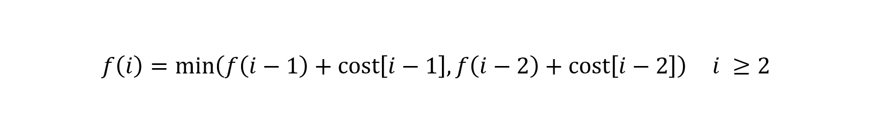

> 原文链接: https://leetcode-cn.com/problems/GzCJIP


## 中文题目
<div><p>数组的每个下标作为一个阶梯，第 <code>i</code> 个阶梯对应着一个非负数的体力花费值&nbsp;<code>cost[i]</code>（下标从 <code>0</code> 开始）。</p>

<p>每当爬上一个阶梯都要花费对应的体力值，一旦支付了相应的体力值，就可以选择向上爬一个阶梯或者爬两个阶梯。</p>

<p>请找出达到楼层顶部的最低花费。在开始时，你可以选择从下标为 0 或 1 的元素作为初始阶梯。</p>

<p>&nbsp;</p>

<p><strong>示例&nbsp;1：</strong></p>

<pre>
<strong>输入：</strong>cost = [10, 15, 20]
<strong>输出：</strong>15
<strong>解释：</strong>最低花费是从 cost[1] 开始，然后走两步即可到阶梯顶，一共花费 15 。
</pre>

<p><strong>&nbsp;示例 2：</strong></p>

<pre>
<strong>输入：</strong>cost = [1, 100, 1, 1, 1, 100, 1, 1, 100, 1]
<strong>输出：</strong>6
<strong>解释：</strong>最低花费方式是从 cost[0] 开始，逐个经过那些 1 ，跳过 cost[3] ，一共花费 6 。
</pre>

<p>&nbsp;</p>

<p><strong>提示：</strong></p>

<ul>
	<li><code>2 &lt;= cost.length &lt;= 1000</code></li>
	<li><code>0 &lt;= cost[i] &lt;= 999</code></li>
</ul>

<p>&nbsp;</p>

<p><meta charset="UTF-8" />注意：本题与主站 746&nbsp;题相同：&nbsp;<a href="https://leetcode-cn.com/problems/min-cost-climbing-stairs/">https://leetcode-cn.com/problems/min-cost-climbing-stairs/</a></p>
</div>

## 通过代码
<RecoDemo>
</RecoDemo>


## 高赞题解
# **分析**
动态规划与回溯法、分治法之间既有联系又有区别，搞清楚三者之间的关系可以帮助我们快速定位问题的解决方案。

**动态规划 VS 回溯法**
联系：
- 问题可以分为若干步，每一步都面临若干种选择

区别：
- 回溯法：要求列举出所有的解
- 动态规划：求解一个问题的最优解（通常是最值），或者求问题解的个数

**动态规划 VS 分治法**
联系：
- 都可以采用递归思路通过把大问题分成成小问题求解

区别：
- 分治法：各小问题之间不存在重叠部分
- 动态规划：各小问题之间存在重叠部分

# **动态规划**
分析本问题可以发现，若需要到达第 i 层，那么此时面临两个选择，第一个是是从第 i-1 层到达，第二个是是从第 i-2 层到达，求解的目标是到达的最少成本。所以该问题可以分为若干步，每一步都面临若干种选择，同时需要返回问题的最小值，所以采用动态规划求解。

动态规划重要一步就是找出状态1转移方法，可以用函数 f(i) 表示到达第 i 层楼梯的最小成本。因为可以从第 i-1 层楼梯或者 i-2 层楼梯到达，所以状态转移方程为

题目中明确 i >= 2，且一开始可以从第 0 层或者第 1 层开始，所以 f(0) = f(1) = 0。从状态转移方程来看，动态规划很容易采用递归的方式解决，即把大问题拆分为多个小问题。但是因为这些小问题之间存在大量重叠，所以直接处理会带来严重的效率问题，虽然可以使用缓存的方式保存各小问题的解来避免重复计算，但是同时也会带来空间效率的降低。一种比较好的解决方式就是采用迭代的形式求解动态规划问题，即先解决小问题再解决大问题的方式，这样可以优化时间和空间效率。

总而言之，对于动态规划问题采用递归的形式思考问题，迭代的形式解决问题，完整的代码如下：
```
class Solution {
public:
    int minCostClimbingStairs(vector<int>& cost) {
        int step1 = 0;
        int step2 = 0;
        int cur = 0;
        for (int i = 2; i <= cost.size(); ++i) {
            cur = min(step1 + cost[i - 1], step2 + cost[i - 2]);
            step2 = step1;
            step1 = cur;
        }
        return cur;
    }
};
```


## 统计信息
| 通过次数 | 提交次数 | AC比率 |
| :------: | :------: | :------: |
|    5968    |    8041    |   74.2%   |

## 提交历史
| 提交时间 | 提交结果 | 执行时间 |  内存消耗  | 语言 |
| :------: | :------: | :------: | :--------: | :--------: |
