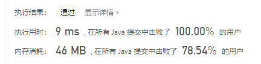

> 原文链接: https://leetcode-cn.com/problems/string-to-url-lcci


## 英文原文
<div><p>Write a method to replace all spaces in a string with &#39;%20&#39;. You may assume that the string has sufficient space at the end to hold the additional characters,and that you are given the &quot;true&quot; length of the string. (Note: If implementing in Java,please use a character array so that you can perform this operation in place.)</p>

<p><strong>Example 1:</strong></p>

<pre>
<strong>Input: </strong>&quot;Mr John Smith &quot;, 13
<strong>Output: </strong>&quot;Mr%20John%20Smith&quot;
</pre>

<p><strong>Example 2:</strong></p>

<pre>
<strong>Input: </strong>&quot;               &quot;, 5
<strong>Output: </strong>&quot;%20%20%20%20%20&quot;
</pre>

<p>&nbsp;</p>

<p><strong>Note:</strong></p>

<ol>
	<li><code>0 &lt;= S.length &lt;= 500000</code></li>
</ol>
</div>

## 中文题目
<div><p>URL化。编写一种方法，将字符串中的空格全部替换为<code>%20</code>。假定该字符串尾部有足够的空间存放新增字符，并且知道字符串的“真实”长度。（注：用<code>Java</code>实现的话，请使用字符数组实现，以便直接在数组上操作。）</p>

<p> </p>

<p><strong>示例 1：</strong></p>

<pre>
<strong>输入</strong>："Mr John Smith    ", 13
<strong>输出</strong>："Mr%20John%20Smith"
</pre>

<p><strong>示例 2：</strong></p>

<pre>
<strong>输入</strong>："               ", 5
<strong>输出</strong>："%20%20%20%20%20"
</pre>

<p> </p>

<p><strong>提示：</strong></p>

<ul>
	<li>字符串长度在 [0, 500000] 范围内。</li>
</ul>
</div>

## 通过代码
<RecoDemo>
</RecoDemo>


## 高赞题解



### 解法一


使用```StringBuilder```解决，逐渐遍历字符串中的字符，如果不是空格就把当前字符加入到```StringBuilder```中，如果是字符就把```"%20"```加入到```StringBuilder```中，代码如下

```java
    public String replaceSpaces(String S, int length) {
        StringBuilder stringBuilder = new StringBuilder();
        //逐渐遍历字符串
        for (int i = 0; i < length; i++) {
            //如果不是空格就加入到StringBuilder中，如果是空格
            //就把"%20"加入到StringBuilder中
            char ch = S.charAt(i);
            if (ch == ' ') {
                stringBuilder.append("%20");
            } else {
                stringBuilder.append(ch);
            }
        }
        return stringBuilder.toString();
    }
```

还可以使用java提供的方法，

```java
    public String replaceSpaces(String S, int length) {
       return S.substring(0, length).replaceAll(" ", "%20");
   }
```

但题中说了如果使用java实现的话，要使用字符数组实现，所以下面代码在这里不合适，我们来把它改一下

<br>



### 解法二

也是逐渐遍历字符串中的所有字符，如果遇到空格，就把他转化为```"%20"```，只不过这里是一数组的形式来计算。

```
    public String replaceSpaces(String S, int length) {
        //先把字符串转化为字符数组
        char[] chars = S.toCharArray();
        int index = chars.length - 1;
        for (int i = length - 1; i >= 0; i--) {
            //如果遇到空格就把他转化为"%20"
            if (chars[i] == ' ') {
                chars[index--] = '0';
                chars[index--] = '2';
                chars[index--] = '%';
            } else {
                chars[index--] = chars[i];
            }
        }
        return new String(chars, index + 1, chars.length - index - 1);
    }
```

看一下运行结果







<br>

我把部分算法题整理成了PDF文档，截止目前总共有**900多页**，大家可以下载阅读
**链接**：https://pan.baidu.com/s/1hjwK0ZeRxYGB8lIkbKuQgQ 
**提取码**：6666 

#### 如果觉得有用就给个赞吧，还可以关注我的[LeetCode主页](https://leetcode-cn.com/u/sdwwld/)查看更多的详细题解

## 统计信息
| 通过次数 | 提交次数 | AC比率 |
| :------: | :------: | :------: |
|    47655    |    82380    |   57.8%   |

## 提交历史
| 提交时间 | 提交结果 | 执行时间 |  内存消耗  | 语言 |
| :------: | :------: | :------: | :--------: | :--------: |
