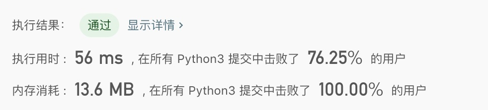

> 原文链接: https://leetcode-cn.com/problems/compress-string-lcci


## 英文原文
<div><p>Implement a method to perform basic string compression using the counts of repeated characters. For example, the string aabcccccaaa would become a2blc5a3. If the &quot;compressed&quot; string would not become smaller than the original string, your method should return the original string. You can assume the string has only uppercase and lowercase letters (a - z).</p>

<p><strong>Example 1:</strong></p>

<pre>
<strong>Input: </strong>&quot;aabcccccaaa&quot;
<strong>Output: </strong>&quot;a2b1c5a3&quot;
</pre>

<p><strong>Example 2:</strong></p>

<pre>
<strong>Input: </strong>&quot;abbccd&quot;
<strong>Output: </strong>&quot;abbccd&quot;
<strong>Explanation: </strong>
The compressed string is &quot;a1b2c2d1&quot;, which is longer than the original string.
</pre>

<p>&nbsp;</p>

<p><strong>Note:</strong></p>

<ol>
	<li><code>0 &lt;= S.length &lt;= 50000</code></li>
</ol>
</div>

## 中文题目
<div><p>字符串压缩。利用字符重复出现的次数，编写一种方法，实现基本的字符串压缩功能。比如，字符串<code>aabcccccaaa</code>会变为<code>a2b1c5a3</code>。若“压缩”后的字符串没有变短，则返回原先的字符串。你可以假设字符串中只包含大小写英文字母（a至z）。</p>

<p> <strong>示例1:</strong></p>

<pre>
<strong> 输入</strong>："aabcccccaaa"
<strong> 输出</strong>："a2b1c5a3"
</pre>

<p> <strong>示例2:</strong></p>

<pre>
<strong> 输入</strong>："abbccd"
<strong> 输出</strong>："abbccd"
<strong> 解释</strong>："abbccd"压缩后为"a1b2c2d1"，比原字符串长度更长。
</pre>

<p><strong>提示：</strong></p>

<ol>
<li>字符串长度在[0, 50000]范围内。</li>
</ol>
</div>

## 通过代码
<RecoDemo>
</RecoDemo>


## 高赞题解
这是一道考验基本功的题目。

这道题考察的第一个点是如何找到字符串中连续的字符。方法是使用双指针，移动两个下标 `i` 和 `j`。过程如下图所示：


这道题考察的第二个点是构建字符串的时间复杂度。例如在 C++ 中，`res += s` 和 `res = res + s` 的含义是不一样的。前者是直接在 `res` 后面添加字符串；后者是用一个临时对象计算 `res + s`，会消耗很多时间和内存。

同样的，在 Java 中，要使用 `StringBuilder`，而不能直接用字符串相加。

使用这个方法，内存消耗能击败 100%：




以下是完整题解代码。

```C++ []
string compressString(string S) {
    int N = S.length();
    string res;
    int i = 0;
    while (i < N) {
        int j = i;
        while (j < N && S[j] == S[i]) {
            j++;
        }
        res += S[i];
        res += to_string(j - i);
        i = j;
    }

    if (res.length() < S.length()) {
        return res;
    } else {
        return S;
    }
}
```

```Java []
public String compressString(String S) {
    int N = S.length();
    int i = 0;
    StringBuilder sb = new StringBuilder();
    while (i < N) {
        int j = i;
        while (j < N && S.charAt(j) == S.charAt(i)) {
            j++;
        }
        sb.append(S.charAt(i));
        sb.append(j - i);
        i = j;
    }

    String res = sb.toString();
    if (res.length() < S.length()) {
        return res;
    } else {
        return S;
    }
}
```

```Python []
def compressString(self, S: str) -> str:
    N = len(S)
    res = ''
    i = 0
    while i < N:
        j = i
        while j < N and S[j] == S[i]:
            j += 1
        res += S[i] + str(j - i)
        i = j

    if len(res) < len(S):
        return res
    else:
        return S
```

如果你觉得本文对你有帮助，欢迎关注我的公众号《面向大象编程》，其中的《LeetCode 例题精讲》系列文章正在写作，不仅有题解，更能让你学会解题的通用思路，举一反三！


## 统计信息
| 通过次数 | 提交次数 | AC比率 |
| :------: | :------: | :------: |
|    76847    |    163143    |   47.1%   |

## 提交历史
| 提交时间 | 提交结果 | 执行时间 |  内存消耗  | 语言 |
| :------: | :------: | :------: | :--------: | :--------: |
