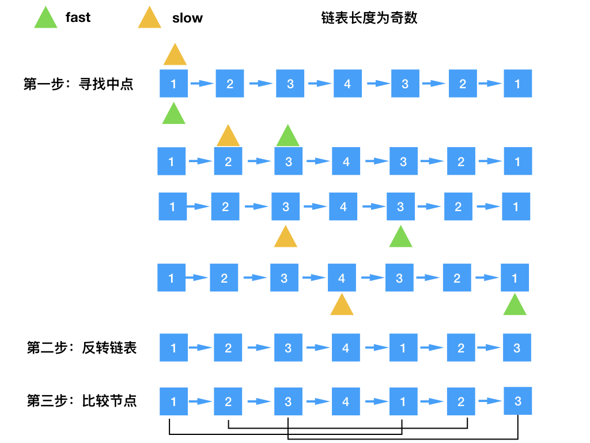
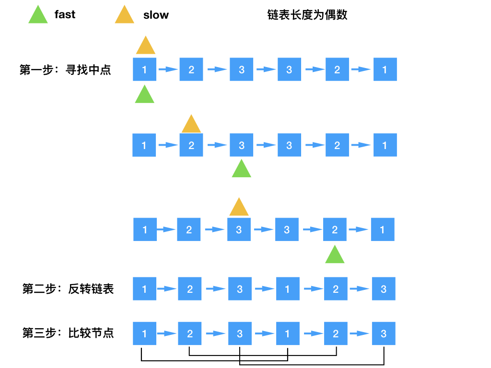

> 原文链接: https://leetcode-cn.com/problems/palindrome-linked-list-lcci


## 英文原文
<div><p>Implement a function to check if a linked list is a palindrome.</p>

<p>&nbsp;</p>

<p><strong>Example 1: </strong></p>

<pre>
<strong>Input:  </strong>1-&gt;2
<strong>Output: </strong> false 
</pre>

<p><strong>Example 2: </strong></p>

<pre>
<strong>Input:  </strong>1-&gt;2-&gt;2-&gt;1
<strong>Output: </strong> true 
</pre>

<p>&nbsp;</p>

<p><b>Follow up:</b><br />
Could you do it in O(n) time and O(1) space?</p>
</div>

## 中文题目
<div><p>编写一个函数，检查输入的链表是否是回文的。</p>

<p>&nbsp;</p>

<p><strong>示例 1：</strong></p>

<pre><strong>输入： </strong>1-&gt;2
<strong>输出：</strong> false 
</pre>

<p><strong>示例 2：</strong></p>

<pre><strong>输入： </strong>1-&gt;2-&gt;2-&gt;1
<strong>输出：</strong> true 
</pre>

<p>&nbsp;</p>

<p><strong>进阶：</strong><br>
你能否用 O(n) 时间复杂度和 O(1) 空间复杂度解决此题？</p>
</div>

## 通过代码
<RecoDemo>
</RecoDemo>


## 高赞题解
# 解题思路：
1，采用快慢两个指针去寻找链表的中间节点；
2，根据链表的中间节点反转后一半的链表；
3，迭代比较链表前一半的元素和后一半的元素，判断节点的值是否相等，得出是否为回文。


# 图解：






# 解题代码：
```
class Solution {
    public boolean isPalindrome(ListNode head) {
        if(head == null) return true;

        ListNode midNode = findMidNode(head);
        ListNode secondHalfHead = reverseLinked(midNode.next);
        ListNode curr1 = head;
        ListNode curr2 = secondHalfHead;

        boolean palindrome = true;
        while(palindrome && curr2 != null){
            if(curr1.val != curr2.val) palindrome = false;
            curr1 = curr1.next;
            curr2 = curr2.next;
        }

        return palindrome;
    }

    /* 反转链表 */
    private ListNode reverseLinked(ListNode head){
        ListNode cur = head;
        ListNode prev = null;
        while(cur != null){
            ListNode nextTemp = cur.next;
            cur.next = prev;
            prev = cur;
            cur = nextTemp;
        }
        return prev;
    }

    /* 快慢指针寻找中间节点 */
    private ListNode findMidNode(ListNode head){
        ListNode fast = head;
        ListNode low = head;
        while(fast.next != null && fast.next.next != null){
            fast = fast.next.next;
            low = low.next;
        }
        return low;
    }

}
```


## 统计信息
| 通过次数 | 提交次数 | AC比率 |
| :------: | :------: | :------: |
|    41697    |    86084    |   48.4%   |

## 提交历史
| 提交时间 | 提交结果 | 执行时间 |  内存消耗  | 语言 |
| :------: | :------: | :------: | :--------: | :--------: |
