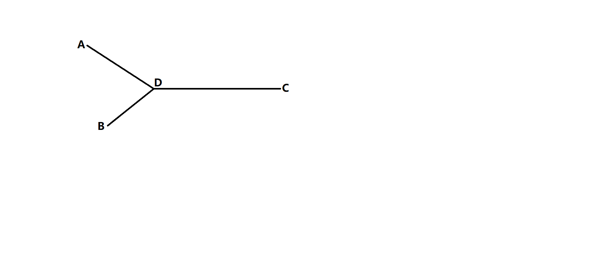

> 原文链接: https://leetcode-cn.com/problems/intersection-of-two-linked-lists-lcci


## 英文原文
<div><p>Given two (singly) linked lists, determine if the two lists intersect. Return the inter&shy; secting node. Note that the intersection is defined based on reference, not value. That is, if the kth node of the first linked list is the exact same node (by reference) as the jth node of the second linked list, then they are intersecting.</p>

<p><strong>Example 1: </strong></p>

<pre>
<strong>Input: </strong>intersectVal = 8, listA = [4,1,8,4,5], listB = [5,0,1,8,4,5], skipA = 2, skipB = 3
<strong>Output: </strong>Reference of the node with value = 8
<strong>Input Explanation:</strong> The intersected node&#39;s value is 8 (note that this must not be 0 if the two lists intersect). From the head of A, it reads as [4,1,8,4,5]. From the head of B, it reads as [5,0,1,8,4,5]. There are 2 nodes before the intersected node in A; There are 3 nodes before the intersected node in B.</pre>

<p><strong>Example 2: </strong></p>

<pre>
<strong>Input: </strong>intersectVal = 2, listA = [0,9,1,2,4], listB = [3,2,4], skipA = 3, skipB = 1
<strong>Output: </strong>Reference of the node with value = 2
<strong>Input Explanation:</strong>&nbsp;The intersected node&#39;s value is 2 (note that this must not be 0 if the two lists intersect). From the head of A, it reads as [0,9,1,2,4]. From the head of B, it reads as [3,2,4]. There are 3 nodes before the intersected node in A; There are 1 node before the intersected node in B.</pre>

<p><strong>Example 3: </strong></p>

<pre>
<strong>Input: </strong>intersectVal = 0, listA = [2,6,4], listB = [1,5], skipA = 3, skipB = 2
<strong>Output: </strong>null
<strong>Input Explanation:</strong> From the head of A, it reads as [2,6,4]. From the head of B, it reads as [1,5]. Since the two lists do not intersect, intersectVal must be 0, while skipA and skipB can be arbitrary values.
<strong>Explanation:</strong> The two lists do not intersect, so return null.</pre>

<p><b>Notes:</b></p>

<ul>
	<li>If the two linked lists have no intersection at all, return&nbsp;<code>null</code>.</li>
	<li>The linked lists must retain their original structure after the function returns.</li>
	<li>You may assume there are no cycles anywhere in the entire linked structure.</li>
	<li>Your code should preferably run in O(n) time and use only O(1) memory.</li>
</ul>
</div>

## 中文题目
<div><p>给你两个单链表的头节点 <code>headA</code> 和 <code>headB</code> ，请你找出并返回两个单链表相交的起始节点。如果两个链表没有交点，返回 <code>null</code> 。</p>

<p>图示两个链表在节点 <code>c1</code> 开始相交<strong>：</strong></p>

<p><a href="https://assets.leetcode-cn.com/aliyun-lc-upload/uploads/2018/12/14/160_statement.png" target="_blank"></a></p>

<p>题目数据 <strong>保证</strong> 整个链式结构中不存在环。</p>

<p><strong>注意</strong>，函数返回结果后，链表必须 <strong>保持其原始结构</strong> 。</p>

<p> </p>

<p><strong>示例 1：</strong></p>

<p><a href="https://assets.leetcode.com/uploads/2018/12/13/160_example_1.png" target="_blank"></a></p>

<pre>
<strong>输入：</strong>intersectVal = 8, listA = [4,1,8,4,5], listB = [5,0,1,8,4,5], skipA = 2, skipB = 3
<strong>输出：</strong>Intersected at '8'
<strong>解释：</strong>相交节点的值为 8 （注意，如果两个链表相交则不能为 0）。
从各自的表头开始算起，链表 A 为 [4,1,8,4,5]，链表 B 为 [5,0,1,8,4,5]。
在 A 中，相交节点前有 2 个节点；在 B 中，相交节点前有 3 个节点。
</pre>

<p><strong>示例 2：</strong></p>

<p><a href="https://assets.leetcode.com/uploads/2018/12/13/160_example_2.png" target="_blank"></a></p>

<pre>
<strong>输入：</strong>intersectVal = 2, listA = [0,9,1,2,4], listB = [3,2,4], skipA = 3, skipB = 1
<strong>输出：</strong>Intersected at '2'
<strong>解释：</strong>相交节点的值为 2 （注意，如果两个链表相交则不能为 0）。
从各自的表头开始算起，链表 A 为 [0,9,1,2,4]，链表 B 为 [3,2,4]。
在 A 中，相交节点前有 3 个节点；在 B 中，相交节点前有 1 个节点。
</pre>

<p><strong>示例 3：</strong></p>

<p><a href="https://assets.leetcode.com/uploads/2018/12/13/160_example_3.png" target="_blank"></a></p>

<pre>
<strong>输入：</strong>intersectVal = 0, listA = [2,6,4], listB = [1,5], skipA = 3, skipB = 2
<strong>输出：</strong>null
<strong>解释：</strong>从各自的表头开始算起，链表 A 为 [2,6,4]，链表 B 为 [1,5]。
由于这两个链表不相交，所以 intersectVal 必须为 0，而 skipA 和 skipB 可以是任意值。
这两个链表不相交，因此返回 null 。
</pre>

<p> </p>

<p><strong>提示：</strong></p>

<ul>
	<li><code>listA</code> 中节点数目为 <code>m</code></li>
	<li><code>listB</code> 中节点数目为 <code>n</code></li>
	<li><code>0 <= m, n <= 3 * 10<sup>4</sup></code></li>
	<li><code>1 <= Node.val <= 10<sup>5</sup></code></li>
	<li><code>0 <= skipA <= m</code></li>
	<li><code>0 <= skipB <= n</code></li>
	<li>如果 <code>listA</code> 和 <code>listB</code> 没有交点，<code>intersectVal</code> 为 <code>0</code></li>
	<li>如果 <code>listA</code> 和 <code>listB</code> 有交点，<code>intersectVal == listA[skipA + 1] == listB[skipB + 1]</code></li>
</ul>

<p> </p>

<p><strong>进阶：</strong>你能否设计一个时间复杂度 <code>O(n)</code> 、仅用 <code>O(1)</code> 内存的解决方案？</p>
</div>

## 通过代码
<RecoDemo>
</RecoDemo>


## 高赞题解
根据题意,两个链表相交的点是指: 该结点既在A链表上又在B链表上,说明A和B是相交的

而对于相交的情况,两条链表一定是这种结构:


为什么呢?
因为如果链表A和链表B相交于D的话,那么说明D结点即在A上又在B上,而D之后的元素自然也就均在A和B上了,因为他们是通过next指针相连的.

如果有相交的结点D的话,每条链的头结点先走完自己的链表长度,然后回头走另外的一条链表,那么两结点一定为相交于D点,因为这时每个头结点走的距离是一样的,都是 AD + BD + DC,而他们每次又都是前进1,所以距离相同,速度又相同,固然一定会在相同的时间走到相同的结点上,即D点

```
class Solution {
public:
    ListNode *getIntersectionNode(ListNode *headA, ListNode *headB) {
        ListNode *t1 = headA; ListNode *t2 = headB;
        while(t1 != t2){
            if (t1 == NULL)
                t1 = headB;
            else t1 = t1->next;
            if (t2 == NULL)
                t2 = headA;
            else t2 = t2->next;
        }
        return t1;
    }
};
```



## 统计信息
| 通过次数 | 提交次数 | AC比率 |
| :------: | :------: | :------: |
|    54825    |    80390    |   68.2%   |

## 提交历史
| 提交时间 | 提交结果 | 执行时间 |  内存消耗  | 语言 |
| :------: | :------: | :------: | :--------: | :--------: |
