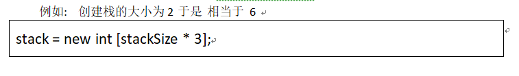
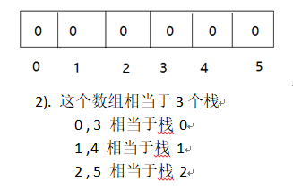
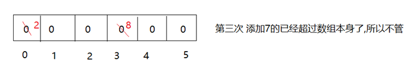
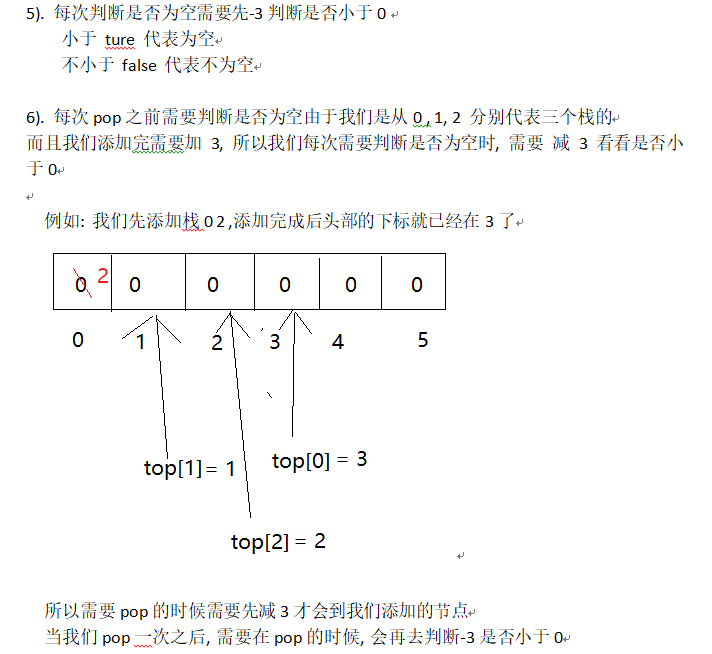

> 原文链接: https://leetcode-cn.com/problems/three-in-one-lcci


## 英文原文
<div><p>Describe how you could use a single array to implement three stacks.</p>

<p>You&nbsp;should implement&nbsp;<code>push(stackNum, value)</code>、<code>pop(stackNum)</code>、<code>isEmpty(stackNum)</code>、<code>peek(stackNum)</code>&nbsp;methods.&nbsp;<code>stackNum<font face="sans-serif, Arial, Verdana, Trebuchet MS">&nbsp;</font></code><font face="sans-serif, Arial, Verdana, Trebuchet MS">is the index of the stack.&nbsp;</font><code>value</code>&nbsp;is the value that pushed to the stack.</p>

<p>The constructor requires a&nbsp;<code>stackSize</code>&nbsp;parameter, which represents the size of each stack.</p>

<p><strong>Example1:</strong></p>

<pre>
<strong> Input</strong>: 
[&quot;TripleInOne&quot;, &quot;push&quot;, &quot;push&quot;, &quot;pop&quot;, &quot;pop&quot;, &quot;pop&quot;, &quot;isEmpty&quot;]
[[1], [0, 1], [0, 2], [0], [0], [0], [0]]
<strong> Output</strong>: 
[null, null, null, 1, -1, -1, true]
<b>Explanation</b>: When the stack is empty, `pop, peek` return -1. When the stack is full, `push` does nothing.
</pre>

<p><strong>Example2:</strong></p>

<pre>
<strong> Input</strong>: 
[&quot;TripleInOne&quot;, &quot;push&quot;, &quot;push&quot;, &quot;push&quot;, &quot;pop&quot;, &quot;pop&quot;, &quot;pop&quot;, &quot;peek&quot;]
[[2], [0, 1], [0, 2], [0, 3], [0], [0], [0], [0]]
<strong> Output</strong>: 
[null, null, null, null, 2, 1, -1, -1]
</pre>
</div>

## 中文题目
<div><p>三合一。描述如何只用一个数组来实现三个栈。</p>

<p>你应该实现<code>push(stackNum, value)</code>、<code>pop(stackNum)</code>、<code>isEmpty(stackNum)</code>、<code>peek(stackNum)</code>方法。<code>stackNum</code>表示栈下标，<code>value</code>表示压入的值。</p>

<p>构造函数会传入一个<code>stackSize</code>参数，代表每个栈的大小。</p>

<p><strong>示例1:</strong></p>

<pre>
<strong> 输入</strong>：
["TripleInOne", "push", "push", "pop", "pop", "pop", "isEmpty"]
[[1], [0, 1], [0, 2], [0], [0], [0], [0]]
<strong> 输出</strong>：
[null, null, null, 1, -1, -1, true]
<strong>说明</strong>：当栈为空时`pop, peek`返回-1，当栈满时`push`不压入元素。
</pre>

<p><strong>示例2:</strong></p>

<pre>
<strong> 输入</strong>：
["TripleInOne", "push", "push", "push", "pop", "pop", "pop", "peek"]
[[2], [0, 1], [0, 2], [0, 3], [0], [0], [0], [0]]
<strong> 输出</strong>：
[null, null, null, null, 2, 1, -1, -1]
</pre>

<p>&nbsp;</p>

<p><strong>提示：</strong></p>

<ul>
	<li><code>0 &lt;= stackNum &lt;= 2</code></li>
</ul>
</div>

## 通过代码
<RecoDemo>
</RecoDemo>


## 高赞题解
# 一开始看这个题目是很懵逼的
**例题看得也懵逼, 所以当自己看懂了之后, 就来分享一下啦.**

1. 首先开始创建类时构造函数里面创入的大小是栈的大小 ( stackSize  )
2. 其次不管是push还是pop还是peek或者isEmpty 的参数 (stackNum)
   **stackNum输入的值,代表的是哪个栈!!!!**
    这个题叫三合一就是说 三个栈代表全部放在一个数组里面
	例如: 参数stackNum 为 0 时就代表第一个栈
         参数stackNum 为 1 时就代表第二个栈
         参数stackNum 为 2 时就代表第三个栈

3. 由于是一个数组相当于3个栈,所以创建的时候就 乘 3


4. 每次push的时候 需要先判断头指针是否小于数组的长度
    如果小于需要添加值,而且需要把top节点加3
    例如: 添加栈0 2, 添加栈0 8, 添加栈0 7


  此时top[0] = 0 减3之后就是 -3 所以它是空的返回-1

7 . 每次peek的时候, 先判断是否为空 空直接返回-1, 不为空话就把top – 3 的下标给它就可以了,此时不是抛出所以不需要改变原来的top的值

```
public class TripleInOne {

    //定义一个数组栈
    private int[] stack;
    //定义一个头指针的数组
    private int[] top;

    public TripleInOne(int stackSize) {
        //定义三栈合一
       stack = new int[stackSize * 3];
       // 三个栈的头结点
       top = new int[3];

       //分别赋值第一次的头结点
        // 栈0 top[0] = 0;
        // 栈1 top[1] = 1;
        // 栈2 top[2] = 2;
       for (int i = 0; i < 3; i++) {
           top[i] = i;
       }
    }

    public void push(int stackNum, int value) {
        //判断是否添加满了
        if (top[stackNum] < stack.length) {
            //赋值
            stack[top[stackNum]] = value;
            //头结点+3
            top[stackNum] = top[stackNum] + 3;
        }
    }

    public int pop(int stackNum) {

        //判断是否为空
        if (isEmpty(stackNum)) {
            return -1;
        }
        //原本的top[stackNum]减3
        top[stackNum] = top[stackNum] - 3;

        //返回
        return stack[(top[stackNum])];


    }

    public int peek(int stackNum) {
        //判断是否为空
        if (isEmpty(stackNum)) {
            return -1;
        }
        //把下标给它但是不改变原来的top[stackNum]
        int index = top[stackNum] - 3;
        return stack[index];
    }

    public boolean isEmpty(int stackNum) {
        //判断这个栈是否为空
        if (top[stackNum] -3 < 0) {
            return true;
        }
        return false;
    }
}
```


## 统计信息
| 通过次数 | 提交次数 | AC比率 |
| :------: | :------: | :------: |
|    11908    |    22215    |   53.6%   |

## 提交历史
| 提交时间 | 提交结果 | 执行时间 |  内存消耗  | 语言 |
| :------: | :------: | :------: | :--------: | :--------: |
