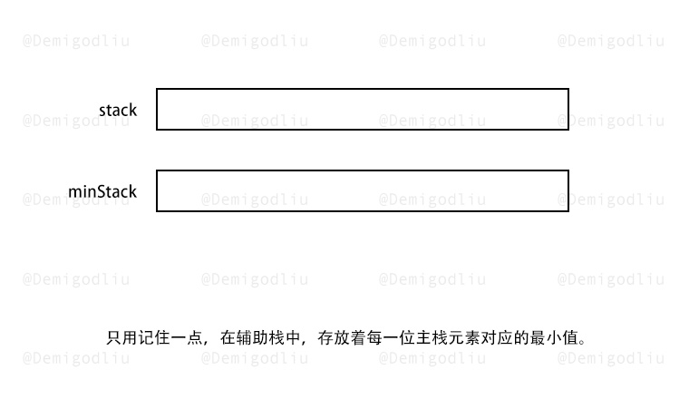
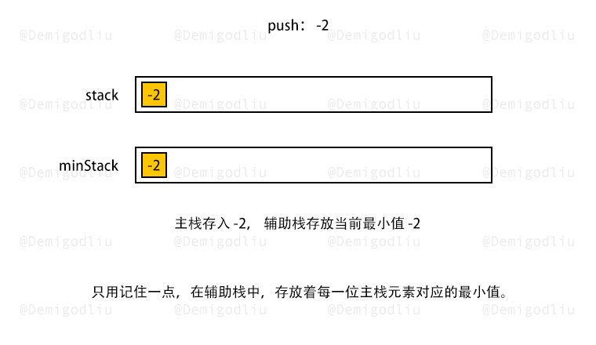
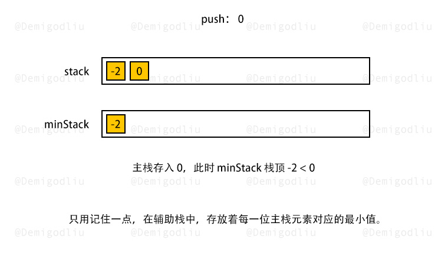
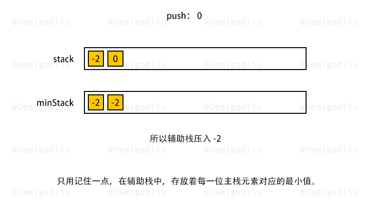
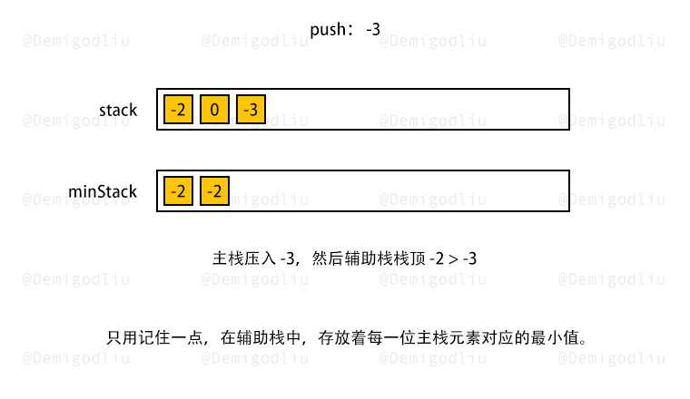
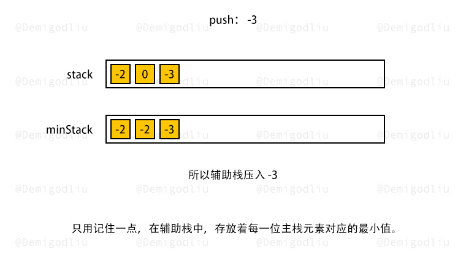
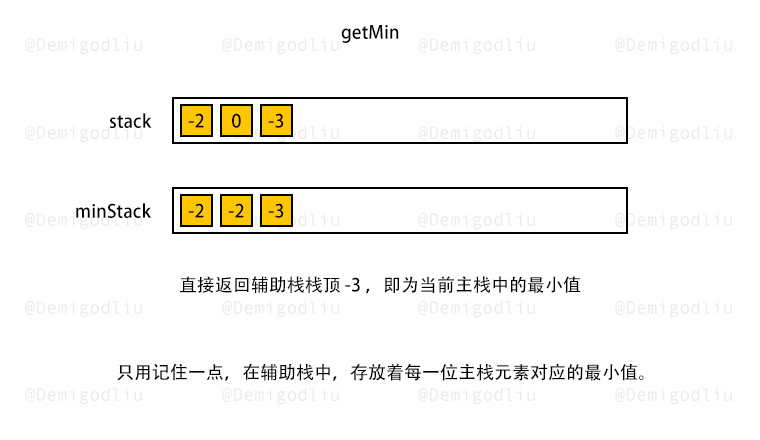
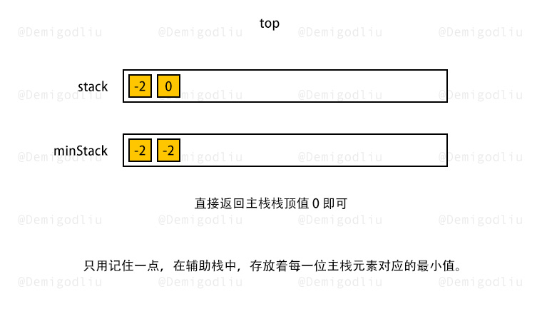
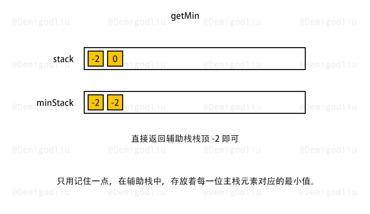

> 原文链接: https://leetcode-cn.com/problems/min-stack-lcci


## 英文原文
<div><p>How would you design a stack which, in addition to push and pop, has a function min which returns the minimum element? Push, pop and min should all operate in 0(1) time.</p>

<p><strong>Example: </strong></p>

<pre>
MinStack minStack = new MinStack();
minStack.push(-2);
minStack.push(0);
minStack.push(-3);
minStack.getMin();   --&gt; return -3.
minStack.pop();
minStack.top();      --&gt; return 0.
minStack.getMin();   --&gt; return -2.</pre>
</div>

## 中文题目
<div><p>请设计一个栈，除了常规栈支持的pop与push函数以外，还支持min函数，该函数返回栈元素中的最小值。执行push、pop和min操作的时间复杂度必须为O(1)。</p><br><p><strong>示例：</strong><pre>MinStack minStack = new MinStack();<br>minStack.push(-2);<br>minStack.push(0);<br>minStack.push(-3);<br>minStack.getMin();   --> 返回 -3.<br>minStack.pop();<br>minStack.top();      --> 返回 0.<br>minStack.getMin();   --> 返回 -2.</pre></p></div>

## 通过代码
<RecoDemo>
</RecoDemo>


## 高赞题解


---

### 🧠 解题思路

根据题意，我们需要在常量级的时间内找到最小值！

这说明，我们绝不能在需要最小值的时候，再做排序，查找等操作来获取！

所以，我们可以创建两个栈，一个栈是主栈 $stack$，另一个是辅助栈 $minStack$，用于存放对应主栈不同时期的最小值。

---

### 🎨 图解演示

<,,,,,,,,,>

---

### 🍭 示例代码

```Javascript []
var MinStack = function() {
    this.x_stack = [];
    this.min_stack = [Infinity];
};

MinStack.prototype.push = function(x) {
    this.x_stack.push(x);
    this.min_stack.push(Math.min(this.min_stack[this.min_stack.length - 1], x));
};

MinStack.prototype.pop = function() {
    this.x_stack.pop();
    this.min_stack.pop();
};

MinStack.prototype.top = function() {
    return this.x_stack[this.x_stack.length - 1];
};

MinStack.prototype.getMin = function() {
    return this.min_stack[this.min_stack.length - 1];
};
```
```Python3 []
class MinStack:
    def __init__(self):
        self.stack = []
        self.min_stack = [math.inf]

    def push(self, x: int) -> None:
        self.stack.append(x)
        self.min_stack.append(min(x, self.min_stack[-1]))

    def pop(self) -> None:
        self.stack.pop()
        self.min_stack.pop()

    def top(self) -> int:
        return self.stack[-1]

    def getMin(self) -> int:
        return self.min_stack[-1]
```
```C++ []
class MinStack {
    stack<int> x_stack;
    stack<int> min_stack;
public:
    MinStack() {
        min_stack.push(INT_MAX);
    }
    
    void push(int x) {
        x_stack.push(x);
        min_stack.push(min(min_stack.top(), x));
    }
    
    void pop() {
        x_stack.pop();
        min_stack.pop();
    }
    
    int top() {
        return x_stack.top();
    }
    
    int getMin() {
        return min_stack.top();
    }
};
```
```Java []
class MinStack {
    Deque<Integer> xStack;
    Deque<Integer> minStack;

    public MinStack() {
        xStack = new LinkedList<Integer>();
        minStack = new LinkedList<Integer>();
        minStack.push(Integer.MAX_VALUE);
    }
    
    public void push(int x) {
        xStack.push(x);
        minStack.push(Math.min(minStack.peek(), x));
    }
    
    public void pop() {
        xStack.pop();
        minStack.pop();
    }
    
    public int top() {
        return xStack.peek();
    }
    
    public int getMin() {
        return minStack.peek();
    }
}
```
```Golang []
type MinStack struct {
    stack []int
    minStack []int
}

func Constructor() MinStack {
    return MinStack{
        stack: []int{},
        minStack: []int{math.MaxInt64},
    }
}

func (this *MinStack) Push(x int)  {
    this.stack = append(this.stack, x)
    top := this.minStack[len(this.minStack)-1]
    this.minStack = append(this.minStack, min(x, top))
}

func (this *MinStack) Pop()  {
    this.stack = this.stack[:len(this.stack)-1]
    this.minStack = this.minStack[:len(this.minStack)-1]
}

func (this *MinStack) Top() int {
    return this.stack[len(this.stack)-1]
}

func (this *MinStack) GetMin() int {
    return this.minStack[len(this.minStack)-1]
}

func min(x, y int) int {
    if x < y {
        return x
    }
    return y
}
```

---

### 转身挥手

嘿，少年，做图不易，留下个赞或评论再走吧！谢啦~ 💐

差点忘了，祝你牛年大吉 🐮 ，AC 和 Offer 📑 多多益善~

⛲⛲⛲ 期待下次再见~ 

## 统计信息
| 通过次数 | 提交次数 | AC比率 |
| :------: | :------: | :------: |
|    27197    |    44315    |   61.4%   |

## 提交历史
| 提交时间 | 提交结果 | 执行时间 |  内存消耗  | 语言 |
| :------: | :------: | :------: | :--------: | :--------: |
