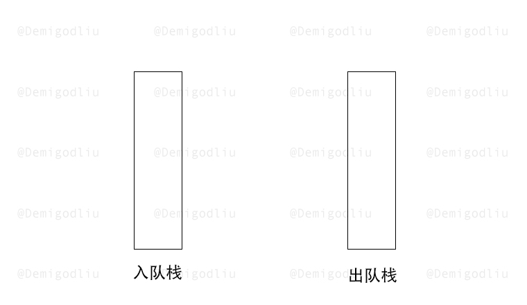
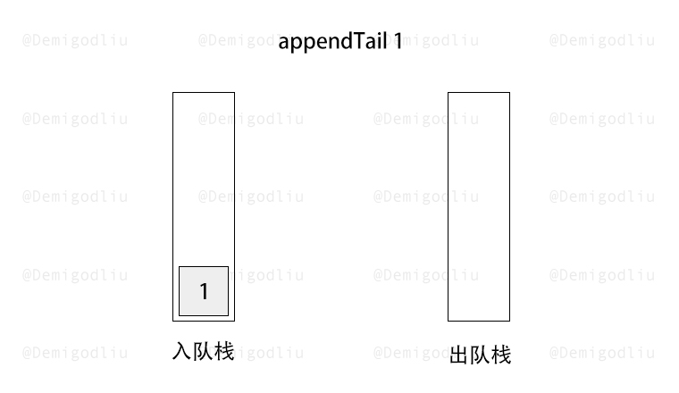
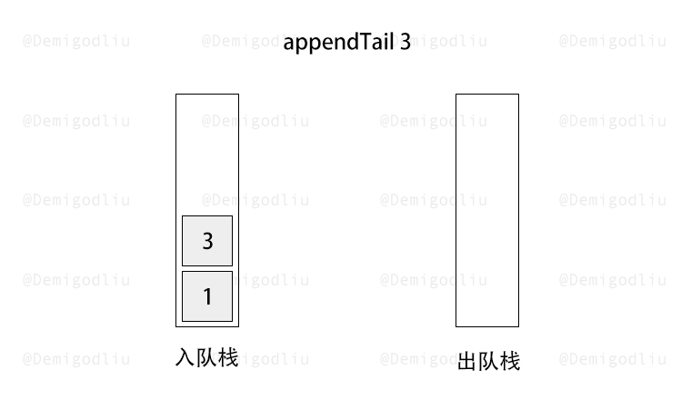
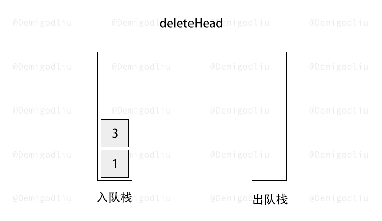
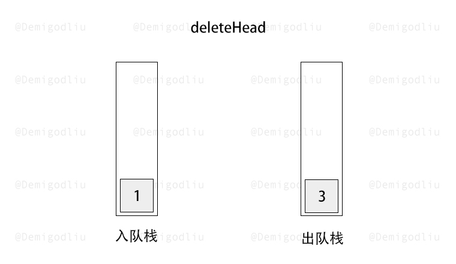
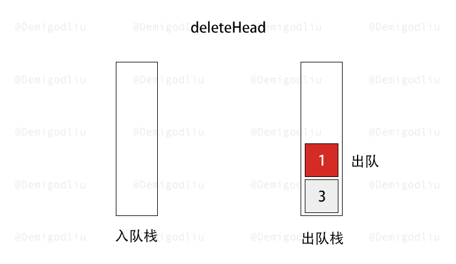
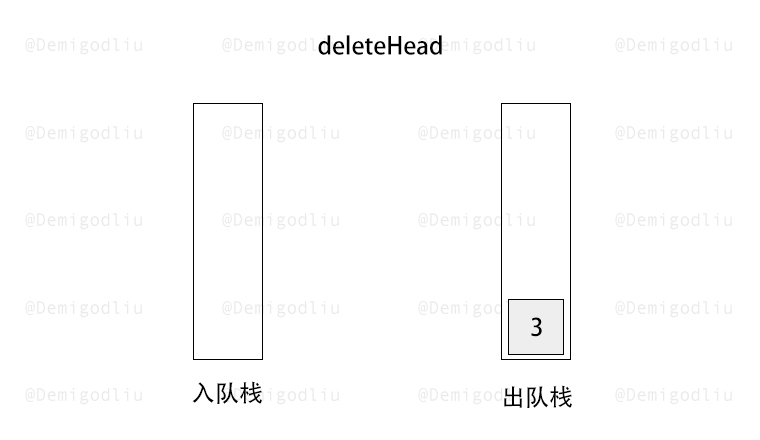
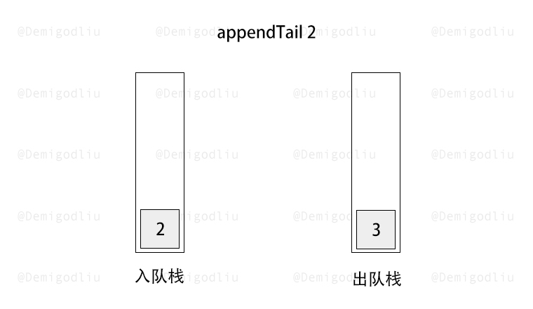
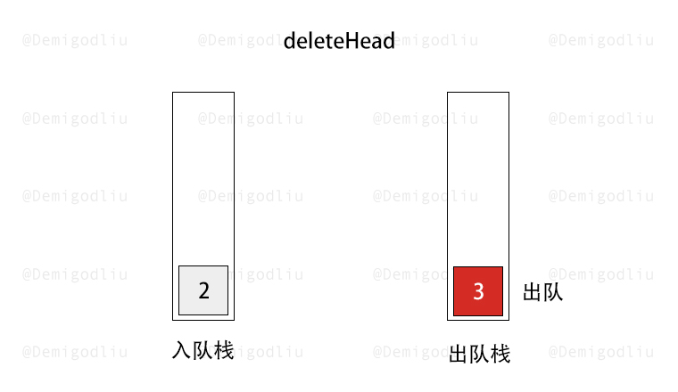
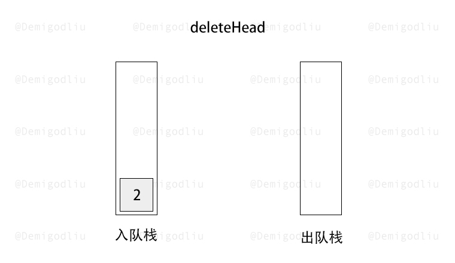

> 原文链接: https://leetcode-cn.com/problems/implement-queue-using-stacks-lcci


## 英文原文
<div><p>Implement a MyQueue class which implements a queue using two stacks.</p>
&nbsp;

<p><strong>Example: </strong></p>

<pre>
MyQueue queue = new MyQueue();

queue.push(1);
queue.push(2);
queue.peek();  // return 1
queue.pop();   // return 1
queue.empty(); // return false</pre>

<p>&nbsp;</p>

<p><b>Notes:</b></p>

<ul>
	<li>You must use&nbsp;<i>only</i>&nbsp;standard operations of a stack -- which means only&nbsp;<code>push to top</code>,&nbsp;<code>peek/pop from top</code>,&nbsp;<code>size</code>, and&nbsp;<code>is empty</code>&nbsp;operations are valid.</li>
	<li>Depending on your language, stack may not be supported natively. You may simulate a stack by using a list or deque (double-ended queue), as long as you use only standard operations of a stack.</li>
	<li>You may assume that all operations are valid (for example, no pop or peek operations will be called on an empty queue).</li>
</ul>

<p>&nbsp;</p>
</div>

## 中文题目
<div><p>实现一个MyQueue类，该类用两个栈来实现一个队列。</p><br><p><strong>示例：</strong><pre>MyQueue queue = new MyQueue();<br><br>queue.push(1);<br>queue.push(2);<br>queue.peek();  // 返回 1<br>queue.pop();   // 返回 1<br>queue.empty(); // 返回 false</pre></p><br><p><strong>说明：</strong><br><ul><li>你只能使用标准的栈操作 -- 也就是只有 <code>push to top</code>, <code>peek/pop from top</code>, <code>size</code> 和 <code>is empty</code> 操作是合法的。</li><li>你所使用的语言也许不支持栈。你可以使用 list 或者 deque（双端队列）来模拟一个栈，只要是标准的栈操作即可。</li><li>假设所有操作都是有效的 （例如，一个空的队列不会调用 pop 或者 peek 操作）。</li></ul></p></div>

## 通过代码
<RecoDemo>
</RecoDemo>


## 高赞题解


---

### 🧠 解题思路

队列的特性是 $FIFO$（先入先出），而栈的特性是 $FILO$（先入后出）。

知道两者特性之后，我们需要用两个栈来模拟队列的特性，一个栈为入队栈，一个栈为出对栈。

当出队栈存在内容时，出队栈的栈顶，即为第一个出队的元素。

若出队栈无元素，我们的需求又是出队的话，我们就需要将入队栈的内容反序导入出队栈，然后弹出栈顶即可。

注意：根据栈的的特性，我们仅能使用 $push$ 和 $pop$ 操作。

---

### 🎨 图解演示

<,,,,,,,,,>

---

### 代码

```Javascript []
var MyQueue = function() {
    this.stackIn = [];
    this.stackOut = [];
};

MyQueue.prototype.push = function(x) {
    this.stackIn.push(x);
};

MyQueue.prototype.pop = function() {
    while(this.stackIn.length > 1){
        this.stackOut.push(this.stackIn.pop());
    }
    let ans =  this.stackIn.pop();
    while(this.stackOut.length){
        this.stackIn.push(this.stackOut.pop());
    }
    return ans;
};

MyQueue.prototype.peek = function() {
    while(this.stackIn.length){
        this.stackOut.push(this.stackIn.pop());
    }
    let ans =  this.stackOut[this.stackOut.length - 1];
    while(this.stackOut.length){
        this.stackIn.push(this.stackOut.pop());
    }
    return ans;
};

MyQueue.prototype.empty = function() {
    return !this.stackIn.length && !this.stackOut.length;
};
```
```C++ []
class MyQueue {
private:
    stack<int> inStack, outStack;

    void in2out() {
        while (!inStack.empty()) {
            outStack.push(inStack.top());
            inStack.pop();
        }
    }

public:
    MyQueue() {}

    void push(int x) {
        inStack.push(x);
    }

    int pop() {
        if (outStack.empty()) {
            in2out();
        }
        int x = outStack.top();
        outStack.pop();
        return x;
    }

    int peek() {
        if (outStack.empty()) {
            in2out();
        }
        return outStack.top();
    }

    bool empty() {
        return inStack.empty() && outStack.empty();
    }
};
```
```Java []
class MyQueue {
    Deque<Integer> inStack;
    Deque<Integer> outStack;

    public MyQueue() {
        inStack = new LinkedList<Integer>();
        outStack = new LinkedList<Integer>();
    }
    
    public void push(int x) {
        inStack.push(x);
    }
    
    public int pop() {
        if (outStack.isEmpty()) {
            in2out();
        }
        return outStack.pop();
    }
    
    public int peek() {
        if (outStack.isEmpty()) {
            in2out();
        }
        return outStack.peek();
    }
    
    public boolean empty() {
        return inStack.isEmpty() && outStack.isEmpty();
    }

    private void in2out() {
        while (!inStack.isEmpty()) {
            outStack.push(inStack.pop());
        }
    }
}
```
```Golang []
type MyQueue struct {
    inStack, outStack []int
}

func Constructor() MyQueue {
    return MyQueue{}
}

func (q *MyQueue) Push(x int) {
    q.inStack = append(q.inStack, x)
}

func (q *MyQueue) in2out() {
    for len(q.inStack) > 0 {
        q.outStack = append(q.outStack, q.inStack[len(q.inStack)-1])
        q.inStack = q.inStack[:len(q.inStack)-1]
    }
}

func (q *MyQueue) Pop() int {
    if len(q.outStack) == 0 {
        q.in2out()
    }
    x := q.outStack[len(q.outStack)-1]
    q.outStack = q.outStack[:len(q.outStack)-1]
    return x
}

func (q *MyQueue) Peek() int {
    if len(q.outStack) == 0 {
        q.in2out()
    }
    return q.outStack[len(q.outStack)-1]
}

func (q *MyQueue) Empty() bool {
    return len(q.inStack) == 0 && len(q.outStack) == 0
}
```
```C []
typedef struct {
    int* stk;
    int stkSize;
    int stkCapacity;
} Stack;

Stack* stackCreate(int cpacity) {
    Stack* ret = malloc(sizeof(Stack));
    ret->stk = malloc(sizeof(int) * cpacity);
    ret->stkSize = 0;
    ret->stkCapacity = cpacity;
    return ret;
}

void stackPush(Stack* obj, int x) {
    obj->stk[obj->stkSize++] = x;
}

void stackPop(Stack* obj) {
    obj->stkSize--;
}

int stackTop(Stack* obj) {
    return obj->stk[obj->stkSize - 1];
}

bool stackEmpty(Stack* obj) {
    return obj->stkSize == 0;
}

void stackFree(Stack* obj) {
    free(obj->stk);
}

typedef struct {
    Stack* inStack;
    Stack* outStack;
} MyQueue;

MyQueue* myQueueCreate() {
    MyQueue* ret = malloc(sizeof(MyQueue));
    ret->inStack = stackCreate(100);
    ret->outStack = stackCreate(100);
    return ret;
}

void in2out(MyQueue* obj) {
    while (!stackEmpty(obj->inStack)) {
        stackPush(obj->outStack, stackTop(obj->inStack));
        stackPop(obj->inStack);
    }
}

void myQueuePush(MyQueue* obj, int x) {
    stackPush(obj->inStack, x);
}

int myQueuePop(MyQueue* obj) {
    if (stackEmpty(obj->outStack)) {
        in2out(obj);
    }
    int x = stackTop(obj->outStack);
    stackPop(obj->outStack);
    return x;
}

int myQueuePeek(MyQueue* obj) {
    if (stackEmpty(obj->outStack)) {
        in2out(obj);
    }
    return stackTop(obj->outStack);
}

bool myQueueEmpty(MyQueue* obj) {
    return stackEmpty(obj->inStack) && stackEmpty(obj->outStack);
}

void myQueueFree(MyQueue* obj) {
    stackFree(obj->inStack);
    stackFree(obj->outStack);
}
```

---

### 转身挥手

嘿，少年，做图不易，留下个赞或评论再走吧！谢啦~ 💐

差点忘了，祝你牛年大吉 🐮 ，AC 和 Offer 📑 多多益善~

⛲⛲⛲ 期待下次再见~ 

## 统计信息
| 通过次数 | 提交次数 | AC比率 |
| :------: | :------: | :------: |
|    24498    |    34322    |   71.4%   |

## 提交历史
| 提交时间 | 提交结果 | 执行时间 |  内存消耗  | 语言 |
| :------: | :------: | :------: | :--------: | :--------: |
