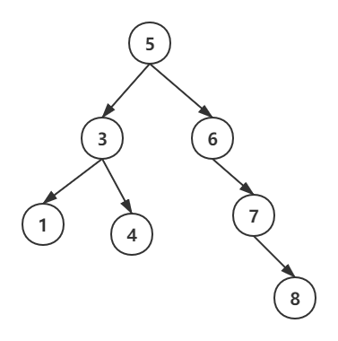
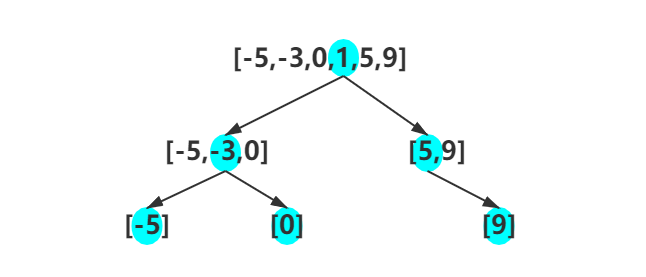

> 原文链接: https://leetcode-cn.com/problems/minimum-height-tree-lcci


## 英文原文
<div><p>Given a sorted (increasing order) array with unique integer elements, write an algo&shy;rithm to create a binary search tree with minimal height.</p>

<p><strong>Example:</strong></p>

<pre>
Given sorted array: [-10,-3,0,5,9],

One possible answer is: [0,-3,9,-10,null,5]，which represents the following tree: 

          0 
         / \ 
       -3   9 
       /   / 
     -10  5 
</pre>
</div>

## 中文题目
<div><p>给定一个有序整数数组，元素各不相同且按升序排列，编写一个算法，创建一棵高度最小的二叉搜索树。</p><strong>示例:</strong><pre>给定有序数组: [-10,-3,0,5,9],<br><br>一个可能的答案是：[0,-3,9,-10,null,5]，它可以表示下面这个高度平衡二叉搜索树：<br><br>          0 <br>         / &#92 <br>       -3   9 <br>       /   / <br>     -10  5 <br></pre></div>

## 通过代码
<RecoDemo>
</RecoDemo>


## 高赞题解
首先复习下二叉搜索树的定义：对于树中的所有子树都有，左子树上的值都小于根节点的值，右子树上的值都大于根节点上的值。总结一下就是，树的中序遍历可以得到一个升序序列。

如下图所示：


那如何保证高度最小呢？当树中的任意结点的左右子树高度差都不超过 1 时，整棵树的深度最小。

下面是一种构造最小高度树的思路：
1. 如果序列长度为 0，那么是一棵空树。
1. 如果序列长度为 1，那么只有一个根节点。
2. 如果长度大于 1，那么选取中间位置的数赋给根节点，然后前一半递归构建左子树，后一半递归构建右子树。

以 [-5,-3,0,1,5,9] 为例，构造过程如下图所示：



```
/**
 * Definition for a binary tree node.
 * struct TreeNode {
 *     int val;
 *     TreeNode *left;
 *     TreeNode *right;
 *     TreeNode(int x) : val(x), left(NULL), right(NULL) {}
 * };
 */
class Solution {
public:
    TreeNode* dfs(const vector<int> &nums, int L, int R) {
        if(L > R) {
            return nullptr;
        }
        int mid = (L+R)>>1;
        auto ptr = new TreeNode(nums[mid]); //填充根节点
        ptr->left = dfs(nums, L, mid-1); //构造左子树
        ptr->right = dfs(nums, mid+1, R); //构造右子树
        return ptr;
    }
    TreeNode* sortedArrayToBST(vector<int>& nums) {
        return dfs(nums, 0, nums.size()-1);
    }
};
```


扫码关注，更多福利~

## 统计信息
| 通过次数 | 提交次数 | AC比率 |
| :------: | :------: | :------: |
|    36069    |    45699    |   78.9%   |

## 提交历史
| 提交时间 | 提交结果 | 执行时间 |  内存消耗  | 语言 |
| :------: | :------: | :------: | :--------: | :--------: |
