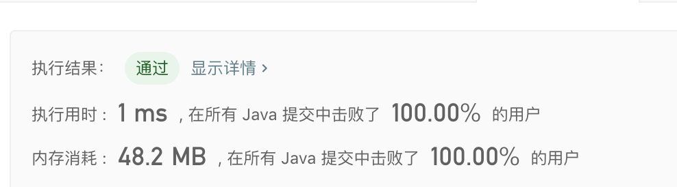

> 原文链接: https://leetcode-cn.com/problems/check-balance-lcci


## 英文原文
<div><p>Implement a function to check if a binary tree is balanced. For the purposes of this question, a balanced tree is defined to be a tree such that the heights of the two subtrees of any node never differ by more than one.</p>

<p><br />
<strong>Example 1:</strong></p>

<pre>
Given tree [3,9,20,null,null,15,7]
    3
   / \
  9  20
    /  \
   15   7
return true.</pre>

<p><strong>Example 2:</strong></p>

<pre>
Given [1,2,2,3,3,null,null,4,4]
      1
     / \
    2   2
   / \
  3   3
 / \
4   4
return&nbsp;false.</pre>

<p>&nbsp;</p>
</div>

## 中文题目
<div><p>实现一个函数，检查二叉树是否平衡。在这个问题中，平衡树的定义如下：任意一个节点，其两棵子树的高度差不超过 1。</p><br><strong>示例 1:</strong><pre>给定二叉树 [3,9,20,null,null,15,7]<br>    3<br>   / &#92<br>  9  20<br>    /  &#92<br>   15   7<br>返回 true 。</pre><strong>示例 2:</strong><br><pre>给定二叉树 [1,2,2,3,3,null,null,4,4]<br>      1<br>     / &#92<br>    2   2<br>   / &#92<br>  3   3<br> / &#92<br>4   4<br>返回 false 。</pre></div>

## 通过代码
<RecoDemo>
</RecoDemo>


## 高赞题解
### 解题思路
屏幕快照 2020-02-17 下午5.04.37


### 代码

```java
/**
 * Definition for a binary tree node.
 * public class TreeNode {
 *     int val;
 *     TreeNode left;
 *     TreeNode right;
 *     TreeNode(int x) { val = x; }
 * }
 */
class Solution {
    //定义变量减枝
    boolean isBalance = true;
    public boolean isBalanced(TreeNode root) {
        if(root==null){
            return true;
        }
        getDepth(root);
        return isBalance;
    }
    private int getDepth(TreeNode node){
        //如果已经找到不平衡的树枝，不需要递归，直接返回
        if(!isBalance){
            return 0;
        }
        if(node == null){
            return 0;
        }
        int left = getDepth(node.left);
        int rignt = getDepth(node.right);
        //判断左右树枝是否平衡，如果不平衡更新减枝变量
        if(Math.abs(left-rignt)>1){
            isBalance = false;
        }
        return Math.max(left,rignt)+1;
    }
}
```

## 统计信息
| 通过次数 | 提交次数 | AC比率 |
| :------: | :------: | :------: |
|    34392    |    58657    |   58.6%   |

## 提交历史
| 提交时间 | 提交结果 | 执行时间 |  内存消耗  | 语言 |
| :------: | :------: | :------: | :--------: | :--------: |
