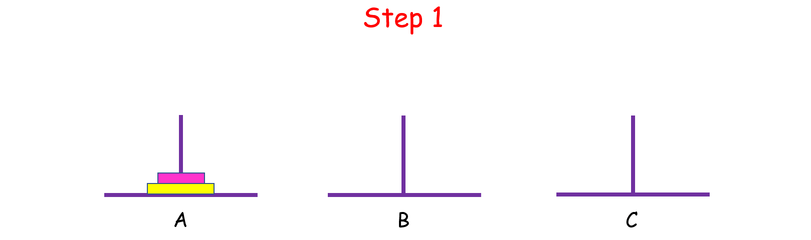

> 原文链接: https://leetcode-cn.com/problems/hanota-lcci


## 英文原文
<div><p>In the classic problem of the Towers of Hanoi, you have 3 towers and N disks of different sizes which can slide onto any tower. The puzzle starts with disks sorted in ascending order of size from top to bottom (i.e., each disk sits on top of an even larger one). You have the following constraints:</p>

<p>(1) Only one disk can be moved at a time.<br />
(2) A disk is slid off the top of one tower onto another tower.<br />
(3) A disk cannot be placed on top of a smaller disk.</p>

<p>Write a program to move the disks from the first tower to the last using stacks.</p>

<p><strong>Example1:</strong></p>

<pre>
<strong> Input</strong>: A = [2, 1, 0], B = [], C = []
<strong> Output</strong>: C = [2, 1, 0]
</pre>

<p><strong>Example2:</strong></p>

<pre>
<strong> Input</strong>: A = [1, 0], B = [], C = []
<strong> Output</strong>: C = [1, 0]
</pre>

<p><strong>Note:</strong></p>

<ol>
	<li><code>A.length &lt;= 14</code></li>
</ol>
</div>

## 中文题目
<div><p>在经典汉诺塔问题中，有 3 根柱子及 N 个不同大小的穿孔圆盘，盘子可以滑入任意一根柱子。一开始，所有盘子自上而下按升序依次套在第一根柱子上(即每一个盘子只能放在更大的盘子上面)。移动圆盘时受到以下限制:<br>
(1) 每次只能移动一个盘子;<br>
(2) 盘子只能从柱子顶端滑出移到下一根柱子;<br>
(3) 盘子只能叠在比它大的盘子上。</p>

<p>请编写程序，用栈将所有盘子从第一根柱子移到最后一根柱子。</p>

<p>你需要原地修改栈。</p>

<p><strong>示例1:</strong></p>

<pre><strong> 输入</strong>：A = [2, 1, 0], B = [], C = []
<strong> 输出</strong>：C = [2, 1, 0]
</pre>

<p><strong>示例2:</strong></p>

<pre><strong> 输入</strong>：A = [1, 0], B = [], C = []
<strong> 输出</strong>：C = [1, 0]
</pre>

<p><strong>提示:</strong></p>

<ol>
	<li>A中盘子的数目不大于14个。</li>
</ol>
</div>

## 通过代码
<RecoDemo>
</RecoDemo>


## 高赞题解
### Tower of Hanoi

>相传在很久以前，有个寺庙里的几个和尚整天不停地移动着 64 个盘子，日复一日，年复一年。据说，当 64 个盘子全部移完的那一天就是世界末日...

### 问题描述
有 A,B,C 三根柱子，A 上面有 n 个盘子，我们想把 A 上面的盘子移动到 C 上，但是要满足以下三个条件：
1. 每次只能移动一个盘子;
2. 盘子只能从柱子顶端滑出移到下一根柱子;
3. 盘子只能叠在比它大的盘子上。

{:width=500}

### 解题思路：递归与分治
这是一道递归方法的经典题目，乍一想还挺难理清头绪的，我们不妨先从简单的入手。

假设 `n = 1`,只有一个盘子，很简单，直接把它从 A 中拿出来，移到 C 上；

如果 `n = 2` 呢？这时候我们就要借助 B 了，因为小盘子必须时刻都在大盘子上面，共需要 4 步。

{:width=500}


如果  `n > 2` 呢？思路和上面是一样的，我们把 n 个盘子也看成两个部分，一部分有 1 个盘子，另一部分有 n - 1 个盘子。

{:width=500}


观察上图，你可能会问：“那 n - 1 个盘子是怎么从 A 移到 C 的呢？”

注意，**当你在思考这个问题的时候，就将最初的 n 个盘子从 A 移到 C 的问题，转化成了将 n - 1 个盘子从 A 移到 C 的问题，** 依次类推，直至转化成 1 个盘子的问题时，问题也就解决了。这就是分治的思想。 

而实现分治思想的常用方法就是递归。不难发现，如果原问题可以分解成若干个与原问题结构相同但规模较小的子问题时，往往可以用递归的方法解决。具体解决办法如下：
- `n = 1` 时，直接把盘子从 A 移到 C；
- `n > 1` 时，
    - 先把上面 n - 1 个盘子从 A 移到 B（子问题，递归）；
    - 再将最大的盘子从 A 移到 C；
    - 再将 B 上 n - 1 个盘子从 B 移到 C（子问题，递归）。


### 代码

```python []
class Solution:
    def hanota(self, A: List[int], B: List[int], C: List[int]) -> None:
        n = len(A)
        self.move(n, A, B, C)
    # 定义move 函数移动汉诺塔
    def move(self,n, A, B, C):
        if n == 1:
            C.append(A[-1])
            A.pop()
            return 
        else:
            self.move(n-1, A, C, B)  # 将A上面n-1个通过C移到B
            C.append(A[-1])          # 将A最后一个移到C
            A.pop()                  # 这时，A空了
            self.move(n-1,B, A, C)   # 将B上面n-1个通过空的A移到C
```

```cpp []
class Solution {
public:
    void hanota(vector<int>& A, vector<int>& B, vector<int>& C) {
        int n = A.size();
        move(n, A, B, C);
    }

    void move(int n, vector<int>& A, vector<int>& B, vector<int>& C){
        if (n == 1){
            C.push_back(A.back());
            A.pop_back();
            return;
        }

        move(n-1, A, C, B);    // 将A上面n-1个通过C移到B
        C.push_back(A.back());  // 将A最后一个移到C
        A.pop_back();          // 这时，A空了
        move(n-1, B, A, C);     // 将B上面n-1个通过空的A移到C
    }
};
```

### 复杂度分析：世界会毁灭吗
- 时间复杂度：$O(2^n-1)$。一共需要移动的次数。
- 空间复杂度：$O(1)$。


当 `n = 64`时，也就是有 64 个盘子的时候，如果每秒移动一个盘子，大约需要 $1.8\times10^{19}$ 秒...

那个时候地球会毁灭吗？

也许会，也许不会。


## 统计信息
| 通过次数 | 提交次数 | AC比率 |
| :------: | :------: | :------: |
|    25316    |    38604    |   65.6%   |

## 提交历史
| 提交时间 | 提交结果 | 执行时间 |  内存消耗  | 语言 |
| :------: | :------: | :------: | :--------: | :--------: |
