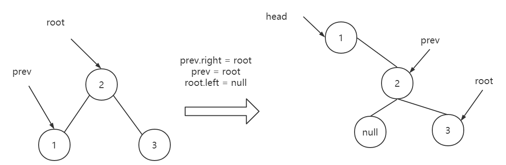

> 原文链接: https://leetcode-cn.com/problems/binode-lcci


## 英文原文
<div><p>The data structure&nbsp;<code>TreeNode</code>&nbsp;is used for binary tree, but it can also used to represent a single linked list (where left is null, and right is the next node in the list). Implement a method to convert a binary search tree (implemented with <code>TreeNode</code>) into a single&nbsp;linked list. The values should be kept in order and the operation should be performed in place (that is, on the original data structure).</p>

<p>Return the head node of the linked list after converting.</p>

<p><b>Note:&nbsp;</b>This problem is slightly different from the original one in the book.</p>

<p>&nbsp;</p>

<p><strong>Example: </strong></p>

<pre>
<strong>Input: </strong> [4,2,5,1,3,null,6,0]
<strong>Output: </strong> [0,null,1,null,2,null,3,null,4,null,5,null,6]
</pre>

<p><strong>Note: </strong></p>

<ul>
	<li>The number of nodes will not exceed&nbsp;100000.</li>
</ul>
</div>

## 中文题目
<div><p>二叉树数据结构<code>TreeNode</code>可用来表示单向链表（其中<code>left</code>置空，<code>right</code>为下一个链表节点）。实现一个方法，把二叉搜索树转换为单向链表，要求依然符合二叉搜索树的性质，转换操作应是原址的，也就是在原始的二叉搜索树上直接修改。</p>

<p>返回转换后的单向链表的头节点。</p>

<p><strong>注意：</strong>本题相对原题稍作改动</p>

<p>&nbsp;</p>

<p><strong>示例：</strong></p>

<pre><strong>输入：</strong> [4,2,5,1,3,null,6,0]
<strong>输出：</strong> [0,null,1,null,2,null,3,null,4,null,5,null,6]
</pre>

<p><strong>提示：</strong></p>

<ul>
	<li>节点数量不会超过 100000。</li>
</ul>
</div>

## 通过代码
<RecoDemo>
</RecoDemo>


## 高赞题解
### 解题思路

1. 要求是原址修改，即**要直接利用这些已经存在的节点空间**，**修改**这些节点的**指向**来得到单向链表。

2. 要求单向链表依然符合二叉搜索树的性质，说是单向链表，其实还是一棵特殊的二叉搜索树。

3. 众所周知，对二叉搜索树采用**中序遍历**就能得到一个升序序列。 那么如果我们在遍历过程中，**修改每一个根节点的左右指向**，不就实现了原址修改了吗。




### 代码

```java
/**
 * Definition for a binary tree node.
 * public class TreeNode {
 *     int val;
 *     TreeNode left;
 *     TreeNode right;
 *     TreeNode(int x) { val = x; }
 * }
 */
class Solution {
    TreeNode head = new TreeNode(-1);   // 为了返回单向链表的头节点而多设的一个节点
    TreeNode perv = null;               // 指向当前节点的前一个节点
    public TreeNode convertBiNode(TreeNode root) {
        helper(root);
        return head.right;
    }

    public void helper(TreeNode root) {
        if (root == null) { return;}
        helper(root.left);
        if (perv == null) {     // 第一个节点
            perv = root;        // 记录第一个节点
            head.right = root;  // 记录它，它将作为单链表的表头
        } else {                // 第一个节点之后的节点
            perv.right = root;  // 前一个节点的右指针指向当前节点
            perv = root;        // 更新perv指向
        }
        root.left = null;       // 当前节点的左指针设为null
        helper(root.right);
    }
}
```

### 算法分析

设$n$为二叉搜索树中节点的个数。

1. 中序遍历所有节点仅访问一次，所以时间复杂度为$O(n)$.

2. 递归使用辅助栈空间$O(n)$，几个临时变量$O(1)$，因此总的空间复杂度为$O(n)$.

### 如果本文对你有帮助，可以给一个大拇指呀！


## 统计信息
| 通过次数 | 提交次数 | AC比率 |
| :------: | :------: | :------: |
|    21853    |    34533    |   63.3%   |

## 提交历史
| 提交时间 | 提交结果 | 执行时间 |  内存消耗  | 语言 |
| :------: | :------: | :------: | :--------: | :--------: |
